# **Table of Contents**

**Unit 1: Fundamentals of Security and Threats**  
1.1 Introduction to Security and the CIA Triad  
1.2 Security Concepts  
 1.2.1 Exploit, Threat, Vulnerability, Risk, and Attack  
 1.2.2 Malware Overview  
1.3 Malware Terminology  
 1.3.1 Rootkits, Trapdoors, Botnets, and Keyloggers  
 1.3.2 Honeypots  
1.4 Types of Security Attacks  
 1.4.1 Active and Passive Attacks  
 1.4.2 IP Spoofing, Tear Drop, DoS, and DDoS  
 1.4.3 XSS, SQL Injection, Smurf, and Man-in-the-Middle Attacks  
 1.4.4 Format String Attack  
1.5 Types of Security Vulnerabilities  
 1.5.1 Buffer Overflows  
 1.5.2 Invalidated Input  
 1.5.3 Race Conditions  
 1.5.4 Access Control Problems  
 1.5.5 Weaknesses in Authentication, Authorization, or Cryptographic Practices  

**Unit 2: Cryptographic Techniques and Mechanisms**  
2.1 One-Way Functions and Pseudorandom Generators  
2.2 Hash Functions  
2.3 Symmetric Key Cryptography  
 2.3.1 Block Ciphers  
 2.3.2 Stream Ciphers  
2.4 Access Control Methods  
2.5 Message Authentication and Digital Signatures  

**Unit 3: Security Challenges and Protocols in Wireless Networks**  
3.1 Vulnerabilities and Security Challenges of Wireless Networks  
3.2 Trust Assumptions and Adversary Models  
3.3 Security Protocols for Wireless Networks  
3.4 Attacks Against Naming and Addressing in the Internet  
3.5 Security Protocols for Address Resolution and Auto-Configuration  

**Unit 4: Advanced Security Protocols in IP and Ad-hoc Networks**  
4.1 Security for Global IP Mobility  
4.2 IP Security (IPSec) Protocol  
4.3 Key Establishment and Revocation Protocols in Sensor Networks  
4.4 Secure Neighbor Discovery  
4.5 Secure Routing Protocols in Multihop Wireless Networks  
4.6 Provable Security for Ad-hoc Network Routing Protocols  

**Unit 5: Privacy and Security in Ad-hoc and Vehicular Networks**  
5.1 Privacy-Preserving Routing in Ad-hoc Networks  
5.2 Location Privacy in Vehicular Ad-hoc Networks  
5.3 Secure Protocols for Behavior Enforcement  
5.4 Game Theoretic Model of Packet Forwarding  

---
---

# B.Tech. (Computer Science & Engineering (Cyber Security))
## 7CY4-01: Cybersecurity in Wireless and Ad-hoc Networks
### Comprehensive Detailed Notes with Visual Diagrams

---

## Table of Contents
1. [Unit 1: Fundamentals of Security and Threats](#unit-1-fundamentals-of-security-and-threats)
2. [Unit 2: Cryptographic Techniques and Mechanisms](#unit-2-cryptographic-techniques-and-mechanisms)
3. [Unit 3: Security Challenges and Protocols in Wireless Networks](#unit-3-security-challenges-and-protocols-in-wireless-networks)
4. [Unit 4: Advanced Security Protocols in IP and Ad-hoc Networks](#unit-4-advanced-security-protocols-in-ip-and-ad-hoc-networks)
5. [Unit 5: Privacy and Security in Ad-hoc and Vehicular Networks](#unit-5-privacy-and-security-in-ad-hoc-and-vehicular-networks)

---

## Unit 1: Fundamentals of Security and Threats

### 1.1 Introduction to Security and the CIA Triad

#### Core Security Principles
The foundation of cybersecurity rests on three fundamental principles known as the **CIA Triad**:

- **Confidentiality**: Ensuring that information is accessible only to authorized individuals
- **Integrity**: Maintaining the accuracy and completeness of data
- **Availability**: Ensuring that information and resources are accessible when needed


#### Security Goals and Objectives
- **Preventive**: Stop attacks before they occur
- **Detective**: Identify when attacks are happening
- **Corrective**: Respond to and recover from attacks
- **Deterrent**: Discourage potential attackers

### 1.2 Security Concepts

#### 1.2.1 Exploit, Threat, Vulnerability, Risk, and Attack

These concepts form the foundation of cybersecurity understanding:

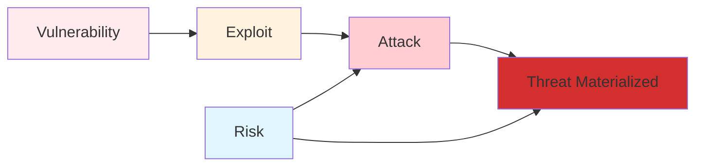

**Definitions:**

1. **Vulnerability**: A weakness in a system that can be exploited
   - Software bugs
   - Misconfigurations
   - Design flaws
   - Human errors

2. **Threat**: A potential danger that could exploit vulnerabilities
   - Natural disasters
   - Human threats (insiders, outsiders)
   - Technical failures

3. **Exploit**: A method or technique used to take advantage of a vulnerability
   - Zero-day exploits
   - Known exploits
   - Proof-of-concept exploits

4. **Attack**: An actual attempt to exploit vulnerabilities
   - Passive attacks (eavesdropping)
   - Active attacks (modification, fabrication)

5. **Risk**: The potential for loss or damage when a threat exploits a vulnerability
   - Risk = Threat × Vulnerability × Impact

#### 1.2.2 Malware Overview

**Malware** (malicious software) refers to any software designed to harm, exploit, or gain unauthorized access to systems.

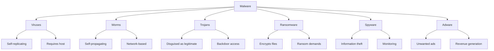

### 1.3 Malware Terminology

#### 1.3.1 Rootkits, Trapdoors, Botnets, and Keyloggers

**Rootkits**:
- Software designed to hide malicious activities
- Provides persistent access with elevated privileges
- Difficult to detect and remove
- Can modify system files and processes

**Trapdoors (Backdoors)**:
- Secret entry points into systems
- Bypass normal authentication procedures
- Often installed by attackers for future access
- Can be legitimate (debugging) or malicious

**Botnets**:
- Networks of compromised computers
- Controlled by a command and control (C&C) server
- Used for DDoS attacks, spam distribution, data theft
- Can be IoT devices, PCs, or mobile devices

**Keyloggers**:
- Record keystrokes on infected systems
- Capture passwords, credit card numbers, sensitive data
- Can be hardware-based or software-based
- Often used in identity theft and espionage

#### 1.3.2 Honeypots

**Honeypots** are decoy systems designed to:
- Detect and analyze attacks
- Gather intelligence about attackers
- Divert attacks from real systems
- Study attack methodologies

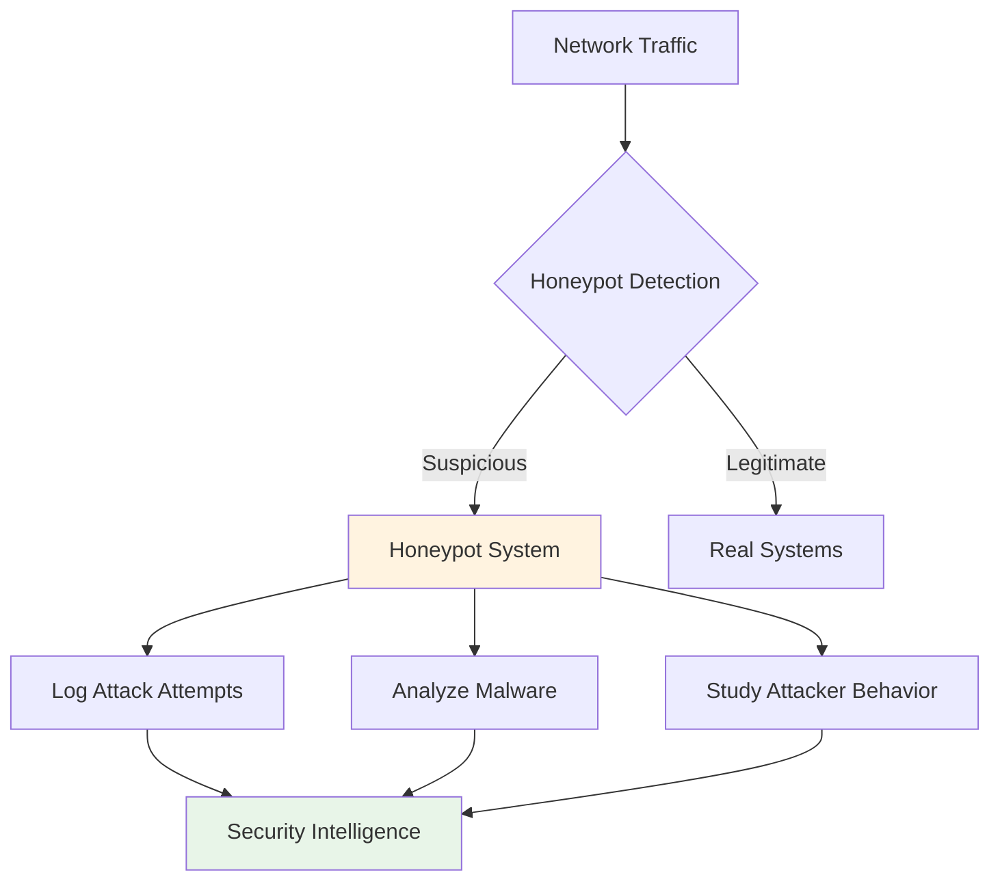

### 1.4 Types of Security Attacks

#### 1.4.1 Active and Passive Attacks

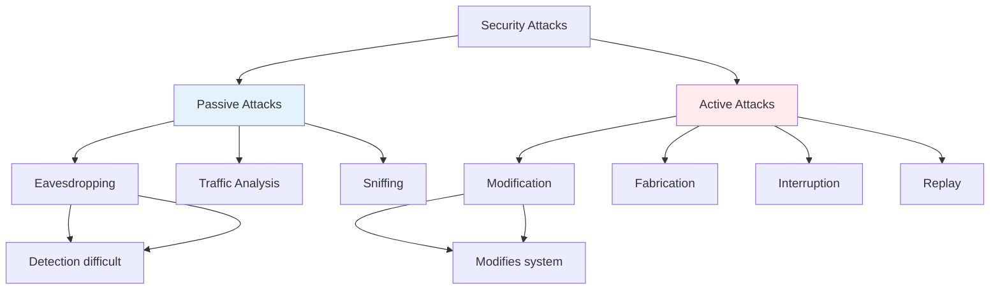

**Passive Attacks**:
- **Eavesdropping**: Intercepting communication without alteration
- **Traffic Analysis**: Analyzing communication patterns
- **Sniffing**: Capturing network traffic

**Active Attacks**:
- **Modification**: Altering data or messages
- **Fabrication**: Creating false data
- **Interruption**: Denying service
- **Replay**: Re-transmitting captured data

#### 1.4.2 IP Spoofing, Tear Drop, DoS, and DDoS

**IP Spoofing**:
- Forging source IP addresses in packets
- Used to hide attacker identity
- Enables reflection attacks
- Can bypass IP-based filtering

**Tear Drop Attack**:
- Exploits fragmentation reassembly vulnerabilities
- Sends overlapping IP fragments
- Causes system crashes or freezes
- Particularly effective against older systems

**DoS (Denial of Service)**:
- Overwhelming system resources
- Preventing legitimate access
- Examples: SYN flooding, ping flooding

**DDoS (Distributed Denial of Service)**:
- Multiple systems targeting one victim
- Botnets amplify attack power
- Harder to mitigate and trace
- Types: Volume-based, Protocol-based, Application-layer

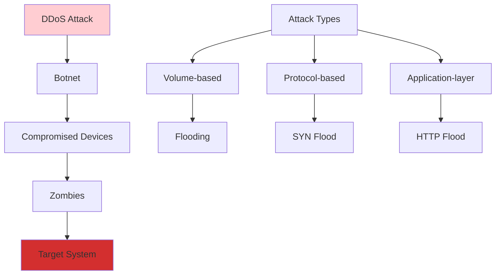

#### 1.4.3 XSS, SQL Injection, Smurf, and Man-in-the-Middle Attacks

**XSS (Cross-Site Scripting)**:
- Injecting malicious scripts into web pages
- Types: Stored, Reflected, DOM-based
- Steals cookies, session tokens, sensitive data
- Can deface websites or redirect users

**SQL Injection**:
- Injecting malicious SQL queries
- Bypasses authentication mechanisms
- Extracts, modifies, or deletes database data
- Can gain administrative access

**Smurf Attack**:
- ICMP echo request to broadcast address
- Spoofed source IP address
- Amplifies attack traffic
- Overwhelms victim with responses

**Man-in-the-Middle (MITM)**:
- Intercepts communication between parties
- Can read, modify, or inject data
- Examples: WiFi eavesdropping, ARP poisoning
- Requires position between communicating parties

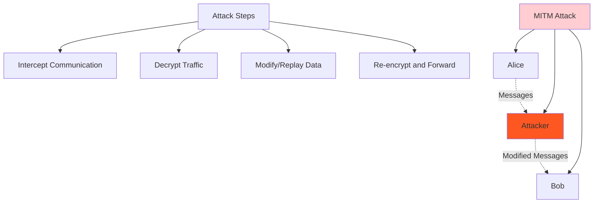

#### 1.4.4 Format String Attack

**Format String Vulnerabilities**:
- Occur when user input is used as format string
- Allows reading/writing arbitrary memory
- Can execute arbitrary code
- Common in C/C++ programs using printf(), sprintf()

**Attack Techniques**:
- Memory disclosure using %x specifiers
- Stack corruption using %n specifier
- Heap corruption using heap-specific functions

### 1.5 Types of Security Vulnerabilities

#### 1.5.1 Buffer Overflows

**Buffer Overflow** occurs when data exceeds buffer capacity, potentially overwriting adjacent memory.

**Types**:
- **Stack-based**: Overflow occurs in stack memory
- **Heap-based**: Overflow occurs in heap memory
- **Global overflow**: Overflow in global data segment

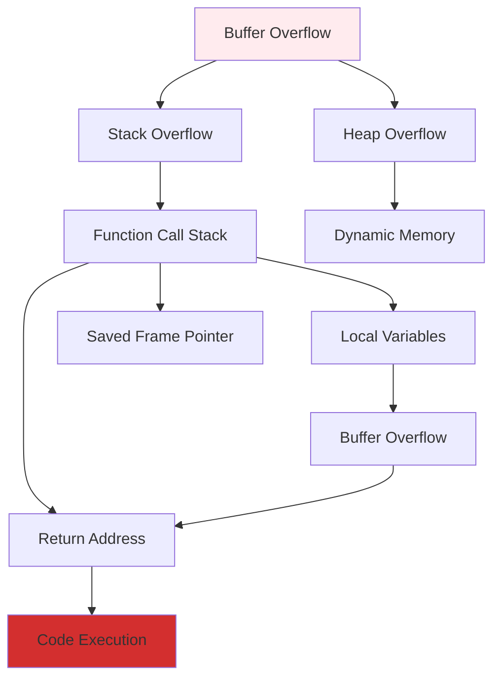

**Consequences**:
- System crashes
- Arbitrary code execution
- Privilege escalation
- Data corruption

#### 1.5.2 Invalidated Input

**Input Validation Vulnerabilities**:
- Missing or insufficient input checking
- Allows malicious data to enter system
- Can lead to various attacks

**Common Issues**:
- Buffer overflows
- Command injection
- Path traversal
- Cross-site scripting

#### 1.5.3 Race Conditions

**Race Condition** occurs when system behavior depends on relative timing of events.

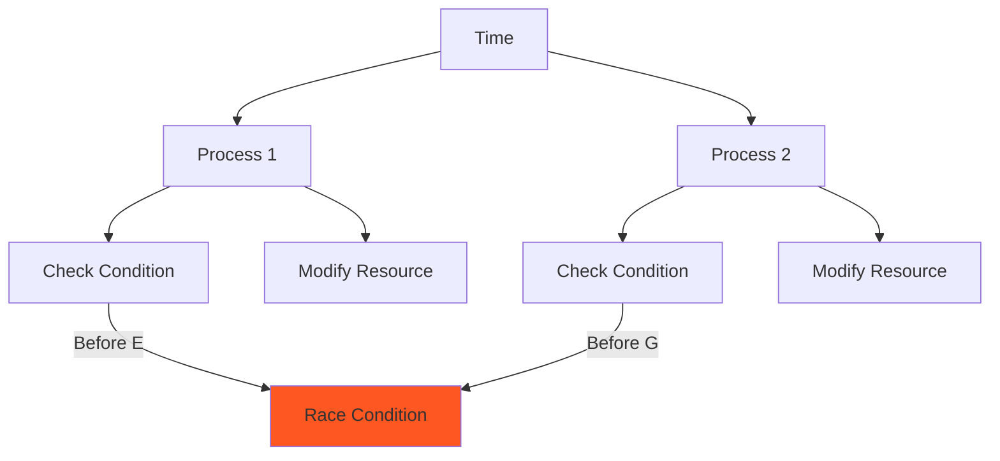

**Examples**:
- TOCTOU (Time-of-Check-Time-of-Use)
- File access race conditions
- Network protocol timing issues

#### 1.5.4 Access Control Problems

**Access Control Mechanisms**:
- Authentication: Verifying identity
- Authorization: Determining permissions
- Accounting: Tracking actions

**Common Vulnerabilities**:
- Inadequate privilege separation
- Default passwords
- Broken authentication
- Insufficient access controls

#### 1.5.5 Weaknesses in Authentication, Authorization, or Cryptographic Practices

**Authentication Weaknesses**:
- Weak passwords
- Session management flaws
- Brute force vulnerabilities
- Password recovery issues

**Authorization Weaknesses**:
- Privilege escalation
- Inadequate permission checks
- Broken access control models

**Cryptographic Weaknesses**:
- Weak algorithms
- Poor key management
- Implementation flaws
- Random number generation issues

---

## Unit 2: Cryptographic Techniques and Mechanisms

### 2.1 One-Way Functions and Pseudorandom Generators

#### One-Way Functions

**Definition**: Functions that are easy to compute but computationally infeasible to invert.

**Properties**:
- **Easy to compute**: f(x) can be calculated efficiently
- **Hard to invert**: Given y = f(x), finding x is computationally difficult
- **Pre-image resistance**: Cannot find any x such that f(x) = y
- **Second pre-image resistance**: Cannot find x' ≠ x such that f(x') = f(x)

```mermaid
graph LR
    A[x] --> B[f(x) = y]
    C[y] --> D[Inversion]
    D -.->|Hard| E[x]
    
    F[Easy Direction] --> G[f(x) = y]
    H[Hard Direction] --> I[f(x) = y]
    I -.->|Difficult| J[x]
    
    style D fill:#ffcdd2
    style I fill:#ffcdd2
```

**Examples**:
- Modular exponentiation: f(x) = a^x mod p
- Hash functions: SHA-256, MD5
- Discrete logarithm problem

#### Pseudorandom Generators (PRGs)

**Definition**: Deterministic algorithms that expand short random seeds into longer pseudorandom sequences.

**Requirements**:
- **Efficiency**: Fast computation
- **Pseudorandomness**: Output appears random to PPT algorithms
- **Expansion**: Output longer than input seed

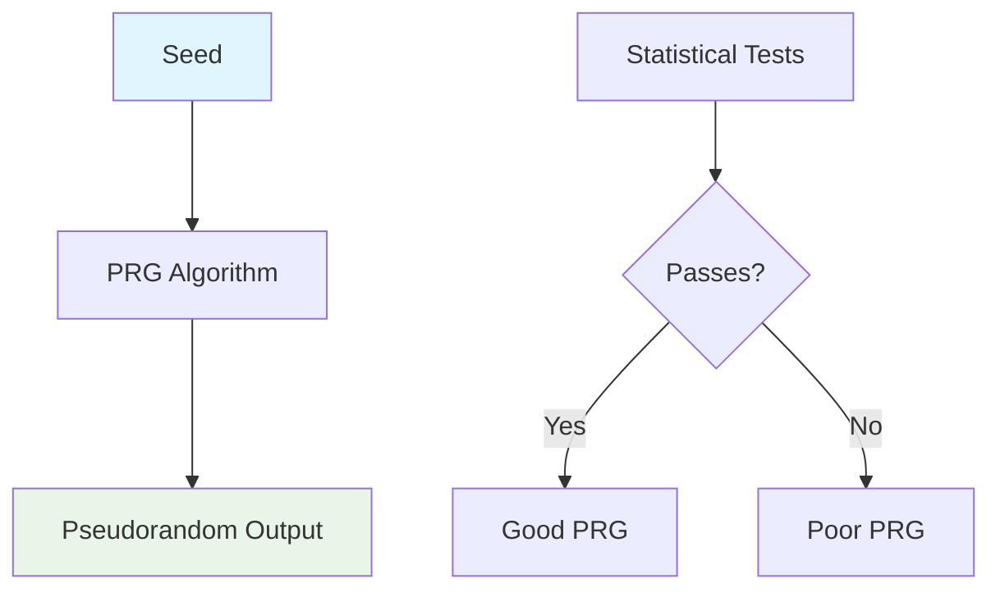

**Applications**:
- Stream ciphers
- Key derivation
- Random number generation
- Cryptographic protocols

### 2.2 Hash Functions

**Hash Functions** map input data of arbitrary size to fixed-size output.

**Properties**:
- **Deterministic**: Same input always produces same output
- **Quick computation**: Efficient to compute
- **Pre-image resistance**: Hard to find input for given hash
- **Second pre-image resistance**: Hard to find different input with same hash
- **Collision resistance**: Hard to find two different inputs with same hash

```mermaid
graph TB
    A[Input Data] --> B[ B --> C[Hash Function]
   Fixed-size Hash]
    
    D[Message M] --> E[H(M)]
    F[Message M'] --> G[H(M') = H(M)]
    
    H[Properties] --> I[Deterministic]
    H --> J[Quick Computation]
    H --> K[Pre-image Resistant]
    H --> L[Second Pre-image Resistant]
    H --> M[Collision Resistant]
    
    style C fill:#e8f5e8
```

**Common Hash Functions**:
- **MD5**: 128-bit output, cryptographically broken
- **SHA-1**: 160-bit output, deprecated
- **SHA-256**: 256-bit output, currently secure
- **SHA-3**: Latest NIST standard

### 2.3 Symmetric Key Cryptography

**Symmetric Key Cryptography** uses the same key for encryption and decryption.

#### 2.3.1 Block Ciphers

**Block Ciphers** encrypt data in fixed-size blocks.

**Structure**:
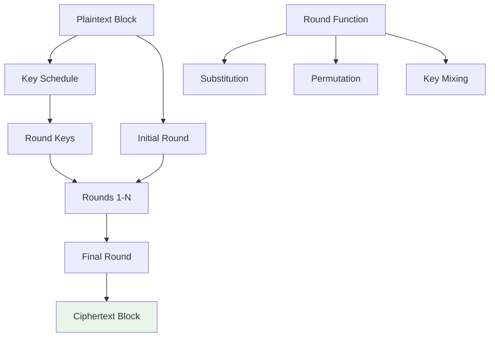

**Modes of Operation**:
- **ECB (Electronic Codebook)**: Each block encrypted independently
- **CBC (Cipher Block Chaining)**: Each block XORed with previous ciphertext
- **CTR (Counter)**: Encrypts counter values
- **GCM (Galois/Counter Mode)**: Provides authentication

#### 2.3.2 Stream Ciphers

**Stream Ciphers** encrypt data bit by bit or byte by byte.

**Structure**:
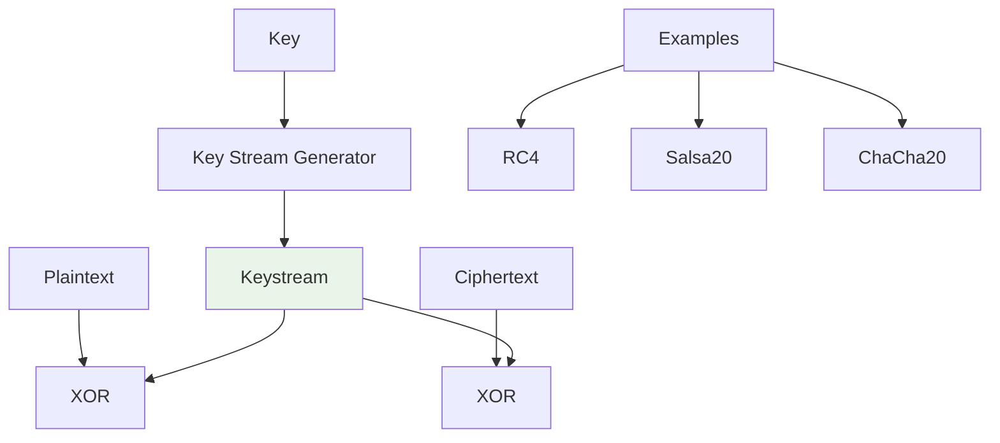

**Advantages**:
- Speed
- Low memory requirements
- Suitable for streaming applications

### 2.4 Access Control Methods

**Access Control** determines who can access what resources and how.

**Models**:

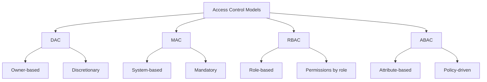

**Implementation Methods**:
- **Access Control Lists (ACLs)**: Define permissions for specific users/groups
- **Capability Lists**: Users hold capabilities/permissions
- **Role-Based Access Control (RBAC)**: Permissions assigned to roles
- **Attribute-Based Access Control (ABAC)**: Based on user and resource attributes

### 2.5 Message Authentication and Digital Signatures

#### Message Authentication

**Ensures message integrity and authenticity**.

**Methods**:
- **Message Authentication Codes (MACs)**: Symmetric key-based
- **Hash-based MACs (HMAC)**: Uses hash functions
- **Keyed-hash MACs**: Combines secret key with hash

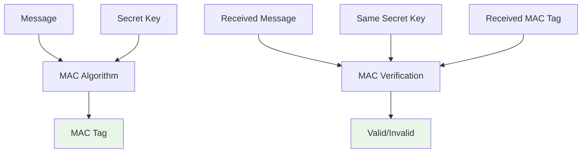

#### Digital Signatures

**Provide non-repudiation and authenticity**.

**Process**:
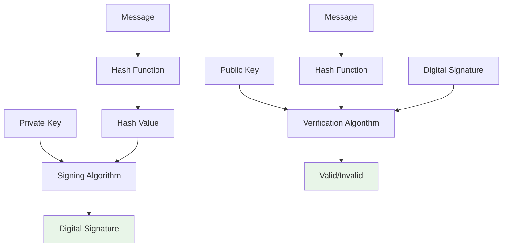

**Schemes**:
- **RSA Signatures**: Based on RSA algorithm
- **DSA**: Digital Signature Algorithm
- **ECDSA**: Elliptic Curve DSA
- **EdDSA**: Edwards-curve DSA

---

## Unit 3: Security Challenges and Protocols in Wireless Networks

### 3.1 Vulnerabilities and Security Challenges of Wireless Networks

#### Unique Wireless Security Challenges

**Broadcast Nature**:
- Signals can be intercepted by anyone in range
- Difficult to control signal propagation
- Physical security is challenging

**Mobility**:
- Devices frequently join/leave networks
- Dynamic topology changes
- Secure handoff between access points

**Resource Constraints**:
- Limited processing power
- Battery life limitations
- Memory constraints

**Network Scalability**:
- Large number of devices
- Dynamic membership
- Centralized management challenges

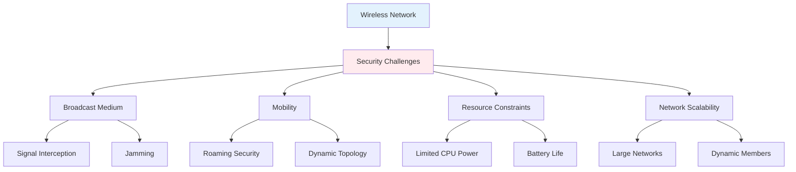

### 3.2 Trust Assumptions and Adversary Models

#### Trust Models

**Centralized Trust**:
- Single trusted authority
- Certificate authorities
- Key distribution centers

**Distributed Trust**:
- Peer-to-peer trust relationships
- Web of trust models
- No central authority

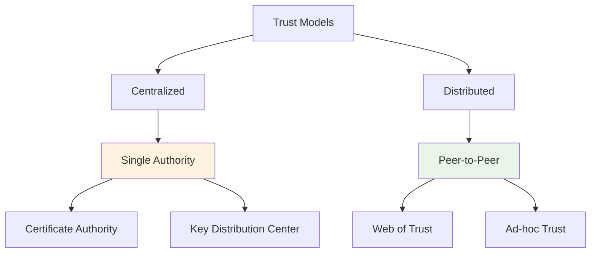

#### Adversary Models

**Passive Adversaries**:
- Eavesdropping on communications
- Traffic analysis
- No active interference

**Active Adversaries**:
- Message modification
- Impersonation
- Replay attacks
- Denial of service

**Mobile Adversaries**:
- Move through network
- May compromise multiple nodes
- Adaptive attack strategies

### 3.3 Security Protocols for Wireless Networks

#### Key Establishment Protocols

**Needham-Schroeder Protocol**:
- Establishes shared secrets
- Uses trusted third party
- Vulnerable to replay attacks

**Kerberos Protocol**:
- Ticket-based authentication
- Symmetric cryptography
- Trusted key distribution center

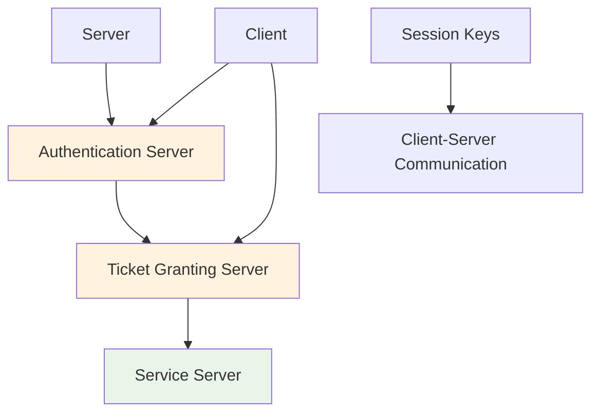

#### Wireless Specific Protocols

**WEP (Wired Equivalent Privacy)**:
- Deprecated security protocol
- RC4 stream cipher
- Weaknesses: Short IV, no replay protection

**WPA/WPA2**:
- Temporal Key Integrity Protocol (TKIP)
- Advanced Encryption Standard (AES)
- Stronger security than WEP

**WPA3**:
- Simultaneous Authentication of Equals (SAE)
- Forward secrecy
- Enhanced protection

### 3.4 Attacks Against Naming and Addressing in the Internet

#### DNS Vulnerabilities

**DNS Spoofing/Poisoning**:
- Corrupts DNS cache
- Redirects traffic to malicious sites
- Cache poisoning attacks

**DNS Amplification**:
- Uses DNS responses to amplify attacks
- Reflection-based DDoS attacks
- Spoofed source addresses

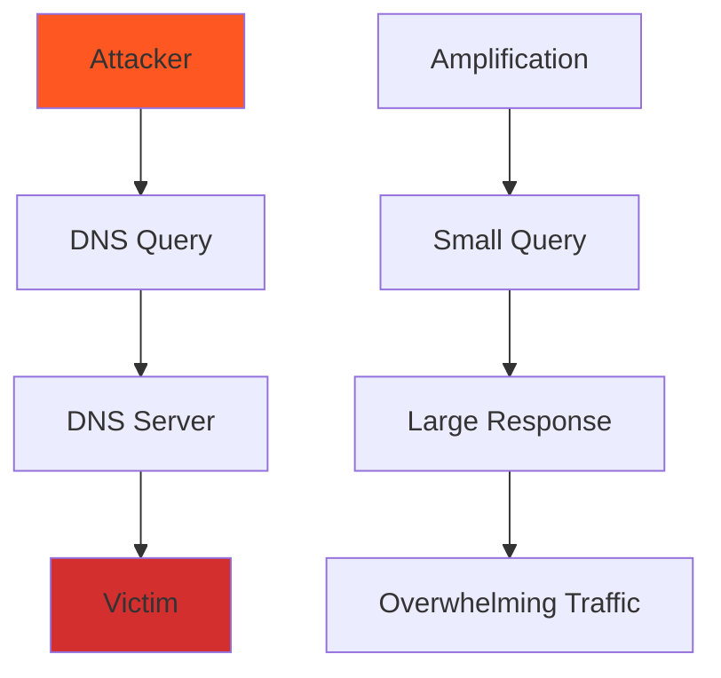

#### Address Resolution Attacks

**ARP Spoofing**:
- Associates attacker's MAC with victim's IP
- Redirects traffic through attacker
- Enables MITM attacks

**IPv6 Attacks**:
- Neighbor Discovery spoofing
- Router advertisement attacks
- Duplicate address detection attacks

### 3.5 Security Protocols for Address Resolution and Auto-Configuration

#### Secure Address Resolution

**ARP Security**:
- **ARP Secure**: Cryptographic protection
- **S-ARP**: Secure ARP with digital signatures
- **ARP Inspection**: Switch-based protection

```mermaid
graph TB
    A[ARP Request] --> B[ARP Cache]
    C[ARP Response] --> D[Security Check]
    D --> E[Cache Update]
    
    F[IP Address] --> G[MAC Address Resolution]
    G --> H[Authenticated Response]
    
    style E fill:#e8f5e8
    style H fill:#e8f5e8
```

#### IPv6 Security Extensions

**Secure Neighbor Discovery (SEND)**:
- Cryptographic protections for NDP
- Uses certificates and signatures
- Prevents spoofing attacks

**Auto-Configuration Security**:
- **Secure DHCPv6**: Authenticated address assignment
- **RA Guard**: Router advertisement protection
- **DHCPv6 Shield**: DHCPv6 message filtering

---

## Unit 4: Advanced Security Protocols in IP and Ad-hoc Networks

### 4.1 Security for Global IP Mobility

#### Mobile IP Architecture

**Components**:
- **Mobile Node (MN)**: Device changing locations
- **Home Agent (HA)**: Maintains persistent address
- **Foreign Agent (FA)**: Acts as gateway in foreign network
- **Correspondent Node (CN)**: Communication partner

```mermaid
graph TB
    A[Mobile Node] --> B[Foreign Network]
    A --> C[Home Network]
    C --> D[Home Agent]
    E[Correspondent Node] --> D
    D --> F[Tunnel]
    F --> G[Foreign Agent]
    G --> A
    
    H[Care-of Address] --> I[Foreign Agent]
    I --> J[Encapsulation]
    J --> A
    
    style D fill:#fff3e0
    style G fill:#fff3e0
```

#### Security Challenges in Mobile IP

**Registration Vulnerabilities**:
- Unauthorized registration
- Replay attacks on registration
- Tunnel hijacking

**Tunnel Security**:
- Packet interception in tunnel
- Tunnel endpoint spoofing
- Integrity and confidentiality issues

### 4.2 IP Security (IPSec) Protocol

#### IPSec Architecture

**Components**:
- **Authentication Header (AH)**: Provides integrity and authentication
- **Encapsulating Security Payload (ESP)**: Provides confidentiality
- **Internet Key Exchange (IKE)**: Key management protocol

```mermaid
graph TB
    A[Original IP Packet] --> B[IPSec Processing]
    
    B --> C[AH Mode]
    B --> D[ESP Mode]
    
    C --> E[Transport Mode]
    C --> F[Tunnel Mode]
    
    D --> G[Transport Mode]
    D --> H[Tunnel Mode]
    
    E --> I[AH Header Added]
    F --> J[New IP Header + AH]
    
    G --> K[ESP Header/Trailer Added]
    H --> L[New IP Header + ESP]
    
    style C fill:#e3f2fd
    style D fill:#f3e5f5
```

#### IPSec Modes

**Transport Mode**:
- Protects payload of IP packet
- Used for end-to-end communication
- Original IP header preserved

**Tunnel Mode**:
- Entire original packet encapsulated
- New IP header added
- Used for gateway-to-gateway communication

#### Security Associations (SAs)

**Components**:
- **Security Parameters Index (SPI)**: Identifies SA
- **Destination IP Address**: Endpoint of SA
- **Security Protocol**: AH or ESP

### 4.3 Key Establishment and Revocation Protocols in Sensor Networks

#### Sensor Network Challenges

**Resource Constraints**:
- Limited computational power
- Energy limitations
- Memory constraints

**Network Characteristics**:
- Large number of nodes
- Unattended deployment
- Dynamic topology

#### Key Establishment Methods

**Probabilistic Key Predistribution**:
```mermaid
graph TB
    A[Key Pool] --> B[Random Keys]
    B --> C[Node Key Rings]
    C --> D[Shared Key Discovery]
    D --> E[Secure Links]
    
    F[Key Pool Size: P] --> G[Keys per Node: k]
    G --> H[Probability: P_shared = k²/P]
    
    style E fill:#e8f5e8
```

**Deterministic Key Predistribution**:
- Grid-based schemes
- Polynomial-based schemes
- Deployment knowledge-based schemes

#### Key Revocation Mechanisms

**Revocation Triggers**:
- Node compromise detection
- Key exposure
- Network topology changes

**Revocation Methods**:
- Blacklisting compromised keys
- Re-keying neighbor nodes
- Network-wide key update

### 4.4 Secure Neighbor Discovery

#### Neighbor Discovery Protocol (NDP)

**Functions**:
- Address resolution
- Neighbor unreachability detection
- Router discovery
- Prefix discovery

```mermaid
graph TB
    A[Router Advertisement] --> B[Prefix Information]
    A --> C[Link-layer Address]
    
    D[Neighbor Solicitation] --> E[Address Resolution]
    F[Neighbor Advertisement] --> G[Reachability]
    
    H[Duplicate Address Detection] --> I[Address Conflict]
    
    style A fill:#fff3e0
    style D fill:#e3f2fd
    style F fill:#e8f5e8
```

#### Secure Neighbor Discovery (SEND)

**Security Mechanisms**:
- **Cryptographic Addresses**: CGA-based addresses
- **RSA Signatures**: Authenticity verification
- **Nonce-based Protection**: Replay attack prevention

```mermaid
graph TB
    A[SEND Message] --> B[Cryptographic Address]
    A --> C[RSA Signature]
    A --> D[Nonce]
    
    E[Verification] --> F[Address Validation]
    E --> G[Signature Check]
    E --> H[Nonce Validation]
    
    F --> I[Valid/Invalid]
    G --> I
    H --> I
    
    style I fill:#e8f5e8
```

### 4.5 Secure Routing Protocols in Multihop Wireless Networks

#### Ad-hoc Network Routing Challenges

**Security Requirements**:
- Route integrity
- Node authentication
- DoS resistance
- Privacy protection

#### Routing Protocols

**Proactive Protocols**:
- **OLSR (Optimized Link State Routing)**
- **DSDV (Destination-Sequenced Distance Vector)**

**Reactive Protocols**:
- **AODV (Ad-hoc On-Demand Distance Vector)**
- **DSR (Dynamic Source Routing)**

**Hybrid Protocols**:
- **ZRP (Zone Routing Protocol)**

```mermaid
graph TB
    A[Routing Protocols] --> B[Proactive]
    A --> C[Reactive]
    A --> D[Hybrid]
    
    B --> E[Periodic Updates]
    B --> F[Low Latency]
    B --> G[High Overhead]
    
    C --> H[On-demand Discovery]
    C --> I[Low Overhead]
    C --> J[High Latency]
    
    D --> K[Zone-based]
    D --> L[Adaptive]
    
    style B fill:#e3f2fd
    style C fill:#f3e5f5
    style D fill:#e8f5e8
```

#### Secure Routing Mechanisms

**SAODV (Secure AODV)**:
- Digital signatures for route discovery
- Hash chains for hop authentication
- Timestamp-based replay protection

**SRP (Secure Routing Protocol)**:
- Route request/reply authentication
- Source routing security
- Byzantine fault tolerance

### 4.6 Provable Security for Ad-hoc Network Routing Protocols

#### Provable Security Framework

**Security Model**:
- Adversary capabilities definition
- Security goals specification
- Threat model establishment

**Proof Techniques**:
- **Reduction-based proofs**: Show security reduction to hard problems
- **Game-based proofs**: Formal security games
- **Simulation-based proofs**: Ideal-world/real-world simulation

```mermaid
graph TB
    A[Provable Security] --> B[Security Model]
    A --> C[Adversary Model]
    A --> D[Security Proof]
    
    B --> E[Formal Definitions]
    C --> F[Capabilities]
    D --> G[Reduction Proof]
    
    E --> H[IND-CPA, IND-CCA]
    F --> I[PPT Adversaries]
    G --> J[Computational Hardness]
    
    style D fill:#e8f5e8
```

#### Formal Verification Tools

**Automated Tools**:
- **ProVerif**: Cryptographic protocol verification
- **AVISPA**: Security protocol verification
- **Tamarin Prover**: Symbolic protocol analysis

**Manual Analysis**:
- State-space exploration
- Dolev-Yao attacker model
- Cryptographic reductions

---

## Unit 5: Privacy and Security in Ad-hoc and Vehicular Networks

### 5.1 Privacy-Preserving Routing in Ad-hoc Networks

#### Privacy Requirements in Ad-hoc Networks

**Location Privacy**:
- Concealing node positions
- Preventing location tracking
- Maintaining route anonymity

**Identity Privacy**:
- Unlinkability of communications
- Anonymity of participants
- Pseudonym-based systems

**Traffic Analysis Resistance**:
- Preventing pattern recognition
- Hiding communication patterns
- Timing obfuscation

#### Privacy-Preserving Techniques

**Mix Networks**:
```mermaid
graph TB
    A[Source Node] --> B[Mix Node 1]
    B --> C[Mix Node 2]
    C --> D[Mix Node 3]
    D --> E[Destination Node]
    
    F[Multiple Messages] --> G[Batch Processing]
    G --> H[Decryption and Re-encryption]
    H --> I[Output Ordering Randomization]
    
    style B fill:#fff3e0
    style C fill:#fff3e0
    style D fill:#fff3e0
```

**Onion Routing**:
- Encrypted message layers
- Each hop decrypts one layer
- Source anonymity maintained

**Pseudonym Systems**:
- Temporary identities
- Certificate-based pseudonyms
- Revocation mechanisms

#### Anonymous Routing Protocols

**ANODR (Anonymous On-Demand Routing)**:
- Route discovery without revealing identities
- Trapdoor-based routing
- Anonymous feedback mechanism

**ASR (Anonymous Secure Routing)**:
- Multi-path routing for anonymity
- Cryptographic protection
- Identity obfuscation

### 5.2 Location Privacy in Vehicular Ad-hoc Networks (VANETs)

#### VANET Architecture

**Components**:
- **On-Board Units (OBUs)**: Vehicle-mounted devices
- **Roadside Units (RSUs)**: Infrastructure components
- **Trusted Authority (TA)**: Central management

```mermaid
graph TB
    A[OBU - Vehicle 1] --> B[RSU 1]
    A --> C[OBU - Vehicle 2]
    
    D[OBU - Vehicle 3] --> E[RSU 2]
    D --> C
    
    F[Trusted Authority] --> G[Certificate Management]
    F --> H[Privacy Protection]
    
    style F fill:#fff3e0
    style B fill:#e3f2fd
    style E fill:#e3f2fd
```

#### Location Privacy Challenges

**Location Inference Attacks**:
- Tracking vehicle movements
- Correlating temporal patterns
- Social network analysis

**Contextual Attacks**:
- Combining multiple data sources
- Geographic database correlation
- Side-channel information

#### Privacy-Preserving Techniques

**Pseudonym Changing Strategies**:
- **Mix-zones**: Areas for pseudonym changes
- **Context-aware pseudonym switching**
- **Privacy budget management**

**k-Anonymity**:
- Ensures each record indistinguishable from k-1 others
- Generalized location information
- Temporal cloaking

**Differential Privacy**:
- Adds calibrated noise to query results
- Formal privacy guarantees
- Utility-privacy tradeoff

### 5.3 Secure Protocols for Behavior Enforcement

#### Behavioral Trust Models

**Trust Components**:
- **Direct Trust**: Based on direct interactions
- **Indirect Trust**: Based on recommendations
- **Reputation Systems**: Community-based trust

```mermaid
graph TB
    A[Trust Evaluation] --> B[Direct Experience]
    A --> C[Recommendations]
    A --> D[Context Factors]
    
    B --> E[Interaction History]
    C --> F[Peer Reports]
    C --> G[Authority Endorsements]
    
    D --> H[Time Decay]
    D --> I[Context Relevance]
    D --> J[Risk Assessment]
    
    E --> K[Trust Score]
    F --> K
    G --> K
    H --> K
    I --> K
    J --> K
    
    style K fill:#e8f5e8
```

#### Misbehavior Detection

**Detection Methods**:
- **Anomaly Detection**: Statistical analysis of behavior
- **Reputation-based Detection**: Community reporting
- **Certificate Validation**: Cryptographic verification

**Response Mechanisms**:
- **Revocation**: Removing malicious nodes
- **Isolation**: Excluding from network
- **Punishment**: Negative reputation impact

#### Incentive Mechanisms

**Reputation-based Incentives**:
- Reward cooperative behavior
- Penalize malicious actions
- Encourage trust-building

**Cryptographic Incentives**:
- **Bitcoin-like systems**: Digital currency rewards
- **Game theory models**: Strategic behavior analysis
- **Smart contracts**: Automated enforcement

### 5.4 Game Theoretic Model of Packet Forwarding

#### Game Theory in Networks

**Basic Concepts**:
- **Players**: Network nodes
- **Strategies**: Cooperation vs. defection
- **Payoffs**: Benefits of different actions
- **Equilibrium**: Stable strategy profile

#### Packet Forwarding Game

**Game Setup**:
- **Players**: Source node, intermediate nodes, destination
- **Actions**: Forward packet or drop packet
- **Payoffs**: Energy cost vs. benefit

```mermaid
graph TB
    A[Source Node] --> B[Forward Packet]
    B --> C[Energy Cost]
    
    D[Intermediate Node] --> E[Forward]
    E --> F[Energy Cost]
    E --> G[Reward from Source]
    
    H[Destination] --> I[Receive Packet]
    I --> J[Utility]
    
    K[Payoff Matrix] --> L[Cooperate/Defect]
    
    style E fill:#e8f5e8
    style I fill:#e8f5e8
```

#### Nash Equilibrium Analysis

**Equilibrium Strategies**:
- All nodes cooperate
- Mixed strategy equilibrium
- Punishment strategies

**Stability Conditions**:
- Incentive compatibility
- Individual rationality
- Computational efficiency

#### Incentive-Compatible Protocols

**Credit-based Systems**:
- **Sprite**: Credit-based incentive scheme
- **POC: Payment-based scheme**
- **FIFC: Fair incentive framework**

**Cryptographic Protocols**:
- **Hash-based commitment**: Prevent cheating
- **Zero-knowledge proofs**: Verify actions
- **Smart contracts**: Automated payments

#### Implementation Considerations

**Overhead Analysis**:
- Computational overhead
- Communication overhead
- Storage requirements

**Security Assumptions**:
- Computational hardness
- Adversary models
- Trust assumptions

---

## Summary and Key Takeaways

This comprehensive guide covers the fundamental and advanced concepts in cybersecurity for wireless and ad-hoc networks. Key areas include:

1. **Security Fundamentals**: Understanding threats, vulnerabilities, and attack vectors
2. **Cryptographic Techniques**: Building blocks for secure communications
3. **Wireless Security Challenges**: Unique issues in wireless environments
4. **Advanced Protocols**: IPSec, Mobile IP, and secure routing
5. **Privacy and Trust**: Maintaining privacy in dynamic networks

The field continues to evolve with new challenges in IoT, 5G, and beyond, requiring continuous research and development of security mechanisms.

---

## References and Further Reading

1. **Textbooks**:
   - "Wireless Communications and Networks" by William Stallings
   - "Computer Security: Art and Science" by Matt Bishop
   - "Cryptography and Network Security" by William Stallings

2. **Standards and RFCs**:
   - RFC 2401: Security Architecture for IP
   - RFC 2402: IP Authentication Header
   - RFC 2406: IP Encapsulating Security Payload
   - RFC 3971: Secure Neighbor Discovery (SEND)

3. **Research Papers**:
   - Current research in ACM CCS, IEEE S&P, NDSS conferences
   - Journal of Computer Security articles
   - IEEE Transactions on Wireless Communications

---

*This document provides comprehensive coverage of cybersecurity in wireless and ad-hoc networks, suitable for B.Tech. CSE students specializing in cybersecurity. Each section includes theoretical foundations, practical implementations, and visual representations to enhance understanding.*


