# UNIT 1: FUNDAMENTALS OF SECURITY AND THREATS
## Comprehensive Detailed Notes with Visual Diagrams

---

## Table of Contents
1. [Introduction to Security and the CIA Triad](#introduction-to-security-and-the-cia-triad)
2. [Security Concepts](#security-concepts)
3. [Malware Terminology](#malware-terminology)
4. [Types of Security Attacks](#types-of-security-attacks)
5. [Types of Security Vulnerabilities](#types-of-security-vulnerabilities)

---

## Introduction to Security and the CIA Triad

### Core Security Principles

The foundation of cybersecurity rests on three fundamental principles known as the **CIA Triad**, which forms the cornerstone of all security architectures and implementations:

#### 1. Confidentiality
**Definition**: Ensuring that information is accessible only to authorized individuals, entities, or processes.

**Key Characteristics**:
- **Data Classification**: Categorizing information based on sensitivity levels
- **Access Control**: Implementing mechanisms to restrict access
- **Encryption**: Converting data into unreadable format for unauthorized parties
- **Data Masking**: Hiding specific data elements within a data structure

**Implementation Techniques**:
- **Encryption at Rest**: Data encrypted when stored
- **Encryption in Transit**: Data encrypted during transmission
- **Access Control Lists (ACLs)**: Define who can access what
- **Role-Based Access Control (RBAC)**: Permissions based on job functions

#### 2. Integrity
**Definition**: Maintaining the accuracy, completeness, and trustworthiness of data over its entire lifecycle.

**Key Characteristics**:
- **Data Consistency**: Ensuring data remains unaltered
- **Modification Detection**: Identifying unauthorized changes
- **Tamper Resistance**: Preventing unauthorized modifications
- **Audit Trails**: Recording all data modifications

**Implementation Techniques**:
- **Cryptographic Hash Functions**: MD5, SHA-256, SHA-3
- **Digital Signatures**: Ensuring authenticity and integrity
- **Checksums**: Simple integrity verification
- **Version Control**: Tracking data changes over time

#### 3. Availability
**Definition**: Ensuring that information and resources are accessible and usable on demand by authorized entities.

**Key Characteristics**:
- **System Reliability**: Maintaining consistent operation
- **Performance Optimization**: Ensuring fast response times
- **Disaster Recovery**: Rapid restoration after failures
- **Scalability**: Handling increased demand gracefully

**Implementation Techniques**:
- **Redundancy**: Multiple backup systems
- **Load Balancing**: Distributing traffic across multiple servers
- **Failover Mechanisms**: Automatic switching to backup systems
- **Regular Backups**: Ensuring data recovery capability

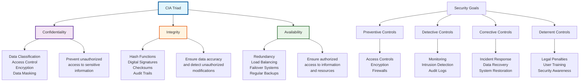

### Security Goals and Objectives Framework

#### Preventive Controls
**Purpose**: Stop attacks before they occur
**Implementation**:
- **Physical Controls**: Locks, barriers, surveillance
- **Technical Controls**: Firewalls, encryption, access controls
- **Administrative Controls**: Policies, procedures, training

#### Detective Controls
**Purpose**: Identify when attacks are happening or have occurred
**Implementation**:
- **Monitoring Systems**: Real-time threat detection
- **Log Analysis**: Automated and manual log review
- **Anomaly Detection**: Statistical analysis for unusual patterns

#### Corrective Controls
**Purpose**: Respond to and recover from attacks
**Implementation**:
- **Incident Response Plans**: Structured response procedures
- **Backup Systems**: Data and system recovery mechanisms
- **System Patching**: Updating systems to fix vulnerabilities

#### Deterrent Controls
**Purpose**: Discourage potential attackers
**Implementation**:
- **Warning Signs**: Visible security measures
- **Legal Consequences**: Clear penalty information
- **User Education**: Training on security importance

---

## Security Concepts

### 1.2.1 Exploit, Threat, Vulnerability, Risk, and Attack

Understanding the relationship between these concepts is crucial for cybersecurity professionals:

#### Vulnerability
**Definition**: A weakness in a system, application, network, or process that could be exploited by threats to gain unauthorized access or cause harm.

**Types of Vulnerabilities**:
1. **Technical Vulnerabilities**:
   - Software bugs and programming errors
   - Misconfigurations
   - Design flaws
   - Protocol weaknesses

2. **Human Vulnerabilities**:
   - Social engineering susceptibility
   - Password reuse and weak passwords
   - Lack of security awareness
   - Insider threats

3. **Physical Vulnerabilities**:
   - Unsecured physical access
   - Environmental factors
   - Equipment theft
   - Natural disasters

#### Threat
**Definition**: A potential cause of an unwanted incident, which may result in harm to a system or organization.

**Threat Categories**:
1. **Natural Threats**:
   - Earthquakes, floods, fires
   - Extreme weather conditions
   - Natural aging of equipment

2. **Human Threats**:
   - **Insider Threats**: Employees, contractors, partners
   - **External Threats**: Hackers, cybercriminals, nation-states
   - **Unintentional Threats**: Human error, accidents

3. **Technical Threats**:
   - Hardware failures
   - Software malfunctions
   - Network outages
   - Malware infections

#### Exploit
**Definition**: A method or technique used to take advantage of a vulnerability to gain unauthorized access or cause harm.

**Exploit Categories**:
1. **Zero-Day Exploits**: Unknown vulnerabilities with no available patches
2. **Known Exploits**: Publicly disclosed vulnerabilities
3. **Proof-of-Concept (PoC)**: Demonstrates exploitability
4. **Weaponized Exploits**: Ready-to-use malicious tools

#### Attack
**Definition**: An actual attempt to exploit vulnerabilities to compromise confidentiality, integrity, or availability.

**Attack Characteristics**:
- **Intentional**: Deliberate malicious action
- **Successful**: Exploitation that achieves the attacker's goal
- **Unauthorized**: Without proper permission or authorization

#### Risk
**Definition**: The potential for loss or damage when a threat exploits a vulnerability.

**Risk Assessment Formula**:
```
Risk = Threat × Vulnerability × Impact
```

**Risk Components**:
- **Likelihood**: Probability of threat occurrence
- **Impact**: Magnitude of potential damage
- **Exposure**: Degree of vulnerability exposure

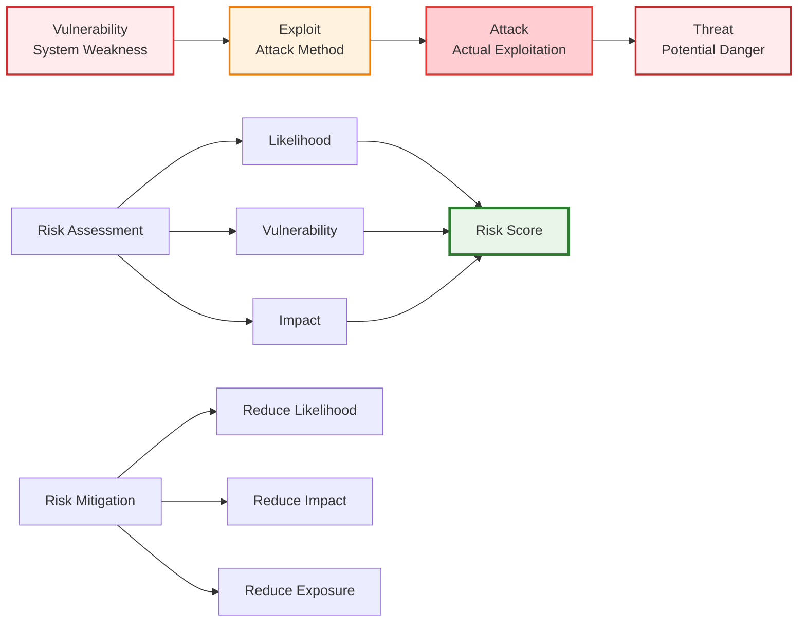

### 1.2.2 Malware Overview

**Malware** (malicious software) encompasses any software intentionally designed to cause damage to a computer, server, client, or computer network.

#### Malware Characteristics
- **Malicious Intent**: Designed to harm, exploit, or gain unauthorized access
- **Self-Replication**: Many types can spread themselves
- **Persistence**: Ability to survive system reboots and removal attempts
- **Evasion**: Techniques to avoid detection and removal

#### Malware Evolution
1. **First Generation (1970s-1980s)**:
   - Computer worms and viruses
   - Simple replication mechanisms
   - Limited damage capabilities

2. **Second Generation (1990s)**:
   - Advanced stealth techniques
   - Network-based spreading
   - More sophisticated payloads

3. **Third Generation (2000s-2010s)**:
   - Crimeware and ransomware
   - Targeted attacks
   - Advanced evasion techniques

4. **Fourth Generation (2010s-Present)**:
   - Nation-state malware
   - AI-enhanced attacks
   - Supply chain compromises

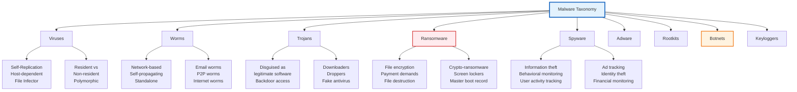

---

## Malware Terminology

### 1.3.1 Rootkits, Trapdoors, Botnets, and Keyloggers

#### Rootkits

**Definition**: Software designed to hide malicious activities and provide persistent access to a system with elevated privileges.

**Types of Rootkits**:

1. **Kernel-Level Rootkits**:
   - Modify operating system kernel
   - Highest privilege level
   - Extremely difficult to detect
   - Example: NTROOTKIT, FU

2. **User-Level Rootkits**:
   - Replace system binaries
   - Modify user-mode processes
   - Easier to detect than kernel-level
   - Example: HackerDefender

3. **Firmware Rootkits**:
   - Target hardware firmware
   - Survive operating system reinstallation
   - Extremely persistent
   - Example: Equation Group malware

4. **Virtual Machine Rootkits**:
   - Run beneath the operating system
   - Virtualize the entire system
   - Nearly invisible to the OS
   - Example: Blue Pill

**Rootkit Detection Techniques**:
- **Behavior Analysis**: Monitoring system behavior for anomalies
- **Integrity Checking**: Verifying system file integrity
- **Hardware-based Detection**: Using hardware security features
- **Memory Analysis**: Examining running processes and memory

#### Trapdoors (Backdoors)

**Definition**: Hidden methods of bypassing normal authentication or encryption to access a system.

**Types of Backdoors**:

1. **Software Backdoors**:
   - Modified legitimate programs
   - Hidden account creation
   - Remote access tools
   - Example: Netcat, Back Orifice

2. **Hardware Backdoors**:
   - Modified firmware
   - Hidden processing units
   - Supply chain compromises
   - Example: NSA ANT catalog devices

3. **Network Backdoors**:
   - Modified network protocols
   - Encrypted communication channels
   - Port knocking mechanisms
   - Example: Staged backdoors

#### Botnets

**Definition**: Networks of compromised computers (bots/zombies) controlled remotely by an attacker (botmaster).

**Botnet Architecture**:

1. **Centralized Architecture**:
   - Single command and control (C&C) server
   - Direct communication with bots
   - Fast response time
   - Single point of failure

2. **Decentralized Architecture**:
   - Multiple C&C servers
   - Peer-to-peer communication
   - Distributed control
   - More resilient

3. **Fast Flux Architecture**:
   - Rapidly changing IP addresses
   - Domain name system (DNS) manipulation
   - Difficult to take down
   - Highly dynamic

**Botnet Capabilities**:
- **DDoS Attacks**: Overwhelming target systems
- **Spam Distribution**: Sending bulk emails
- **Data Theft**: Stealing sensitive information
- **Click Fraud**: Generating fake web traffic
- **Cryptocurrency Mining**: Illicit mining operations

#### Keyloggers

**Definition**: Software or hardware that records keystrokes on a computer or mobile device.

**Types of Keyloggers**:

1. **Software Keyloggers**:
   - **Kernel-level**: Operating system integration
   - **User-level**: Application-based recording
   - **Hook-based**: Windows API hooking
   - **Memory-based**: Capturing keyboard buffer

2. **Hardware Keyloggers**:
   - **USB devices**: Plug between keyboard and computer
   - **PS/2 connectors**: Traditional keyboard connections
   - **Wireless interceptors**: Capturing wireless keyboard signals
   - **Inline devices**: Installed on keyboard cable

**Detection and Prevention**:
- **Antivirus software**: Real-time monitoring
- **Behavioral analysis**: Detecting unusual system behavior
- **Hardware inspection**: Physical security checks
- **Network monitoring**: Analyzing outgoing data

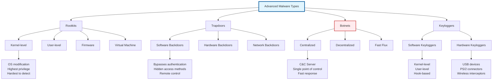

### 1.3.2 Honeypots

**Definition**: Decoy systems designed to attract attackers and study their behavior, techniques, and tools.

#### Honeypot Classification

**By Interaction Level**:
1. **Low-Interaction Honeypots**:
   - Simulate limited services
   - Low risk of compromise
   - Gather basic attack information
   - Example: Honeyd, LaBrea Tarpit

2. **Medium-Interaction Honeypots**:
   - Provide more realistic services
   - Balance between information and security
   - More detailed attack analysis
   - Example: Glastopf, Wordpot

3. **High-Interaction Honeypots**:
   - Full operating system implementation
   - Real services and applications
   - Maximum information gathering
   - Higher security risk

**By Deployment Purpose**:
1. **Research Honeypots**:
   - Academic and research purposes
   - Long-term deployment
   - Detailed attack analysis
   - Threat intelligence gathering

2. **Production Honeypots**:
   - Enterprise security enhancement
   - Real-time attack detection
   - Security improvement insights
   - Intrusion detection supplement

#### Honeypot Architecture

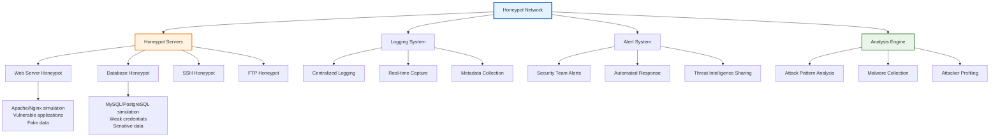

#### Honeypot Deployment Strategies

**Network Positioning**:
- **Deceptive Perimeter**: Outside main network defenses
- **Internal Network**: Within corporate network
- **DMZ**: Demilitarized zone placement
- **Cloud Environment**: Distributed honeypots

**Service Emulation**:
- **Common Services**: HTTP, SSH, FTP, SMTP
- **Vulnerable Applications**: Known vulnerable software
- **Industrial Control Systems**: SCADA/ICS simulation
- **IoT Devices**: Smart home and industrial devices

#### Honeypot Analysis and Intelligence

**Data Collection**:
- **Attack Vectors**: Methods used to compromise
- **Malware Samples**: Collected malicious software
- **Attack Patterns**: Behavioral analysis
- **Attacker Attribution**: Geographic and organizational mapping

**Intelligence Applications**:
- **Threat Hunting**: Proactive threat identification
- **Security Control Enhancement**: Improving defenses
- **Incident Response**: Understanding attack methodologies
- **Industry Sharing**: Collaborative threat intelligence

---

## Types of Security Attacks

### 1.4.1 Active and Passive Attacks

Understanding the distinction between active and passive attacks is fundamental to network security.

#### Passive Attacks

**Definition**: Attacks that do not alter system data or interfere with system operations but rather monitor or eavesdrop on communications.

**Characteristics**:
- **Non-intrusive**: No modification of data or systems
- **Stealthy**: Difficult to detect
- **Information gathering**: Focus on data collection
- **Long-term**: Can be sustained indefinitely

**Types of Passive Attacks**:

1. **Eavesdropping**:
   - Intercepting network communications
   - Capturing data in transit
   - Analyzing communication patterns
   - **Tools**: Network sniffers, packet analyzers

2. **Traffic Analysis**:
   - Monitoring communication patterns
   - Identifying communicating parties
   - Analyzing timing and frequency
   - **Applications**: Military intelligence, competitive analysis

3. **Information Interception**:
   - Capturing sensitive information
   - Password harvesting
   - Session hijacking preparation
   - **Methods**: Man-in-the-middle attacks, network taps

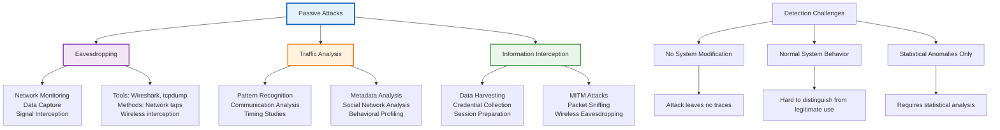

#### Active Attacks

**Definition**: Attacks that involve some modification of data or interference with system operations.

**Characteristics**:
- **Intrusive**: Actively modify systems or data
- **Detectable**: Often leave traces of activity
- **Disruptive**: Can cause service interruptions
- **Immediate impact**: Effects are often immediate

**Types of Active Attacks**:

1. **Modification Attacks**:
   - **Data Alteration**: Changing information content
   - **System Configuration**: Modifying system settings
   - **Code Injection**: Adding malicious code
   - **Software Tampering**: Altering program behavior

2. **Fabrication Attacks**:
   - **False Data Creation**: Generating fake information
   - **Spoofing**: Impersonating legitimate entities
   - **Replay Attacks**: Re-transmitting captured data
   - **False Alarms**: Generating misleading notifications

3. **Interruption Attacks**:
   - **Denial of Service**: Overwhelming resources
   - **System Shutdown**: Causing system failures
   - **Network Disruption**: Breaking connectivity
   - **Data Destruction**: Deleting or corrupting data

4. **Replay Attacks**:
   - **Message Replay**: Re-transmitting valid messages
   - **Session Replay**: Replaying authentication sequences
   - **Transaction Replay**: Repeating valid transactions
   - **Certificate Replay**: Reusing valid credentials

```mermaid
graph TB
    A[Active Attacks] --> B[Modification]
    A --> C[Fabrication]
    A --> D[Interruption]
    A --> E[Replay]
    
    B --> B1[Data Alteration<br/>System Changes<br/>Code Injection]
    B --> B2[XSS Attacks<br/>SQL Injection<br/>Buffer Overflows]
    
    C --> C1[False Data Creation<br/>Spoofing<br/>Impersonation]
    C --> C2[IP Spoofing<br/>Email Spoofing<br/>DNS Poisoning]
    
    D --> D1[Service Disruption<br/>Resource Exhaustion<br/>System Failures]
    D --> D2[DoS Attacks<br/>Network Jamming<br/>System Crashes]
    
    E --> E1[Message Replay<br/>Session Replay<br/>Transaction Replay]
    E --> E2[Authentication Bypass<br/>Transaction Fraud<br/>Certificate Reuse]
    
    F[Detection Methods] --> G[System Monitoring]
    F --> H[Integrity Checks]
    F --> I[Audit Logging]
    
    G --> G1[Real-time alerts<br/>Anomaly detection<br/>Performance monitoring]
    H --> H1[Checksum verification<br/>Digital signatures<br/>Hash comparisons]
    I --> I1[Access logs<br/>System changes<br/>Network traffic]
    
    style A fill:#ffebee,stroke:#c62828,stroke-width:3px
    style B fill:#fff3e0,stroke:#f57c00,stroke-width:2px
    style C fill:#fce4ec,stroke:#ad1457,stroke-width:2px
    style D fill:#ffcdd2,stroke:#e53935,stroke-width:2px
    style E fill:#f3e5f5,stroke:#7b1fa2,stroke-width:2px
```

### 1.4.2 IP Spoofing, Tear Drop, DoS, and DDoS

#### IP Spoofing

**Definition**: Forging the source IP address in network packets to hide the true origin or impersonate another system.

**IP Spoofing Techniques**:

1. **Blind Spoofing**:
   - Attacker cannot see response packets
   - Used in connectionless protocols
   - Requires sequence number prediction
   - Example: UDP flooding attacks

2. **Non-Blind Spoofing**:
   - Attacker can see response packets
   - Used in connection-oriented protocols
   - More accurate sequence number prediction
   - Example: TCP session hijacking

3. **Fragmentation Attacks**:
   - Exploiting IP fragmentation
   - Overlapping fragment reassembly
   - Evasion of security filters
   - Example: Teardrop attack

**IP Spoofing Applications**:
- **DDoS Amplification**: Reflecting attacks off third parties
- **Bypassing Access Controls**: IP-based authentication
- **Evading Attribution**: Hiding attacker identity
- **Man-in-the-Middle Attacks**: Interception positioning

#### Tear Drop Attack

**Definition**: A specific type of IP fragmentation attack that exploits vulnerabilities in reassembly algorithms.

**Attack Mechanism**:
1. **Fragment Creation**: Attacker sends overlapping IP fragments
2. **Reassembly Vulnerability**: Target system fails to handle overlapping fragments properly
3. **System Crash**: Causes system instability or crashes
4. **Denial of Service**: Disrupts normal system operation

**Technical Details**:
- **Fragment Offset**: Indicates position of fragment data
- **Fragment Overlap**: Fragments claim overlapping memory regions
- **Reassembly Buffer**: Vulnerable to buffer overflows
- **Platform Specificity**: Different operating systems affected differently

#### DoS (Denial of Service) Attacks

**Definition**: Attacks designed to make a system or network resource unavailable to legitimate users.

**DoS Attack Categories**:

1. **Volume-Based Attacks**:
   - **UDP Floods**: High-volume UDP traffic
   - **ICMP Floods**: Excessive ping requests
   - **Amplification Attacks**: Leveraging open services
   - **Goal**: Consume bandwidth

2. **Protocol Attacks**:
   - **SYN Floods**: Incomplete TCP connections
   - **Ping of Death**: Oversized ping packets
   - **Smurf Attacks**: Broadcast ping amplification
   - **Goal**: Consume server resources

3. **Application Layer Attacks**:
   - **HTTP Floods**: High-volume web requests
   - **Slowloris**: Slow HTTP connections
   - **R.U.D.Y. (R-U-Dead-Yet)**: Slow POST requests
   - **Goal**: Consume application resources

#### DDoS (Distributed Denial of Service) Attacks

**Definition**: Coordinated attacks from multiple compromised systems targeting a single victim.

**DDoS Architecture**:
1. **Botnet Creation**: Compromising multiple systems
2. **Command and Control**: Centralized or distributed C&C
3. **Attack Coordination**: Synchronized attack execution
4. **Traffic Amplification**: Leveraging reflection/amplification

**DDoS Attack Types**:

1. **Application Layer DDoS**:
   - HTTP/HTTPS floods
   - Slow HTTP attacks
   - SSL exhaustion
   - Database query floods

2. **Protocol Layer DDoS**:
   - SYN floods
   - Fragmented packet attacks
   - Ping of death
   - TCP state exhaustion

3. **Network Layer DDoS**:
   - UDP floods
   - ICMP floods
   - ARP spoofing
   - Route table poisoning

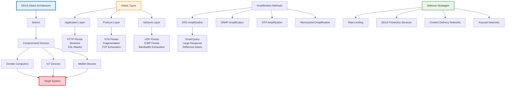

### 1.4.3 XSS, SQL Injection, Smurf, and Man-in-the-Middle Attacks

#### XSS (Cross-Site Scripting)

**Definition**: Injecting malicious scripts into web pages viewed by other users.

**XSS Attack Process**:
1. **Payload Injection**: Malicious script injected into web application
2. **User Interaction**: Legitimate user visits compromised page
3. **Script Execution**: Malicious script runs in user's browser
4. **Data Exfiltration**: Sensitive information stolen or actions performed

**XSS Types**:

1. **Stored XSS (Persistent)**:
   - Malicious script stored in database
   - Affects multiple users
   - Higher impact and persistence
   - Example: Comment sections, user profiles

2. **Reflected XSS (Non-Persistent)**:
   - Script reflected from current HTTP request
   - Single-user impact
   - Requires user interaction
   - Example: Search results, error messages

3. **DOM-based XSS**:
   - Client-side code vulnerability
   - No server-side processing required
   - Browser processes malicious data
   - Example: JavaScript DOM manipulation

**XSS Payload Examples**:
- **Cookie Stealing**: `document.cookie`
- **Session Hijacking**: `sessionStorage`
- **Keylogging**: Event listeners for keyboard input
- **Phishing**: Fake login forms
- **Malware Distribution**: Drive-by downloads

#### SQL Injection

**Definition**: Injecting malicious SQL queries into application inputs to manipulate database operations.

**SQL Injection Types**:

1. **Error-based SQL Injection**:
   - Force database to generate error messages
   - Reveals database structure and content
   - Information gathering phase
   - Example: `' OR '1'='1`

2. **Union-based SQL Injection**:
   - Combine query results with malicious SELECT
   - Extract data from other tables
   - Requires knowledge of table structure
   - Example: `UNION SELECT password FROM users`

3. **Blind SQL Injection**:
   - No error messages displayed
   - Boolean-based and time-based techniques
   - Slower but stealthier
   - Example: Conditional statements

4. **Time-based SQL Injection**:
   - Uses time delays to infer information
   - Database-specific timing functions
   - No visible output required
   - Example: `SLEEP(10)` functions

**SQL Injection Mitigation**:
- **Parameterized Queries**: Pre-compiled SQL statements
- **Input Validation**: Whitelist acceptable inputs
- **Least Privilege**: Database user permissions
- **Error Handling**: Generic error messages

#### Smurf Attack

**Definition**: A network-level DoS attack that exploits ICMP echo requests sent to broadcast addresses.

**Smurf Attack Mechanism**:
1. **ICMP Echo Request**: Attacker sends ping to broadcast address
2. **Spoofed Source IP**: Source IP set to victim's address
3. **Broadcast Amplification**: All hosts respond to broadcast
4. **Victim Overload**: Victim overwhelmed by responses

**Smurf Attack Process**:
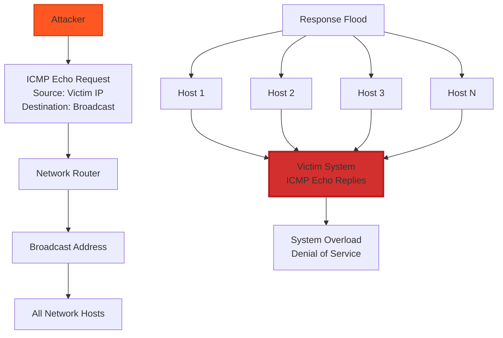

#### Man-in-the-Middle (MITM) Attacks

**Definition**: Intercepting and possibly altering communications between two parties who believe they are directly communicating.

**MITM Attack Categories**:

1. **Passive MITM**:
   - Eavesdropping only
   - No modification of data
   - Difficult to detect
   - Information gathering

2. **Active MITM**:
   - Data modification
   - Session hijacking
   - Message injection
   - More detectable

**MITM Attack Techniques**:

1. **ARP Poisoning**:
   - Sends fake ARP responses
   - Associates attacker's MAC with victim's IP
   - Redirects traffic through attacker
   - Local network attacks

2. **DNS Spoofing**:
   - Corrupts DNS cache
   - Returns malicious IP addresses
   - Redirects to fake websites
   - Browser hijacking

3. **SSL/TLS Stripping**:
   - Downgrades HTTPS to HTTP
   - Man-in-the-middle on secure connections
   - Cookie and session theft
   - Certificate manipulation

4. **WiFi Eavesdropping**:
   - Unsecured WiFi networks
   - Evil twin attacks
   - Deauthentication attacks
   - Traffic interception

```mermaid
graph TB
    A[MITM Attack Scenario] --> B[Alice]
    A --> C[Attacker (MITM)]
    A --> D[Bob]
    
    B -.->|Encrypted?| C
    C -.->|Decrypted| D
    
    E[Attack Phases] --> F[Interception]
    E --> G[Decryption]
    E --> H[Manipulation]
    E --> I[Re-encryption]
    
    F --> F1[Position between parties<br/>Capture traffic<br/>Bypass security]
    
    G --> G1[Key extraction<br/>Certificate manipulation<br/>Protocol downgrade]
    
    H --> H1[Data modification<br/>Message injection<br/>Session hijacking]
    
    I --> I1[Re-encrypt modified data<br/>Forward to destination<br/>Maintain illusion]
    
    J[Common Techniques] --> K[ARP Poisoning]
    J --> L[DNS Spoofing]
    J --> M[SSL Stripping]
    J --> N[WiFi Attacks]
    
    style C fill:#ff5722,stroke:#d84315,stroke-width:3px
    style A fill:#ffcdd2,stroke:#c62828,stroke-width:2px
    style F fill:#fff3e0,stroke:#ef6c00,stroke-width:2px
```

### 1.4.4 Format String Attack

**Definition**: Exploiting insufficient input validation in functions that process format strings to read from or write to arbitrary memory locations.

#### Format String Vulnerabilities

**Vulnerable Functions**:
- **C Standard Library**: `printf()`, `sprintf()`, `fprintf()`
- **System Functions**: `syslog()`, `vsnprintf()`
- **Security Implications**: Memory disclosure and arbitrary code execution

**Attack Mechanism**:
1. **User Input as Format String**: Application uses user input as format string parameter
2. **Format Specifiers**: Malicious format specifiers manipulate stack
3. **Memory Access**: Reading or writing arbitrary memory locations
4. **Exploitation**: Information disclosure or code execution

#### Format String Attack Types

1. **Information Disclosure**:
   - **%x Specifier**: Reads stack values as hexadecimal
   - **%s Specifier**: Attempts to read string at memory address
   - **%p Specifier**: Prints pointer values
   - **%n Specifier**: Writes number of characters written

2. **Memory Corruption**:
   - **Stack Overflow**: Overwriting return addresses
   - **Heap Corruption**: Overwriting heap metadata
   - **Arbitrary Write**: Using `%n` to write to memory
   - **Code Execution**: Overwriting function pointers

**Attack Examples**:

**Information Disclosure**:
```
Input: "AAAA %x %x %x %x"
Output: Shows stack contents
```

**Arbitrary Write**:
```
Input: "BBBB %n"
Effect: Writes 4 to memory location on stack
```

**Exploitation Process**:
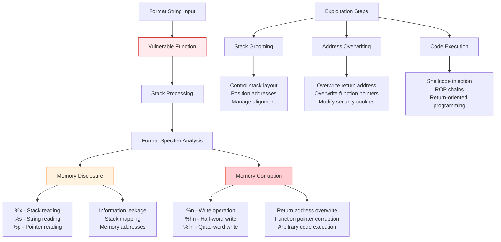

#### Format String Attack Prevention

**Input Validation**:
- **Whitelist Validation**: Only accept expected format strings
- **Input Sanitization**: Remove or escape format specifiers
- **Type Checking**: Ensure correct parameter types

**Secure Coding Practices**:
- **Never use user input as format string**: Always use literal format strings
- **Use format string literals**: `printf("%s", user_input)` not `printf(user_input)`
- **Bounds Checking**: Ensure buffer sizes are respected
- **Compiler Warnings**: Enable and heed format string warnings

**Runtime Protection**:
- **Stack Canaries**: Detect stack smashing
- **ASLR**: Randomize memory addresses
- **DEP/NX**: Prevent execution from data segments
- **FORTIFY_SOURCE**: Compile-time and runtime protection

---

## Types of Security Vulnerabilities

### 1.5.1 Buffer Overflows

**Definition**: Occurs when data exceeds the allocated buffer size, potentially overwriting adjacent memory locations.

#### Buffer Overflow Types

1. **Stack-Based Buffer Overflow**:
   - **Location**: Function call stack
   - **Scope**: Local variables and return addresses
   - **Detection**: Stack canaries, bounds checking
   - **Exploitation**: Return address overwrite

2. **Heap-Based Buffer Overflow**:
   - **Location**: Dynamic memory allocation
   - **Scope**: Heap metadata and adjacent objects
   - **Detection**: Heap integrity checks
   - **Exploitation**: Object corruption, metadata overwrite

3. **Global Buffer Overflow**:
   - **Location**: Global data segment
   - **Scope**: Global variables and constants
   - **Detection**: Global bounds checking
   - **Exploitation**: Global variable corruption

4. **Integer Overflow**:
   - **Mechanism**: Arithmetic operations exceed integer limits
   - **Effect**: Creates smaller buffer than intended
   - **Detection**: Integer overflow checks
   - **Exploitation**: Subsequent buffer overflow

#### Stack-Based Buffer Overflow Deep Dive

**Stack Memory Layout**:
```
High Memory Addresses
+------------------+
|   Return Address |  <- Function return point
+------------------+
|  Saved Frame Ptr |  <- Previous stack frame
+------------------+
|     Local Var 1  |  <- Function variables
+------------------+
|     Local Var 2  |
+------------------+
|   Buffer Array   |  <- Vulnerable buffer
+------------------+
Low Memory Addresses
```

**Exploitation Process**:
1. **Buffer Overflow**: Input exceeds buffer size
2. **Stack Corruption**: Adjacent memory overwritten
3. **Return Address**: Pointer to attacker-controlled code
4. **Code Execution**: Malicious code runs with elevated privileges

**Stack Protection Mechanisms**:
- **Stack Canaries**: Random values before return addresses
- **ASLR**: Address Space Layout Randomization
- **DEP/NX**: Data Execution Prevention
- **Stack Cookies**: Compiler-generated protection

```mermaid
graph TB
    A[Stack Buffer Overflow] --> B[Normal Stack]
    A --> C[Overflowed Stack]
    
    B --> D[Function Parameters]
    B --> E[Return Address]
    B --> F[Saved Frame Pointer]
    B --> G[Local Variables]
    B --> H[Buffer Array]
    
    C --> I[Function Parameters]
    C --> J[Corrupted Return Address]
    C --> K[Corrupted Frame Pointer]
    C --> L[Corrupted Variables]
    C --> M[Buffer Overflow]
    C --> N[Stack Corruption]
    
    O[Protection Mechanisms] --> P[Stack Canaries]
    O --> Q[ASLR]
    O --> R[DEP/NX]
    O --> S[Bounds Checking]
    
    P --> P1[Random canary values<br/>Check before return]
    Q --> Q1[Randomize memory<br/>addresses]
    R --> R1[Prevent execution<br/>from data segments]
    S --> S1[Compiler warnings<br/>Safe functions]
    
    style A fill:#ffebee,stroke:#d32f2f,stroke-width:3px
    style C fill:#ffcdd2,stroke:#c62828,stroke-width:2px
    style J fill:#d32f2f,stroke:#b71c1c,stroke-width:2px
```

#### Heap-Based Buffer Overflow

**Heap Memory Management**:
- **Chunks**: Memory blocks with metadata
- **Free Lists**: Unallocated chunks organized by size
- **Allocators**: malloc(), free(), new(), delete()

**Heap Exploitation Techniques**:
1. **Chunk Corruption**:
   - **Size Field**: Overwrite chunk size
   - **Free List Pointers**: Corrupt free list links
   - **Chunk Alignment**: Manipulate alignment boundaries

2. **Fastbin Attack**:
   - **Fastbin**: Small allocation bin
   - **Double Free**: Free same chunk twice
   - **Arbitrary Allocation**: Control allocation addresses

3. **House of Spirit**:
   - **Fake Chunks**: Create valid-looking chunks
   - **Heap Feng Shui**: Manipulate heap layout
   - **Arbitrary Write**: Control memory writes

### 1.5.2 Invalidated Input

**Definition**: Vulnerabilities arising from insufficient input validation, allowing malicious data to enter the system.

#### Input Validation Vulnerabilities

1. **Buffer Overflow via Input**:
   - **Unbounded Input**: No length checking
   - **Integer Overflow**: Size calculations overflow
   - **Off-by-One**: Boundary condition errors
   - **Unicode Attacks**: Multi-byte character exploits

2. **Command Injection**:
   - **OS Command Injection**: Malicious shell commands
   - **SQL Injection**: Malicious database queries
   - **LDAP Injection**: Directory service exploitation
   - **XPath Injection**: XML query manipulation

3. **Path Traversal**:
   - **Directory Traversal**: `../../../etc/passwd`
   - **URL Manipulation**: Encoding bypasses
   - **File Inclusion**: Remote/local file inclusion
   - **Symbolic Link**: Exploiting symlinks

4. **Cross-Site Scripting (XSS)**:
   - **Reflected XSS**: Immediate script execution
   - **Stored XSS**: Persistent script storage
   - **DOM XSS**: Client-side script injection
   - **MIME Sniffing**: Content type confusion

#### Input Validation Strategies

1. **Positive Validation (Whitelist)**:
   - **Accept Known Good**: Only allow expected inputs
   - **Format Checking**: Validate against known patterns
   - **Type Checking**: Ensure correct data types
   - **Range Checking**: Verify values within bounds

2. **Negative Validation (Blacklist)**:
   - **Reject Known Bad**: Block malicious patterns
   - **Signature Matching**: Detect known attack patterns
   - **Character Filtering**: Remove dangerous characters
   - **Pattern Detection**: Regular expression matching

3. **Context-Aware Validation**:
   - **HTML Context**: Escape HTML special characters
   - **JavaScript Context**: Escape JavaScript special characters
   - **SQL Context**: Parameterize database queries
   - **URL Context**: Encode URL parameters

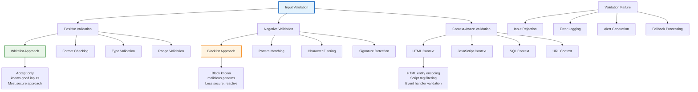

### 1.5.3 Race Conditions

**Definition**: Occurs when system behavior depends on the relative timing of events, leading to unpredictable outcomes.

#### Race Condition Types

1. **Time-of-Check-Time-of-Use (TOCTOU)**:
   - **Check Phase**: Security state verified
   - **Use Phase**: Security state used
   - **Gap**: Time between check and use
   - **Vulnerability**: State may change in gap

2. **File Access Race Conditions**:
   - **File Existence**: Check file exists, then open
   - **File Permissions**: Check permissions, then access
   - **File Creation**: Create file in predictable location
   - **Symbolic Links**: Exploit symlink creation timing

3. **Network Protocol Timing**:
   - **Sequence Numbers**: Predictable or guessable sequences
   - **Session Tokens**: Session fixation attacks
   - **Authentication**: Replay attack windows
   - **State Management**: State synchronization issues

#### TOCTOU Attack Example

**File Access Vulnerability**:
```c
// Vulnerable code
if (access(file_path, R_OK) == 0) {  // Check
    fd = open(file_path, O_RDONLY);   // Use
    // Process file
}
```

**Attack Timeline**:
```mermaid
gantt
    title TOCTOU Attack Timeline
    dateFormat  X
    axisFormat %L

    section Attacker
    Race Window :crit, 0, 10
    File Replace : 5, 5
    
    section Victim Process
    Check File : 0, 2
    Use File : 8, 10
```

**Attack Process**:
1. **Check Phase**: Process checks file permissions
2. **Attacker Action**: Replaces file with malicious content
3. **Use Phase**: Process uses replaced file
4. **Exploitation**: Malicious code execution

#### Race Condition Prevention

1. **Atomic Operations**:
   - **File Locking**: Exclusive file access
   - **Database Transactions**: ACID properties
   - **Memory Barriers**: Prevent reordering
   - **Mutexes/Semaphores**: Synchronization primitives

2. **Immutable Data**:
   - **Read-Only Data**: No modification after creation
   - **Copy-on-Write**: Create copies for modifications
   - **Functional Programming**: Immutable state
   - **Database Views**: Immutable query results

3. **State Validation**:
   - **Re-validation**: Check state before use
   - **Transaction Boundaries**: Atomic state changes
   - **Version Checking**: Verify data version
   - **Checksums**: Verify data integrity

### 1.5.4 Access Control Problems

**Definition**: Vulnerabilities in mechanisms that control access to resources, allowing unauthorized actions or information disclosure.

#### Access Control Models

1. **Discretionary Access Control (DAC)**:
   - **Owner-Based**: Resource owners control access
   - **Flexible**: Users can grant permissions
   - **Risk**: Owners may grant excessive permissions
   - **Examples**: Unix file permissions, Windows ACLs

2. **Mandatory Access Control (MAC)**:
   - **System-Based**: System enforces access rules
   - **Rigid**: Users cannot override system decisions
   - **Secure**: Prevents privilege escalation
   - **Examples**: SELinux, Windows Mandatory Integrity Control

3. **Role-Based Access Control (RBAC)**:
   - **Role-Based**: Permissions assigned to roles
   - **Scalable**: Easy to manage large systems
   - **Principle of Least Privilege**: Roles defined by job functions
   - **Examples**: Enterprise applications, database systems

4. **Attribute-Based Access Control (ABAC)**:
   - **Policy-Driven**: Decisions based on attributes
   - **Flexible**: Complex business rules
   - **Context-Aware**: Considers environmental factors
   - **Examples**: Cloud services, modern web applications

#### Access Control Vulnerabilities

1. **Broken Authentication**:
   - **Weak Passwords**: Easy to guess or crack
   - **Session Management**: Predictable session tokens
   - **Credential Stuffing**: Reused passwords
   - **Brute Force**: No rate limiting

2. **Broken Authorization**:
   - **Privilege Escalation**: Vertical/horizontal privilege abuse
   - **Insufficient Permission Checks**: Missing authorization validation
   - **Direct Object References**: Predictable resource identifiers
   - **IDOR (Insecure Direct Object Reference)**: Authorization bypass

3. **Insecure Session Management**:
   - **Session Fixation**: Fixing session identifiers
   - **Session Hijacking**: Stealing valid sessions
   - **Session Timeout**: Inappropriate session duration
   - **Cross-Session Data**: Information leakage between sessions

#### Access Control Bypass Techniques

1. **Direct Object Reference**:
   ```
   URL: /user/profile?id=123
   Attack: /user/profile?id=456 (other user's profile)
   ```

2. **Parameter Manipulation**:
   ```
   Form: role=standard_user
   Attack: role=administrator
   ```

3. **HTTP Method Bypass**:
   ```
   Expected: POST /admin/delete
   Attack: GET /admin/delete
   ```

4. **Trust Boundary Violation**:
   - Client-side security checks
   - Server-side bypass
   - Inadequate input validation

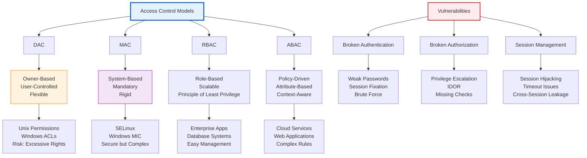

### 1.5.5 Weaknesses in Authentication, Authorization, or Cryptographic Practices

#### Authentication Weaknesses

1. **Weak Password Practices**:
   - **Common Passwords**: "123456", "password", "qwerty"
   - **Dictionary Words**: Easy to guess with wordlists
   - **Personal Information**: Names, dates, addresses
   - **Password Reuse**: Same password across multiple services

2. **Authentication Bypass**:
   - **SQL Injection**: Bypassing login queries
   - **LDAP Injection**: Exploiting directory services
   - **Brute Force**: Automated password guessing
   - **Session Fixation**: Fixing session identifiers

3. **Multi-Factor Authentication (MFA) Weaknesses**:
   - **SMS-based MFA**: SIM swapping attacks
   - **Email-based MFA**: Email account compromise
   - **App-based MFA**: Device theft or malware
   - **Biometric Weaknesses**: Spoofing and false acceptance

#### Authorization Weaknesses

1. **Privilege Escalation**:
   - **Horizontal Escalation**: Same-level privilege abuse
   - **Vertical Escalation**: Higher privilege levels
   - **Administrative Access**: Gaining admin rights
   - **Service Account Abuse**: Exploiting service privileges

2. **Broken Access Control Models**:
   - **Implicit Trust**: Assuming trusted users
   - **Role Confusion**: Incorrect role assignments
   - **Default Permissions**: Overly permissive defaults
   - **Delegation Issues**: Improper privilege delegation

#### Cryptographic Weaknesses

1. **Weak Algorithms**:
   - **Deprecated Ciphers**: DES, RC4, MD5
   - **Short Key Lengths**: 40-bit, 56-bit keys
   - **Proprietary Algorithms**: Unvetted encryption methods
   - **Algorithm Confusion**: Wrong algorithm for use case

2. **Implementation Flaws**:
   - **Random Number Generation**: Predictable random values
   - **Key Management**: Poor key storage and handling
   - **Initialization Vectors**: Reused or weak IVs
   - **Padding Issues**: Incorrect padding schemes

3. **Protocol Vulnerabilities**:
   - **Weak Key Exchange**: Vulnerable key establishment
   - **Man-in-the-Middle**: Lack of mutual authentication
   - **Replay Attacks**: No replay protection
   - **Downgrade Attacks**: Forcing weaker security

#### Cryptographic Best Practices

1. **Algorithm Selection**:
   - **AES-256**: Symmetric encryption
   - **RSA-2048/ECC**: Asymmetric encryption
   - **SHA-256/SHA-3**: Hash functions
   - **PBKDF2/bcrypt**: Password hashing

2. **Key Management**:
   - **Key Generation**: Cryptographically secure random numbers
   - **Key Storage**: Hardware security modules (HSMs)
   - **Key Rotation**: Regular key updates
   - **Key Destruction**: Secure key deletion

3. **Implementation Security**:
   - **Authenticated Encryption**: AEAD modes (GCM, CCM)
   - **Nonce Management**: Unique nonces for each encryption
   - **Side-Channel Protection**: Constant-time operations
   - **Regular Updates**: Keep cryptographic libraries current

```mermaid
graph TB
    A[Cryptographic Security] --> B[Algorithm Selection]
    A --> C[Implementation]
    A --> D[Key Management]
    A --> E[Protocol Design]
    
    B --> B1[Strong Algorithms]
    B --> B2[Avoid Deprecated Methods]
    B --> B3[Appropriate Key Sizes]
    
    B1 --> B1a[AES-256<br/>RSA-2048/ECC<br/>SHA-256/SHA-3]
    B2 --> B2a[No DES, RC4, MD5<br/>No 40/56-bit keys<br/>No proprietary ciphers]
    
    C --> C1[Random Number Generation]
    C --> C2[Authenticated Encryption]
    C --> C3[Side-Channel Protection]
    
    C1 --> C1a[CSPRNGs<br/>Proper entropy<br/>No predictable patterns]
    C2 --> C2a[AEAD modes<br/>GCM, CCM<br/>Integrity + Confidentiality]
    
    D --> D1[Key Generation]
    D --> D2[Key Storage]
    D --> D3[Key Rotation]
    
    D1 --> D1a[Cryptographically secure<br/>Adequate entropy<br/>Proper derivation]
    D2 --> D2a[HSMs<br/>Secure enclaves<br/>Encrypted storage]
    
    E --> E1[Secure Protocols]
    E --> E2[Forward Secrecy]
    E --> E3[Replay Protection]
    
    E1 --> E1a[TLS 1.3<br/>IPSec<br/>SSH v2]
    E2 --> E2a[Perfect forward secrecy<br/>Ephemeral keys<br/>Key compromise resistance]
    
    F[Common Vulnerabilities] --> G[Weak Algorithms]
    F --> H[Implementation Flaws]
    F --> I[Poor Key Management]
    
    style A fill:#e3f2fd,stroke:#1565c0,stroke-width:3px
    style B1a fill:#e8f5e8,stroke:#388e3c,stroke-width:2px
    style B2a fill:#ffcdd2,stroke:#d32f2f,stroke-width:2px
    style F fill:#ffebee,stroke:#c62828,stroke-width:2px
```

---

## Summary and Key Takeaways

### Fundamental Security Concepts

1. **CIA Triad**: Confidentiality, Integrity, and Availability form the foundation of security
2. **Risk Assessment**: Understanding vulnerabilities, threats, and their relationships
3. **Attack Classification**: Active vs. passive attacks require different defense strategies
4. **Malware Evolution**: Understanding modern malware capabilities and techniques

### Critical Vulnerabilities

1. **Input Validation**: Most common source of security vulnerabilities
2. **Buffer Overflows**: Classic vulnerability with modern protection mechanisms
3. **Access Control**: Proper authentication and authorization are essential
4. **Cryptographic Practices**: Strong algorithms and proper implementation are crucial

### Defense Strategies

1. **Defense in Depth**: Multiple layers of security controls
2. **Principle of Least Privilege**: Minimal necessary access for all users and processes
3. **Secure Coding Practices**: Input validation, bounds checking, and safe APIs
4. **Regular Security Assessment**: Continuous testing and improvement

### Modern Security Challenges

1. **Advanced Persistent Threats (APTs)**: Sophisticated, long-term attacks
2. **Supply Chain Security**: Compromising software dependencies
3. **Cloud Security**: Shared responsibility models and new attack vectors
4. **IoT Security**: Resource-constrained device security

This comprehensive understanding of security fundamentals provides the foundation for implementing effective cybersecurity measures in wireless and ad-hoc network environments.

---

*Unit 1 provides the essential foundation for understanding cybersecurity in wireless and ad-hoc networks. Mastery of these fundamental concepts is crucial for implementing effective security measures in the complex and dynamic environments of modern networks.*