# UNIT 2: CRYPTOGRAPHIC TECHNIQUES AND MECHANISMS
## Comprehensive Detailed Notes with Visual Diagrams

---

## Table of Contents
1. [One-Way Functions and Pseudorandom Generators](#one-way-functions-and-pseudorandom-generators)
2. [Hash Functions](#hash-functions)
3. [Symmetric Key Cryptography](#symmetric-key-cryptography)
4. [Access Control Methods](#access-control-methods)
5. [Message Authentication and Digital Signatures](#message-authentication-and-digital-signatures)

---

## One-Way Functions and Pseudorandom Generators

### 2.1 One-Way Functions

#### Definition and Properties

A **One-Way Function** is a mathematical function that is computationally easy to compute in one direction but computationally infeasible to invert. This property makes them fundamental building blocks for cryptographic systems.

**Mathematical Definition**:
A function f: {0,1}* → {0,1}* is one-way if:
1. There exists a polynomial-time algorithm that computes f(x) for all x
2. For every randomized polynomial-time algorithm A, there exists a negligible function negl such that:
   Pr[A(f(x)) ∈ f⁻¹(f(x))] ≤ negl(n)

where n = |x| is the input length.

**Core Properties**:

1. **Easy to Compute**: For any input x, computing f(x) can be done efficiently (polynomial time)
2. **Hard to Invert**: Given y = f(x), finding any x' such that f(x') = y is computationally infeasible
3. **Pre-image Resistance**: Cannot find any input that maps to a specific output
4. **Second Pre-image Resistance**: Cannot find a different input that maps to the same output as a given input

#### Types of One-Way Functions

1. **Arithmetic One-Way Functions**:
   - **Modular Exponentiation**: f(a,b) = a^b mod p
   - **Integer Factorization**: f(n) = p × q (where p and q are primes)
   - **Discrete Logarithm**: f(a,b) = g^ab mod p

2. **Cryptographic One-Way Functions**:
   - **Hash Functions**: SHA-256, SHA-3, BLAKE2
   - **Password Hashing**: bcrypt, scrypt, Argon2
   - **Key Derivation**: PBKDF2, HKDF

3. **Lattice-Based One-Way Functions**:
   - **Learning With Errors (LWE)**: Basis for post-quantum cryptography
   - **Short Integer Solution (SIS)**: Lattice problem variants
   - **Ring Learning With Errors (Ring-LWE)**: Efficient variants

#### Theoretical Foundations

**Computational Complexity Classes**:

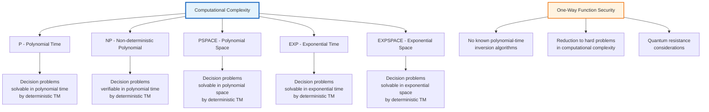

**Hardness Assumptions**:

1. **Factoring Assumption**: Given n = p × q where p and q are primes, it's hard to find p and q
2. **Discrete Logarithm Assumption**: Given g, g^a mod p, it's hard to find a
3. **Collision Resistance**: Finding x ≠ x' such that h(x) = h(x') is hard
4. **Pre-image Resistance**: Given h(x), finding any x' with h(x') = h(x) is hard

#### Practical Applications

**Password Storage**:
```
1. User registers: password → one-way function → stored hash
2. User login: entered password → one-way function → compare with stored hash
3. Attacker compromise: gets hash but cannot reverse to get password
```

**Digital Signatures**: One-way functions ensure signature authenticity
**Key Derivation**: Transform passwords into cryptographic keys
**Commitment Schemes**: Bind to values without revealing them

### 2.2 Pseudorandom Generators (PRGs)

#### Definition and Requirements

A **Pseudorandom Generator** is a deterministic algorithm that takes a short random seed and produces a longer sequence that appears random to any efficient observer.

**Formal Definition**:
A function G: {0,1}^n → {0,1}^m (where m > n) is a PRG if:
1. **Efficiency**: G can be computed in polynomial time
2. **Expansion**: m = poly(n) and m > n
3. **Pseudorandomness**: The output distribution is computationally indistinguishable from uniform distribution

**Pseudorandomness Definition**:
For any probabilistic polynomial-time distinguisher D:
```
|Pr[D(G(s)) = 1] - Pr[D(r) = 1]| ≤ negl(n)
```
where s ← {0,1}^n and r ← {0,1}^m are random

#### PRG Construction Methods

1. **Linear Congruential Generators (LCG)**:
   ```
   X_{n+1} = (a × X_n + c) mod m
   ```
   - **Advantages**: Simple, fast
   - **Disadvantages**: Predictable, fails many randomness tests

2. **Feedback Shift Registers (FSR)**:
   - **Linear FSR**: Linear feedback shift registers
   - **Nonlinear FSR**: Nonlinear feedback mechanisms
   - **Applications**: Stream ciphers, wireless communication

3. **Hash-Based PRGs**:
   ```
   G(s) = h(s || 1) || h(s || 2) || ... || h(s || k)
   ```
   - **Advantages**: Based on cryptographic hash functions
   - **Security**: Reduction to hash function security

4. **Block Cipher-Based PRGs**:
   ```
   CTR Mode: G(s) = E_k(ctr) || E_k(ctr+1) || ...
   ```
   - **Advantages**: Leverages well-analyzed block ciphers
   - **Security**: Reduction to block cipher security

#### PRG Security Analysis

**Statistical Tests**:
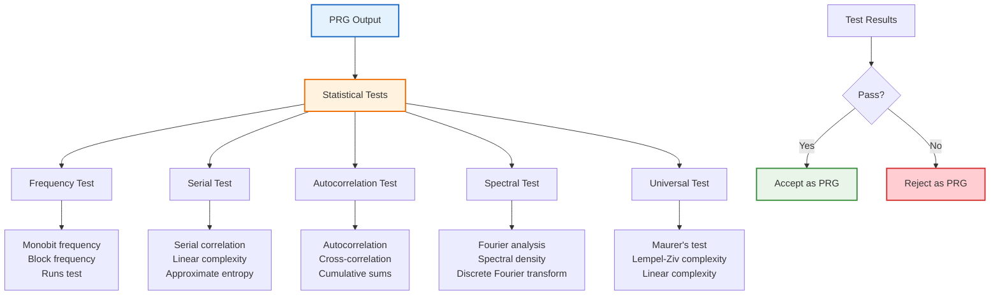

**Distinguisher Attacks**:
1. **Linear Distinguishers**: Exploiting linear relationships
2. **Algebraic Attacks**: Solving systems of equations
3. **Side-Channel Attacks**: Exploiting implementation leaks
4. **Guess-and-Determine**: Reducing search space

#### Modern PRG Constructions

1. **AES-CTR**:
   ```
   Input: 128-bit key, 64-bit counter
   Output: 128-bit block per iteration
   ```
   - **NIST Standard**: SP 800-90A
   - **Security**: AES security assumptions
   - **Performance**: Hardware acceleration available

2. **ChaCha20**:
   ```
   Input: 256-bit key, 96-bit nonce, 64-bit counter
   Output: 512-bit block per iteration
   ```
   - **Designed by**: Daniel J. Bernstein
   - **Advantages**: Fast, simple, secure
   - **Applications**: TLS, SSH, wireless protocols

3. **Hash_DRBG**:
   ```
   Input: Entropy source, personalization string
   Output: Pseudorandom bits
   ```
   - **NIST Standard**: SP 800-90A
   - **Hash Functions**: SHA-256, SHA-512, SHA-1
   - **Security**: Reduction to hash function properties

#### PRG Applications in Cryptography

1. **Stream Ciphers**:
   ```
   Encryption: C_i = P_i ⊕ PRG(K || nonce || i)
   Decryption: P_i = C_i ⊕ PRG(K || nonce || i)
   ```

2. **Key Derivation**:
   ```
   Master Key → PRG → Multiple Derived Keys
   ```

3. **Nonce Generation**:
   ```
   Random Nonce = PRG(Random Seed)
   ```

4. **Session Key Generation**:
   ```
   Long-term Key → PRG → Session Keys
   ```

---

## Hash Functions

### 2.2 Hash Functions Deep Dive

#### Definition and Properties

**Hash Function** h: {0,1}* → {0,1}^n maps arbitrarily long inputs to fixed-length outputs of n bits.

**Core Properties**:

1. **Deterministic**: h(x) = h(x) for all x
2. **Quick Computation**: h(x) can be computed in polynomial time
3. **Pre-image Resistance**: Given y, finding x such that h(x) = y is hard
4. **Second Pre-image Resistance**: Given x, finding x' ≠ x with h(x') = h(x) is hard
5. **Collision Resistance**: Finding x ≠ x' with h(x) = h(x') is hard

**Security Hierarchy**:
```
Collision Resistance > Second Pre-image Resistance > Pre-image Resistance
```

#### Hash Function Architecture

**Merkle-Damgård Construction**:
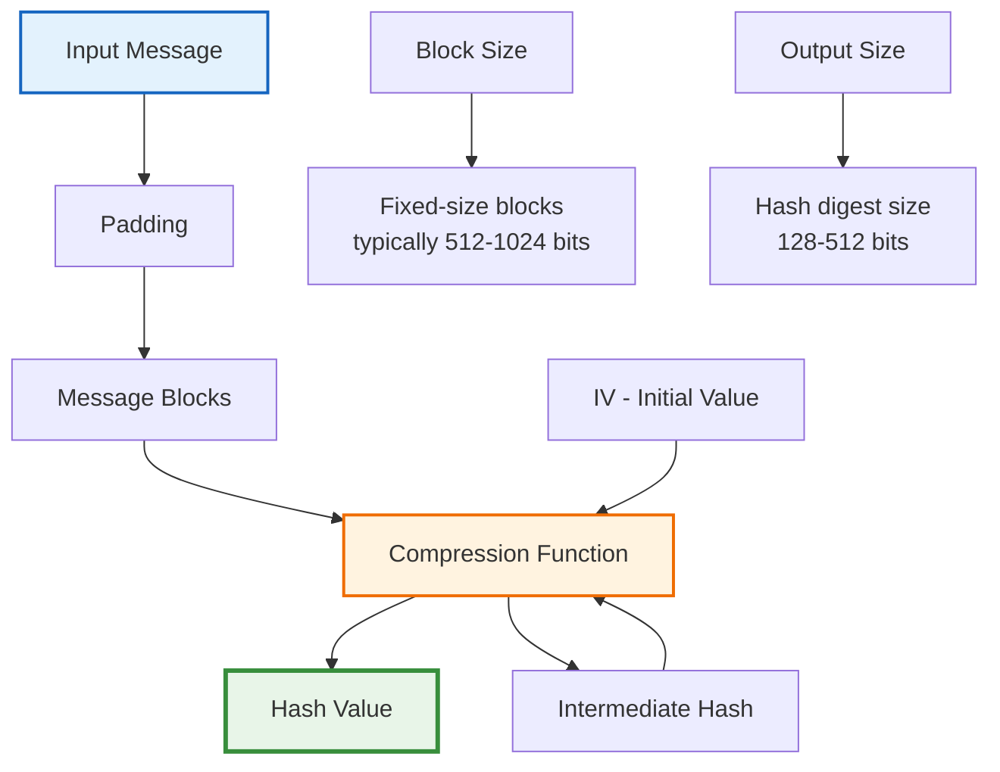

**Compression Function Components**:
1. **Compression Function**: f(H_{i-1}, M_i) → H_i
2. **Block Cipher**: Davies-Meyer, Miyaguchi-Preneel
3. **Dedicated Design**: Custom compression function
4. **Feistel Structure**: Alternating round functions

#### Modern Hash Function Families

**SHA-2 Family**:
- **SHA-224**: 224-bit output, based on SHA-256
- **SHA-256**: 256-bit output, 512-bit message blocks
- **SHA-384**: 384-bit output, based on SHA-512
- **SHA-512**: 512-bit output, 1024-bit message blocks
- **SHA-512/224**: SHA-512 with 224-bit output
- **SHA-512/256**: SHA-512 with 256-bit output

**SHA-3 Family**:
- **SHA3-224**: 224-bit output, 1152-bit rate
- **SHA3-256**: 256-bit output, 1088-bit rate
- **SHA3-384**: 384-bit output, 832-bit rate
- **SHA3-512**: 512-bit output, 576-bit rate
- **Keccak Algorithm**: Sponge construction

**Other Notable Hash Functions**:
- **BLAKE2**: Fast, secure, parallelizable
- **BLAKE3**: Parallel and streaming capable
- **Whirlpool**: 512-bit output, Miyaguchi-Preneel construction
- **Tiger**: Optimized for 64-bit architectures

#### Hash Function Security Analysis

**Collision Attacks**:
```mermaid
graph TB
    A[Hash Function] --> B[Collision Resistance]
    B --> C[Birthday Attack]
    C --> D[2^{n/2} Complexity]
    
    E[Collision Finding] --> F[Brute Force]
    E --> G[Birthday Paradox]
    E --> H[Cryptanalytic Attacks]
    
    F --> F1[Try all possible inputs<br/>Complexity: 2^n]
    
    G --> G1[Birthday paradox<br/>Complexity: 2^{n/2}]
    
    H --> H1[Differential attacks<br/>Linear attacks<br/>Algebraic attacks]
    
    I[Attack Success] --> J{Complexity < 2^{n/2}?}
    J -->|Yes| K[Hash function broken]
    J -->|No| L[Hash function secure]
    
    style A fill:#e3f2fd,stroke:#1565c0,stroke-width:2px
    style C fill:#fff3e0,stroke:#ef6c00,stroke-width:2px
    style K fill:#ffcdd2,stroke:#d32f2f,stroke-width:2px
    style L fill:#e8f5e8,stroke:#388e3c,stroke-width:2px
```

**Pre-image Attacks**:
- **Complexity**: 2^n for ideal hash functions
- **Meet-in-the-Middle**: 2^{n/2+1} complexity
- **Rainbow Tables**: Precomputed hash values
- **Quantum Attacks**: Grover's algorithm reduces to 2^{n/2}

#### Hash Function Applications

**Digital Signatures**:
```
Message → Hash Function → Hash Value → Digital Signature
```

**Password Storage**:
```
Password → Hash Function → Stored Hash
Login: Password → Hash Function → Compare with stored hash
```

**Data Integrity**:
```
File → Hash Function → Hash Value
Transmission: File + Hash Value
Verification: Recompute hash and compare
```

**Merkle Trees**:
```
     Root Hash
    /        \
 Left Hash  Right Hash
 /    \    /    \
...   ... ...   ...
```

**Blockchain Applications**:
- **Bitcoin**: SHA-256 for proof-of-work
- **Ethereum**: Keccak-256 (SHA-3 variant)
- **Merkle Roots**: Transaction integrity
- **Mining**: Hash puzzle solutions

#### Hash Function Implementation Security

**Side-Channel Attacks**:
1. **Timing Attacks**: Variable computation time
2. **Power Analysis**: Power consumption patterns
3. **Electromagnetic Analysis**: EM radiation leaks
4. **Cache Attacks**: Cache timing behaviors

**Protection Mechanisms**:
1. **Constant-Time Implementation**: Fixed computation time
2. **Masking**: Random mask operations
3. **Blinding**: Random blinding factors
4. **Hardware Security Modules**: Dedicated security hardware

---

## Symmetric Key Cryptography

### 2.3 Symmetric Key Cryptography Overview

**Symmetric Key Cryptography** uses the same secret key for encryption and decryption operations.

**Key Properties**:
- **Single Secret Key**: Both parties share the same key
- **High Speed**: Faster than asymmetric cryptography
- **Key Distribution Challenge**: Secure key exchange required
- **Scalability Issues**: O(n²) key pairs for n users

**Applications**:
- **Bulk Data Encryption**: Large file encryption
- **Real-time Communication**: Video/audio encryption
- **Wireless Security**: WiFi, cellular networks
- **Disk Encryption**: Full disk encryption

### 2.3.1 Block Ciphers

#### Block Cipher Fundamentals

**Block Cipher Definition**: A function E: {0,1}^k × {0,1}^n → {0,1}^n that encrypts n-bit blocks with k-bit keys.

**Core Requirements**:
1. **Efficiency**: Fast encryption/decryption
2. **Security**: Indistinguishable from random permutation
3. **Keyed Permutation**: Each key defines a permutation
4. **Invertibility**: Decryption function exists

**Security Model**:
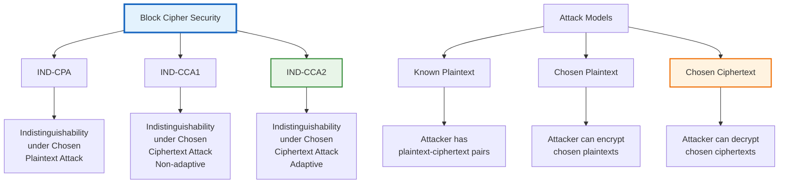

#### Block Cipher Structures

**Feistel Networks**:
```mermaid
graph TB
    A[Input Block] --> B[Split into L,R]
    B --> C[Round 1]
    C --> D[Round 2]
    D --> E[...]
    E --> F[Round N]
    F --> G[Swap L,R]
    G --> H[Output Block]
    
    I[Round Function] --> J[F_i(R_i, K_i)]
    J --> K[XOR with L_i]
    K --> L[L_{i+1} = R_i]
    L --> M[R_{i+1} = L_i ⊕ F_i(R_i, K_i)]
    
    N[Examples] --> O[DES<br/>Triple DES<br/>Blowfish<br/>Twofish]
    
    style A fill:#e3f2fd,stroke:#1565c0,stroke-width:2px
    style H fill:#e8f5e8,stroke:#388e3c,stroke-width:2px
    style I fill:#fff3e0,stroke:#ef6c00,stroke-width:2px
```

**Substitution-Permutation Networks (SPN)**:
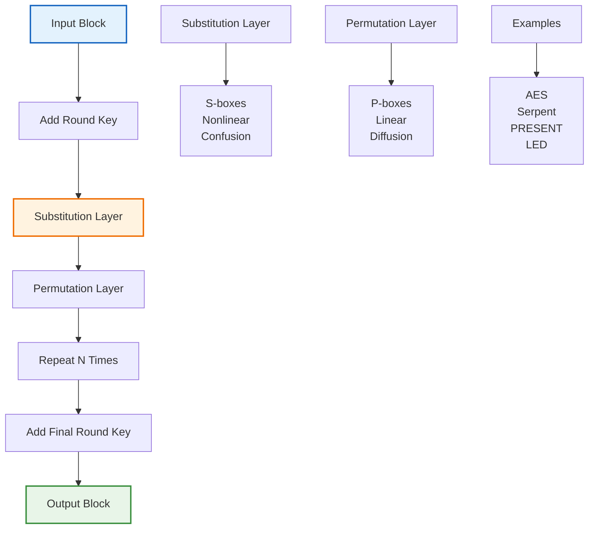

#### Advanced Encryption Standard (AES)

**AES Overview**:
- **Standard**: FIPS 197 (2001)
- **Block Size**: 128 bits
- **Key Sizes**: 128, 192, 256 bits
- **Rounds**: 10, 12, 14 respectively

**AES Structure**:
1. **SubBytes**: Non-linear substitution using S-box
2. **ShiftRows**: Cyclic shift of rows
3. **MixColumns**: Linear mixing of columns
4. **AddRoundKey**: XOR with round key

**AES Security Analysis**:
- **Algebraic Complexity**: High-degree polynomial representation
- **Differential Cryptanalysis**: Resistance proven
- **Linear Cryptanalysis**: No effective attacks
- **Side-Channel Resistance**: Implementation-dependent

#### Block Cipher Modes of Operation

**Electronic Codebook (ECB)**:
```
Encryption: C_i = E_K(P_i)
Decryption: P_i = D_K(C_i)
```
- **Advantages**: Simple, parallelizable
- **Disadvantages**: Patterns visible, not secure for most applications

**Cipher Block Chaining (CBC)**:
```
C_0 = IV
C_i = E_K(P_i ⊕ C_{i-1})
P_i = D_K(C_i) ⊕ C_{i-1}
```
- **Advantages**: Better security than ECB
- **Disadvantages**: Sequential processing, error propagation

**Cipher Feedback (CFB)**:
```
C_0 = IV
C_i = P_i ⊕ E_K(C_{i-1})
P_i = C_i ⊕ E_K(C_{i-1})
```
- **Advantages**: Turns block cipher into stream cipher
- **Disadvantages**: Error propagation, sequential

**Output Feedback (OFB)**:
```
O_0 = IV
O_i = E_K(O_{i-1})
C_i = P_i ⊕ O_i
P_i = C_i ⊕ O_i
```
- **Advantages**: Error-free propagation, parallelizable
- **Disadvantages**: Requires unique IV per key

**Counter (CTR)**:
```
O_i = E_K(counter || nonce)
C_i = P_i ⊕ O_i
P_i = C_i ⊕ O_i
```
- **Advantages**: Parallelizable, random access, no error propagation
- **Disadvantages**: Requires unique counter per key

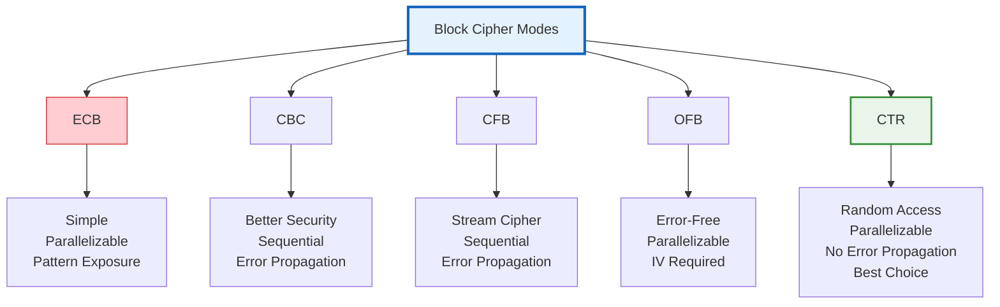

### 2.3.2 Stream Ciphers

#### Stream Cipher Fundamentals

**Stream Cipher Definition**: A symmetric cipher where plaintext bits are encrypted one at a time (or in small groups) using a keystream.

**Mathematical Model**:
```
Encryption: C_i = P_i ⊕ K_i
Decryption: P_i = C_i ⊕ K_i
```
where K_i is the i-th keystream bit.

**Keystream Generation**:
```
PRG: K = G(seed)
Stream: K_1, K_2, K_3, ...
```

#### Stream Cipher Requirements

1. **Keystream Unpredictability**: Next bits should be unpredictable
2. **Period Length**: Keystream should have long period
3. **Linear Complexity**: High linear complexity required
4. **Statistical Properties**: Random-like keystream characteristics

#### Classical Stream Ciphers

**Linear Feedback Shift Registers (LFSR)**:
```
S_{i+n} = c_0·S_i ⊕ c_1·S_{i+1} ⊕ ... ⊕ c_{n-1}·S_{i+n-1}
```
- **Advantages**: Simple, fast, well-analyzed
- **Disadvantages**: Linear structure, predictable

**Nonlinear Feedback Shift Registers (NLFSR)**:
```
S_{i+n} = f(S_i, S_{i+1}, ..., S_{i+n-1})
```
- **Advantages**: Nonlinear, harder to analyze
- **Disadvantages**: Complex analysis, implementation

#### Modern Stream Ciphers

**RC4 (Rivest Cipher 4)**:
```
Initialization: S[0..255] = 0..255
KSA: Permute S using key
PRGA: Generate keystream
```

**ChaCha20**:
```
Quarter-round: (a,b,c,d) = (a⊕b,d⊕a,d,b⊕c)
Stream generation: XOR plaintext with keystream
```

**Salsa20**:
```
Core operation: Quarter-round function
12 or 20 rounds of mixing
ARX (Add, Rotate, XOR) operations
```

**Grain-128a**:
```
Hybrid design: LFSR + NLFSR + FSM
Lightweight for constrained environments
Security: Cryptanalytic resistance
```

#### Stream Cipher Security Analysis

**Cryptanalytic Attacks**:

1. **Linear Attacks**:
   - **Linear Complexity**: Measure of unpredictability
   - **Berlekamp-Massey**: Linear complexity computation
   - **Correlation Attacks**: Correlating keystream with known bits

2. **Algebraic Attacks**:
   - **Boolean Function Analysis**: Algebraic normal form
   - **Guess-and-Determine**: Reducing complexity
   - **XL Algorithm**: Solving systems of equations

3. **Slide Attacks**:
   - **Self-Similarity**: Exploiting round function similarities
   - **Chosen-ciphertext**: Adaptive attacks
   - **Related-key**: Weak key relationships

**Side-Channel Vulnerabilities**:
1. **Timing Analysis**: Variable computation time
2. **Power Analysis**: Power consumption patterns
3. **Cache Attacks**: Cache timing behaviors
4. **Electromagnetic Analysis**: EM radiation analysis

```mermaid
graph TB
    A[Stream Cipher Analysis] --> B[Structural Attacks]
    A --> C[Cryptanalytic Attacks]
    A --> D[Side-Channel Attacks]
    
    B --> E[LFSR Analysis]
    B --> F[State Machine Attacks]
    B --> G[Slide Attacks]
    
    C --> H[Linear Attacks]
    C --> I[Algebraic Attacks]
    C --> J[Differential Attacks]
    
    H --> H1[Linear Complexity<br/>Correlation Attacks<br/>Berlekamp-Massey]
    
    I --> I1[Boolean Functions<br/>Guess-and-Determine<br/>XL Algorithm]
    
    J --> J1[Differential Patterns<br/>Linear Approximations<br/>Impossible Differentials]
    
    D --> K[Timing Analysis]
    D --> L[Power Analysis]
    D --> M[Cache Attacks]
    
    K --> K1[Variable timing<br/>Instruction analysis<br/>Branch prediction]
    
    L --> L1[DPA (Differential)<br/>CPA (Correlation)<br/>EM Analysis]
    
    M --> M1[Cache timing<br/>Prime+Probe<br/>Flush+Reload]
    
    style A fill:#e3f2fd,stroke:#1565c0,stroke-width:3px
    style C fill:#fff3e0,stroke:#ef6c00,stroke-width:2px
    style D fill:#ffebee,stroke:#c62828,stroke-width:2px
```

#### Stream Cipher Applications

**Wireless Communication**:
- **GSM A5/1**: Mobile phone encryption
- **Bluetooth E0**: Bluetooth encryption
- **IEEE 802.11**: WiFi encryption

**Secure Communication**:
- **SSH**: Secure shell encryption
- **TLS**: Transport layer security
- **IPSec**: Network layer encryption

**Resource-Constrained Environments**:
- **IoT Devices**: Internet of Things security
- **Embedded Systems**: Limited computational resources
- **RFID Tags**: Radio frequency identification

---

## Access Control Methods

### 2.4 Access Control Overview

**Access Control** determines who can access what resources and how, ensuring that only authorized users can perform specific actions on protected resources.

**Core Components**:
- **Subject**: User, process, or entity requesting access
- **Object**: Resource being accessed (files, databases, networks)
- **Action**: Operation being performed (read, write, execute)
- **Policy**: Rules governing access decisions

#### Access Control Models Classification

```mermaid
graph TB
    A[Access Control Models] --> B[DAC - Discretionary]
    A --> C[MAC - Mandatory]
    A --> D[RBAC - Role-Based]
    A --> E[ABAC - Attribute-Based]
    A --> F[PBAC - Policy-Based]
    A --> G[CBAC - Context-Based]
    
    B --> B1[Owner-Controlled<br/>User-Defined<br/>Flexible]
    B --> B2[File permissions<br/>Access Control Lists<br/>Discretionary grants]
    
    C --> C1[System-Controlled<br/>Centralized<br/>Hierarchical]
    C --> C2[Security Clearances<br/>Compartmentalization<br/>Mandatory Labels]
    
    D --> D1[Role-Based<br/>Permission by Function<br/>Scalable]
    D --> D2[Job Roles<br/>Permission Groups<br/>User-Role Assignment]
    
    E --> E1[Attribute-Driven<br/>Dynamic Decisions<br/>Flexible]
    E --> E2[User Attributes<br/>Resource Attributes<br/>Environmental Context]
    
    F --> F1[Policy-Driven<br/>Business Rules<br/>Centralized Management]
    F --> F2[Policy Engine<br/>Policy Repository<br/>Decision Points]
    
    G --> G1[Context-Aware<br/>Environmental Factors<br/>Dynamic Adaptation]
    G --> G2[Time-Based<br/>Location-Based<br/>Device-Based]
    
    style A fill:#e3f2fd,stroke:#1565c0,stroke-width:3px
    style E fill:#e8f5e8,stroke:#388e3c,stroke-width:2px
```

### 2.4.1 Discretionary Access Control (DAC)

**Definition**: Access control where resource owners have the discretion to grant access to other users.

**Characteristics**:
- **Owner-Based**: Resource owners control access
- **User-Centric**: Individual users make access decisions
- **Flexible**: Easy to grant and revoke access
- **Granular**: Fine-grained access control possible

**Implementation Mechanisms**:

1. **Access Control Lists (ACLs)**:
   ```
   File: document.txt
   ACL:
   - User: alice | Read, Write
   - User: bob | Read
   - Group: developers | Read, Write
   - User: charlie | No Access
   ```

2. **Capability Lists**:
   ```
   User: alice
   Capabilities:
   - File: /home/alice/private.txt | Read, Write
   - Database: sales_db | Query
   - Network: api.example.com | Connect
   ```

**DAC Advantages**:
- **Flexibility**: Easy to grant access to specific users
- **User Control**: Resource owners manage their own resources
- **Granularity**: Fine-grained access control possible
- **Decentralized**: No central authority required

**DAC Disadvantages**:
- **Security Risk**: Owners may grant excessive permissions
- **Propagation Problem**: Access rights can spread unintentionally
- **Administrative Overhead**: Individual management for each resource
- **Audit Difficulty**: Hard to track who has access to what

### 2.4.2 Mandatory Access Control (MAC)

**Definition**: Access control where the system enforces security policies regardless of user preferences.

**Characteristics**:
- **System-Controlled**: System enforces all access decisions
- **Centralized**: Central authority defines policies
- **Hierarchical**: Multi-level security classification
- **Immutable**: Users cannot override system decisions

**Security Models**:

1. **Bell-LaPadula Model**:
   - **Simple Security Property**: Read down (no read up)
   - *-Property**: Write up (no write down)
   - **Discretionary Security Property**: Standard DAC rules

2. **Biba Model**:
   - **Simple Integrity Property**: Write down (no write up)
   - *-Integrity Property**: Read down (no read up)

3. **Clark-Wilson Model**:
   - **Well-Formed Transactions**: Enforce data integrity
   - **Separation of Duties**: Prevent fraud and error

**Implementation Examples**:

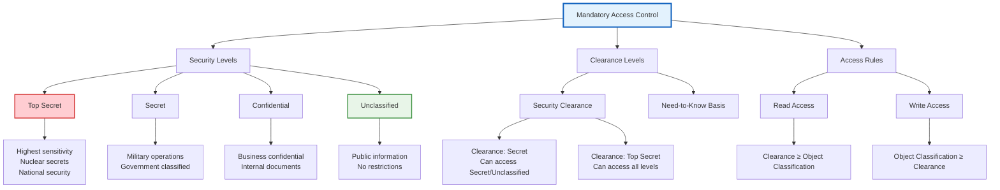

### 2.4.3 Role-Based Access Control (RBAC)

**Definition**: Access control where permissions are assigned to roles, and users are assigned to roles.

**Core Components**:
- **Users**: Human or system entities
- **Roles**: Collections of permissions
- **Permissions**: Authorizations to perform operations
- **Sessions**: Temporary user-role activations

**RBAC Hierarchy**:
```
Organization
├── CEO
│   ├── Read all documents
│   └── Approve budgets
├── Manager
│   ├── Read team documents
│   ├── Approve time sheets
│   └── Manage team
└── Employee
    ├── Read own documents
    └── Submit time sheets
```

**RBAC Types**:

1. **Core RBAC**:
   - Users assigned to roles
   - Roles assigned to permissions
   - Sessions activate role sets

2. **Hierarchical RBAC**:
   - Role inheritance supported
   - Parent roles inherit child permissions
   - Supports organizational structures

3. **Constrained RBAC**:
   - Separation of duties (SoD)
   - Static constraints on role assignments
   - Dynamic constraints on role activation

4. **Symmetric RBAC**:
   - Permission-to-role and role-to-permission mappings
   - Bidirectional access control

**RBAC Implementation**:
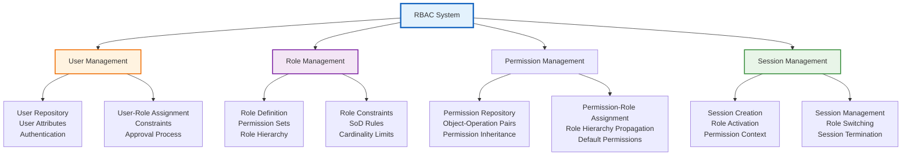

### 2.4.4 Attribute-Based Access Control (ABAC)

**Definition**: Access control where authorization decisions are based on attributes of users, resources, and environmental conditions.

**ABAC Components**:

1. **Subject Attributes**:
   - **User Attributes**: Department, role, clearance level
   - **Group Attributes**: Team membership, organizational unit
   - **Session Attributes**: Current context, temporary attributes

2. **Object Attributes**:
   - **Resource Attributes**: Classification, owner, sensitivity
   - **Operation Attributes**: Action type, scope, purpose
   - **Context Attributes**: Time, location, device type

3. **Environmental Attributes**:
   - **Temporal**: Time, date, business hours
   - **Spatial**: Location, network, building
   - **System**: Load, security level, network zone

**Policy Language**:
```
Policy: Access_to_Salary_Data
Subject: user.department == "HR" AND user.role == "Manager"
Object: resource.type == "salary" AND resource.classification == "confidential"
Action: read
Environmental: time.business_hours == true AND location.secure_area == true
Decision: PERMIT
```

**ABAC Architecture**:
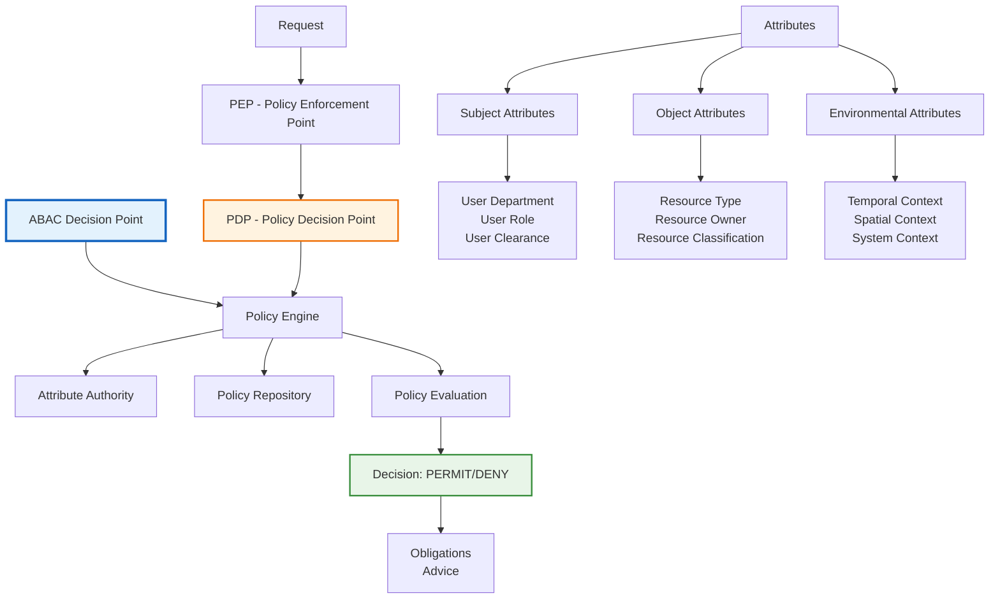

### 2.4.5 Advanced Access Control Models

**Policy-Based Access Control (PBAC)**:
- **Policy-Driven**: Business rules as policies
- **Dynamic Evaluation**: Real-time policy evaluation
- **Context-Aware**: Environmental factors considered
- **Compliance**: Regulatory compliance support

**Risk-Based Access Control**:
- **Dynamic Risk Assessment**: Continuous risk calculation
- **Adaptive Security**: Dynamic access based on risk
- **Context Awareness**: Real-time threat assessment
- **Machine Learning**: AI-driven risk analysis

**Zero Trust Access Control**:
- **Never Trust, Always Verify**: Continuous verification
- **Least Privilege**: Minimal necessary access
- **Micro-Segmentation**: Fine-grained network segmentation
- **Identity-Centric**: Identity as the new perimeter

**Blockchain-Based Access Control**:
- **Decentralized**: No central authority
- **Immutable**: Audit trails on blockchain
- **Smart Contracts**: Automated access decisions
- **Cryptographic**: Strong cryptographic guarantees

---

## Message Authentication and Digital Signatures

### 2.5 Message Authentication

#### Message Authentication Fundamentals

**Message Authentication** ensures the integrity and authenticity of messages in transit.

**Core Requirements**:
1. **Integrity**: Message has not been altered
2. **Authenticity**: Message comes from claimed sender
3. **Non-repudiation**: Sender cannot deny sending message
4. **Freshness**: Message is recent and not replayed

**Authentication Mechanisms**:

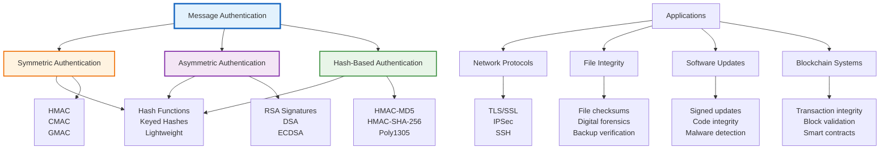

#### Message Authentication Codes (MACs)

**MAC Definition**: A short piece of information used to authenticate a message and confirm its integrity.

**Mathematical Model**:
```
Generation: MAC = MAC_K(M)
Verification: Verify(MAC_K(M), MAC_value)
```

**MAC Properties**:
1. **Compression**: Fixed-size output regardless of input size
2. **Computation**: Efficient computation for given key and message
3. **Unforgeability**: Hard to forge without knowing key
4. **Pseudorandom**: Appears random to adversaries

**MAC Algorithms**:

1. **HMAC (Hash-based MAC)**:
   ```
   HMAC_K(M) = H((K ⊕ opad) || H((K ⊕ ipad) || M))
   ```
   - **Security**: Reduction to hash function security
   - **Applications**: TLS, IPsec, SSH
   - **Standard**: RFC 2104

2. **CMAC (Cipher-based MAC)**:
   ```
   Based on AES block cipher
   CBC-MAC variant
   NIST standard: SP 800-38B
   ```

3. **GMAC (Galois/Counter Mode MAC)**:
   ```
   Based on AES-GCM
   Provides both confidentiality and integrity
   NIST standard: SP 800-38D
   ```

4. **Poly1305**:
   ```
   Fast MAC algorithm
   Designed by Daniel J. Bernstein
   Used in ChaCha20-Poly1305
   ```

#### MAC Security Analysis

**Forgery Attacks**:
1. **Existential Forgery**: Forging MAC for some message
2. **Selective Forgery**: Forging MAC for chosen message
3. **Universal Forgery**: Forging MAC for any message

**Attack Models**:
1. **Known Message Attack**: Attacker has message-MAC pairs
2. **Chosen Message Attack**: Attacker can request MACs for chosen messages
3. **Adaptive Chosen Message**: Dynamic message selection

**Security Reductions**:
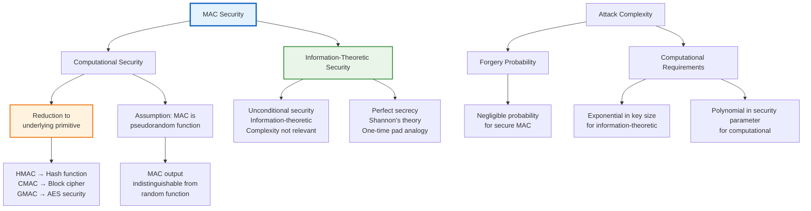

### 2.5.1 Digital Signatures

#### Digital Signature Fundamentals

**Digital Signature Definition**: A mathematical scheme for verifying the authenticity of digital messages or documents.

**Core Properties**:
1. **Authenticity**: Verifies sender identity
2. **Integrity**: Ensures message not altered
3. **Non-repudiation**: Sender cannot deny signing
4. **Unforgeability**: Hard to forge without private key

**Signature Process**:
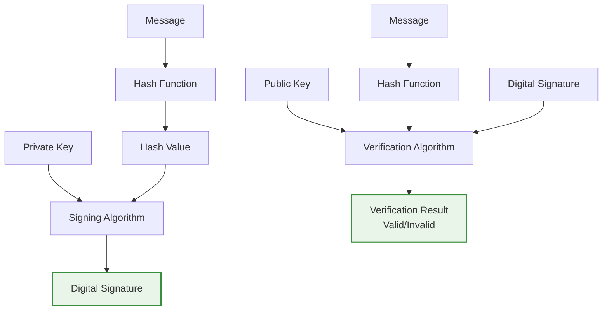

#### RSA Digital Signatures

**RSA Signature Generation**:
```
1. Compute hash: h = H(M)
2. Compute signature: s = h^d mod N
3. Output: (M, s)
```

**RSA Signature Verification**:
```
1. Compute hash: h = H(M)
2. Compute verification: v = s^e mod N
3. Check: v == h
```

**RSA Signature Variants**:

1. **RSA-PSS (Probabilistic Signature Scheme)**:
   - **Salt-based**: Adds randomness to signature
   - **Security proof**: Reduction to RSA problem
   - **Standard**: PKCS#1 v2.1

2. **RSA-PKCS#1 v1.5**:
   - **Legacy scheme**: Older RSA signature format
   - **Vulnerabilities**: Chosen-message attacks
   - **Deprecated**: Use PSS instead

#### DSA (Digital Signature Algorithm)

**DSA Parameters**:
- **p**: Prime modulus (1024-3072 bits)
- **q**: Prime divisor of p-1 (160-256 bits)
- **g**: Generator of subgroup of order q
- **Private Key**: x (1 < x < q)
- **Public Key**: y = g^x mod p

**DSA Signing**:
```
1. Generate random k (1 < k < q)
2. Compute r = (g^k mod p) mod q
3. Compute s = k^(-1) * (H(M) + xr) mod q
4. Output: (r, s)
```

**DSA Verification**:
```
1. Compute w = s^(-1) mod q
2. Compute u1 = H(M) * w mod q
3. Compute u2 = r * w mod q
4. Compute v = (g^u1 * y^u2 mod p) mod q
5. Verify: v == r
```

#### ECDSA (Elliptic Curve DSA)

**ECDSA Parameters**:
- **Elliptic Curve**: E(F_p) with generator G
- **Private Key**: d (random integer)
- **Public Key**: Q = dG

**ECDSA Signing**:
```
1. Generate random k (1 < k < n-1)
2. Compute (x, y) = kG
3. Compute r = x mod n
4. Compute s = k^(-1) * (H(M) + dr) mod n
5. Output: (r, s)
```

**ECDSA Verification**:
```
1. Verify r, s in [1, n-1]
2. Compute w = s^(-1) mod n
3. Compute u1 = H(M) * w mod n
4. Compute u2 = r * w mod n
5. Compute (x, y) = u1G + u2Q
6. Verify: r == x mod n
```

#### EdDSA (Edwards-curve DSA)

**EdDSA Advantages**:
- **Efficient**: Fast scalar multiplication
- **Secure**: Side-channel resistant
- **Simple**: Clean mathematical structure
- **Twisted Edwards Curves**: Edwards25519, Ed448

**Ed25519 Signing**:
```
1. Hash secret key: H(secret_key) = (a, prefix)
2. Scalar a = a & 0x3fffffffffffffffffffffffffffffffffffffffffffffffffffffffffffb
3. Compute r = H(prefix || message) mod q
4. Compute R = rG
5. Compute S = r + H(R || A || message) * a mod q
6. Output: (R, S)
```

**Ed25519 Verification**:
```
1. Compute A (public key point)
2. Compute h = H(R || A || message) mod q
3. Compute S*G = R + h*A
4. Verify: S*G == R + h*A
```

#### Digital Signature Applications

**PKI (Public Key Infrastructure)**:
```mermaid
graph TB
    A[PKI Components] --> B[Certificate Authority]
    A --> C[Registration Authority]
    A --> D[Certificate Repository]
    A --> E[Revocation Lists]
    
    B --> F[Root CA<br/>Intermediate CA<br/>End-entity CA]
    C --> G[Identity verification<br/>Certificate request<br/>Approval process]
    
    D --> H[Certificate storage<br/>Distribution<br/>Query interface]
    
    E --> I[CRL (Certificate Revocation List)<br/>OCSP (Online Certificate Status Protocol)]
    
    J[Certificate Lifecycle] --> K[Registration]
    J --> L[Issuance]
    J --> M[Distribution]
    J --> N[Validation]
    J --> O[Revocation]
    J --> P[Renewal]
    
    style A fill:#e3f2fd,stroke:#1565c0,stroke-width:3px
    style B fill:#fff3e0,stroke:#ef6c00,stroke-width:2px
    style J fill:#e8f5e8,stroke:#388e3c,stroke-width:2px
```

**Blockchain Applications**:
- **Bitcoin**: ECDSA signatures for transactions
- **Ethereum**: ECDSA and newer signature schemes
- **Smart Contracts**: Function call authorization
- **Multi-signature**: Multiple party approvals

**Document Authentication**:
- **PDF Signatures**: Legal document integrity
- **Code Signing**: Software authenticity
- **Email Security**: S/MIME, PGP
- **Time-stamping**: Proving existence at time

#### Digital Signature Security

**Signature Forgery Attacks**:
1. **Existential Forgery**: Forging signature for some message
2. **Selective Forgery**: Forging signature for chosen message
3. **Universal Forgery**: Forging signatures for any message

**Attack Models**:
1. **Known Message**: Attacker has message-signature pairs
2. **Chosen Message**: Attacker can request signatures for chosen messages
3. **Adaptive Chosen Message**: Dynamic message selection

**Security Considerations**:
1. **Key Management**: Secure private key storage
2. **Random Number Generation**: Cryptographically secure random numbers
3. **Side-Channel Protection**: Constant-time operations
4. **Quantum Resistance**: Post-quantum signature schemes

**Post-Quantum Signatures**:
- **Lattice-based**: CRYSTALS-Dilithium, FALCON
- **Hash-based**: SPHINCS+, XMSS
- **Code-based**: Classic McEliece, BIKE
- **Multivariate**: Rainbow, GeMSS

---

## Summary and Key Takeaways

### Cryptographic Foundations

1. **One-Way Functions**: Fundamental building blocks for all cryptographic systems
2. **Pseudorandom Generators**: Essential for key generation and stream ciphers
3. **Hash Functions**: Versatile primitives for integrity, authentication, and key derivation

### Symmetric Cryptography

1. **Block Ciphers**: High-speed encryption for bulk data (AES as gold standard)
2. **Stream Ciphers**: Efficient for real-time communication
3. **Modes of Operation**: CTR mode recommended for most applications

### Access Control

1. **DAC**: Flexible but less secure for high-assurance systems
2. **MAC**: Secure for military/government applications
3. **RBAC**: Scalable for enterprise environments
4. **ABAC**: Flexible for complex, dynamic environments

### Authentication and Signatures

1. **MACs**: Efficient symmetric authentication
2. **Digital Signatures**: Asymmetric authentication with non-repudiation
3. **Modern Schemes**: EdDSA, RSA-PSS recommended over legacy methods

### Security Best Practices

1. **Algorithm Selection**: Use NIST-approved, well-analyzed algorithms
2. **Key Management**: Secure generation, storage, and distribution
3. **Implementation Security**: Side-channel protection, constant-time operations
4. **Quantum Preparedness**: Consider post-quantum cryptography

This comprehensive understanding of cryptographic techniques and mechanisms provides the foundation for implementing secure systems in wireless and ad-hoc network environments, where efficient and robust cryptography is crucial for protecting communications and maintaining network security.

---

*Unit 2 provides the essential cryptographic foundations required for implementing security in wireless and ad-hoc networks. Mastery of these techniques is crucial for designing and deploying secure communication protocols and systems.*