# UNIT 3: SECURITY CHALLENGES AND PROTOCOLS IN WIRELESS NETWORKS
## Comprehensive Detailed Notes with Visual Diagrams

---

## Table of Contents
1. [Vulnerabilities and Security Challenges of Wireless Networks](#vulnerabilities-and-security-challenges-of-wireless-networks)
2. [Trust Assumptions and Adversary Models](#trust-assumptions-and-adversary-models)
3. [Security Protocols for Wireless Networks](#security-protocols-for-wireless-networks)
4. [Attacks Against Naming and Addressing in the Internet](#attacks-against-naming-and-addressing-in-the-internet)
5. [Security Protocols for Address Resolution and Auto-Configuration](#security-protocols-for-address-resolution-and-auto-configuration)

---

## Vulnerabilities and Security Challenges of Wireless Networks

### 3.1 Unique Wireless Security Challenges

Wireless networks present unique security challenges that differ fundamentally from wired networks due to the broadcast nature of wireless transmission and the inherent mobility of devices.

#### Radio Wave Propagation Characteristics

**Open Broadcast Medium**:
- **Signal Transmission**: Electromagnetic waves propagate in all directions
- **Uncontrolled Coverage**: Signal extends beyond intended boundaries
- **Physical Access**: No physical boundary protection
- **Eavesdropping**: Any device within range can intercept transmissions

**Propagation Models**:
1. **Free Space Path Loss**:
   ```
   PL(dB) = 20log₁₀(d) + 20log₁₀(f) + 32.44
   ```
   where d is distance in km and f is frequency in MHz

2. **Two-Ray Ground Reflection**:
   - Direct path and reflected path interference
   - Distance-dependent path loss
   - Frequency-dependent attenuation

3. **Multi-path Fading**:
   - Multiple signal paths due to reflections
   - Constructive and destructive interference
   - Time-varying channel characteristics

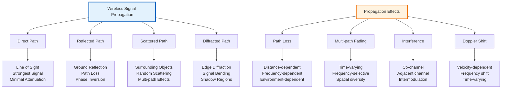

#### Dynamic Network Topology

**Mobility-Induced Changes**:
1. **Topology Changes**:
   - Nodes joining and leaving networks
   - Connection establishment and termination
   - Routing table updates
   - Neighborhood changes

2. **Signal Quality Variations**:
   - **Path Loss**: Distance-dependent signal degradation
   - **Shadowing**: Obstacle-induced signal blocking
   - **Fading**: Multi-path interference effects
   - **Interference**: Co-channel and adjacent channel

3. **Network Partitioning**:
   - **Temporary Disconnections**: Mobile nodes moving out of range
   - **Network Fragmentation**: Groups of nodes isolated from main network
   - **Bridge Formation**: Temporary connections between partitions

#### Resource Constraints in Wireless Devices

**Computational Limitations**:
- **Processing Power**: Limited CPU capabilities
- **Memory Constraints**: Restricted RAM and storage
- **Battery Life**: Power consumption concerns
- **Real-time Requirements**: Low-latency communication needs

**Energy Consumption Analysis**:
```
Total Energy = E_transmit + E_receive + E_idle + E_sleep

where:
E_transmit = P_tx × T_tx
E_receive = P_rx × T_rx
E_idle = P_idle × T_idle
E_sleep = P_sleep × T_sleep
```

**Optimization Strategies**:
1. **Sleep/Wake Scheduling**: Minimizing idle time
2. **Data Aggregation**: Reducing transmission frequency
3. **Adaptive Transmission**: Dynamic power control
4. **Protocol Efficiency**: Minimizing protocol overhead

```mermaid
graph TB
    A[Wireless Device Constraints] --> B[Computational Limits]
    A --> C[Memory Constraints]
    A --> D[Power Limitations]
    A --> E[Communication Limits]
    
    B --> F[Limited CPU<br/>Processing Speed<br/>Real-time Constraints]
    B --> F1[ARM processors<br/>8-32 bit architectures<br/>1-100 MIPS typical]
    
    C --> G[RAM: 1-64 MB<br/>Flash: 1-128 MB<br/>Cache: Limited]
    C --> G1[Code memory constraints<br/>Data structure optimization<br/>Buffer size limitations]
    
    D --> H[Battery Capacity<br/>Solar Power<br/>Energy Harvesting]
    D --> H1[100mAh-3000mAh typical<br/>1-10 years operation<br/>Duty cycle optimization]
    
    E --> I[Bandwidth: 1-100 Mbps<br/>Range: 1-1000m<br/>Latency: 1-100ms]
    E --> E1[Protocol overhead<br/>Error correction<br/>Interference management]
    
    J[Energy Optimization] --> K[Sleep/Wake Cycles]
    J --> L[Data Aggregation]
    J --> M[Adaptive Transmission]
    J --> N[Protocol Efficiency]
    
    K --> K1[Duty cycling<br/>Synchronized wake<br/>Event-driven activation]
    
    L --> L1[Local processing<br/>Compressed transmission<br/>Collaborative sensing]
    
    M --> M1[Power control<br/>Rate adaptation<br/>Channel selection]
    
    N --> N1[Reduced handshakes<br/>Efficient routing<br/>Minimal overhead]
    
    style A fill:#e3f2fd,stroke:#1565c0,stroke-width:3px
    style J fill:#e8f5e8,stroke:#388e3c,stroke-width:2px
```

### 3.1.1 Physical Layer Vulnerabilities

#### Signal Interception and Eavesdropping

**Passive Eavesdropping**:
- **Omnidirectional Antennas**: Intercept signals in all directions
- **Directional Antennas**: Focus on specific targets
- **Spectrum Analyzers**: Monitor radio frequency activity
- **Software-Defined Radio**: Flexible signal reception

**Countermeasures**:
1. **Spread Spectrum Techniques**:
   - **Frequency Hopping**: Rapid frequency switching
   - **Direct Sequence**: Pseudo-random spreading codes
   - **Time Hopping**: Transmission time randomization

2. **Directional Transmission**:
   - **Beamforming**: Focused signal transmission
   - **MIMO**: Multiple input, multiple output
   - **Smart Antennas**: Adaptive antenna arrays

#### Jamming and Interference Attacks

**Jamming Techniques**:

1. **Constant Jamming**:
   - Continuous transmission on target frequency
   - High power consumption for attacker
   - Easy to detect and locate

2. **Random Jamming**:
   - Intermittent jamming bursts
   - Lower energy consumption
   - Harder to detect

3. **Reactive Jamming**:
   - Jamming triggered by detected transmission
   - Energy-efficient
   - Difficult to distinguish from interference

4. **Protocol-Aware Jamming**:
   - Targets specific protocol messages
   - Protocol-level disruption
   - Sophisticated attack

**Jamming Detection and Mitigation**:
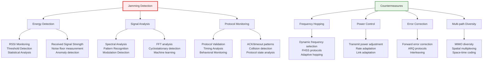

#### Signal Spoofing and Injection

**Spoofing Attacks**:
1. **Identity Spoofing**: Impersonating legitimate devices
2. **Location Spoofing**: False geographic positioning
3. **Time Spoofing**: Incorrect timing information
4. **Signal Strength Spoofing**: False signal quality claims

**Injection Attacks**:
1. **False Beacon Frames**: Malicious network announcements
2. **Fake Control Messages**: Deceptive protocol messages
3. **Replay Attacks**: Re-transmission of captured frames
4. **Protocol Confusion**: Exploiting protocol ambiguities

### 3.1.2 Link Layer Vulnerabilities

#### Wireless MAC Layer Attacks

**802.11 MAC Vulnerabilities**:

1. **Deauthentication Attacks**:
   ```
   Frame Type: Deauthentication
   Reason: 3 (Leaving network)
   Source: Attacker's MAC
   Destination: Victim's MAC
   ```
   - Forces clients to disconnect
   - Enables evil twin attacks
   - Disruption of legitimate communication

2. **Disassociation Attacks**:
   - Similar to deauthentication
   - Breaks existing associations
   - Used in handover attacks

3. **CTS/RTS Attacks**:
   - **CTS Attack**: Sends CTS frames without RTS
   - **RTS Attack**: Sends RTS frames unnecessarily
   - Channel monopolization
   - Denial of service

4. **NAV (Network Allocation Vector) Abuse**:
   - Sets excessive NAV values
   - Prevents legitimate transmissions
   - Virtual carrier sensing manipulation

**CSMA/CA Weaknesses**:
1. **Hidden Terminal Problem**:
   - Nodes cannot detect each other's transmission
   - Leads to collisions
   - Requires RTS/CTS mechanism

2. **Exposed Terminal Problem**:
   - Nodes refrain from transmission unnecessarily
   - Reduces network efficiency
   - Inefficient channel utilization

#### MAC Protocol Security Enhancements

**Enhanced Security Mechanisms**:

1. **Secure MAC Protocols**:
   - **iMAC**: Identity-based MAC protocol
   - **CMAC**: Cipher-based MAC for wireless
   - **B-MAC**: Low-power secure MAC

2. **Detection and Prevention**:
   - **Anomaly Detection**: Statistical analysis of MAC behavior
   - **Intrusion Detection**: Real-time attack identification
   - **Blacklisting**: Blocking malicious nodes
   - **Rate Limiting**: Controlling transmission rates

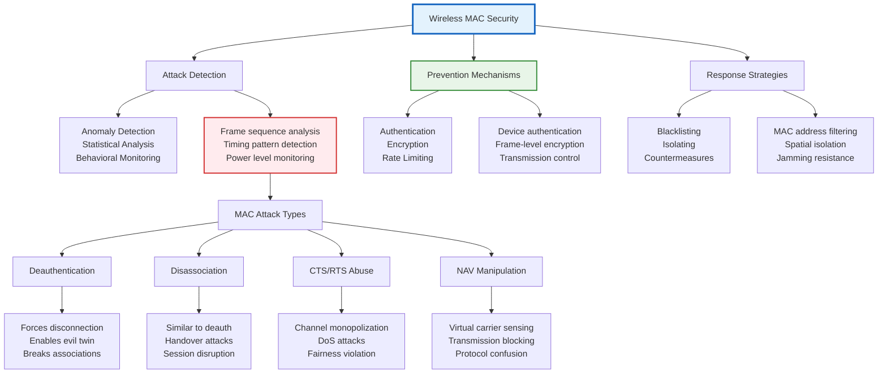

### 3.1.3 Network Layer Vulnerabilities

#### Routing Protocol Attacks

**Ad-hoc Routing Vulnerabilities**:

1. **AODV (Ad-hoc On-Demand Distance Vector) Attacks**:
   - **Route Discovery Pollution**: Broadcasting false routes
   - **Route Maintenance Attacks**: Forging error messages
   - **Sequence Number Manipulation**: Causing routing loops

2. **DSR (Dynamic Source Routing) Attacks**:
   - **Source Route Manipulation**: Adding/removing hops
   - **Route Cache Poisoning**: Corrupting route information
   - **Packet Dropping**: Selective forwarding attacks

3. **OLSR (Optimized Link State Routing) Attacks**:
   - **Topology Control Message Manipulation**: False link information
   - **MPR (Multi-Point Relay) Attacks**: Compromised MPR selection
   - **Sequence Number Fraud**: Outdated information injection

**Routing Attack Classification**:
```mermaid
graph TB
    A[Routing Attacks] --> B[Active Attacks]
    A --> C[Passive Attacks]
    
    B --> D[Route Manipulation]
    B --> E[DoS Attacks]
    B --> F[Impersonation]
    
    C --> G[Eavesdropping]
    C --> H[Traffic Analysis]
    C --> I[Information Gathering]
    
    D --> D1[False Route Creation<br/>Route Modification<br/>Route Deletion]
    D --> D2[Route Discovery Attacks<br/>Route Maintenance Attacks<br/>Data Plane Attacks]
    
    E --> E1[Route Flooding<br/>Blackhole Attacks<br/>Selective Forwarding]
    E --> E2[Resource Exhaustion<br/>Channel Saturation<br/>Protocol Disruption]
    
    F --> F1[Identity Spoofing<br/>Position Spoofing<br/>Time Spoofing]
    F --> F2[MAC Spoofing<br/>IP Spoofing<br/>Route Spoofing]
    
    G --> G1[Route Discovery Eavesdropping<br/>Data Transmission Interception<br/>Control Message Capture]
    
    H --> H1[Communication Pattern Analysis<br/>Network Topology Discovery<br/>Traffic Flow Analysis]
    
    I --> I1[Node Profiling<br/>Network Mapping<br/>Vulnerability Discovery]
    
    J[Defense Mechanisms] --> K[Authentication]
    J --> L[Intrusion Detection]
    J --> M[Secure Routing]
    
    K --> K1[Digital Signatures<br/>Message Authentication<br/>Key Management]
    
    L --> L1[Anomaly Detection<br/>Behavior Analysis<br/>Trust Models]
    
    M --> M1[Cryptographic Protocols<br/>Secure Neighbor Discovery<br/>Privacy Protection]
    
    style A fill:#e3f2fd,stroke:#1565c0,stroke-width:3px
    style B fill:#ffcdd2,stroke:#d32f2f,stroke-width:2px
    style C fill:#fff3e0,stroke:#ef6c00,stroke-width:2px
    style J fill:#e8f5e8,stroke:#388e3c,stroke-width:2px
```

#### IP Layer Security Issues

**IPv4 Security Weaknesses**:
1. **Address Resolution Protocol (ARP) Spoofing**:
   - **ARP Poisoning**: False IP-MAC mappings
   - **ARP Flooding**: Network disruption
   - **ARP Cache Poisoning**: Persistent false mappings

2. **Routing Protocol Attacks**:
   - **RIP (Routing Information Protocol)**: False route announcements
   - **OSPF (Open Shortest Path First)**: Link state database corruption
   - **BGP (Border Gateway Protocol)**: Route hijacking

**IPv6 Security Enhancements**:
1. **Built-in Security**: IPSec support mandatory
2. **Address Privacy**: Privacy extensions for temporary addresses
3. **Duplicate Address Detection**: Prevents address conflicts
4. **Neighbor Discovery Security**: Cryptographic protections

### 3.1.4 Application Layer Vulnerabilities

#### Protocol-Specific Attacks

**HTTP/HTTPS Attacks**:
1. **Man-in-the-Middle**: Interception and modification
2. **SSL/TLS Downgrade**: Forcing weaker cipher suites
3. **Certificate Spoofing**: False certificate presentations
4. **Session Hijacking**: Stealing authenticated sessions

**DNS Security Issues**:
1. **DNS Spoofing**: Corrupting DNS responses
2. **DNS Amplification**: Reflecting attacks
3. **DNS Tunneling**: Covert communication channels
4. **DNS Cache Poisoning**: Persistent false records

**Email Security**:
1. **SMTP Spoofing**: Forging email headers
2. **Spam Distribution**: Bulk unsolicited emails
3. **Email Harvesting**: Extracting email addresses
4. **Attachment-based Attacks**: Malicious attachments

#### Wireless Application Security

**Mobile Application Risks**:
1. **Insecure Data Storage**: Local data exposure
2. **Insecure Communication**: Unencrypted data transmission
3. **Insufficient Cryptography**: Weak encryption implementations
4. **Insecure Authentication**: Flawed authentication mechanisms

**IoT Device Vulnerabilities**:
1. **Default Credentials**: Unchanged factory passwords
2. **Firmware Exploitation**: Vulnerable device firmware
3. **Network Segmentation**: Poor network isolation
4. **Update Mechanisms**: Insecure update processes

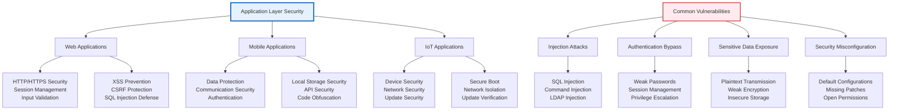

---

## Trust Assumptions and Adversary Models

### 3.2 Trust Models in Wireless Networks

**Trust** in wireless networks refers to the confidence that one entity has in the behavior, integrity, and reliability of another entity.

#### Trust Components

1. **Reliability**: Consistent and predictable behavior
2. **Competence**: Ability to perform required functions
3. **Benevolence**: Acting in the best interest of the system
4. **Integrity**: Adherence to expected standards and protocols

#### Trust Models Classification

```mermaid
graph TB
    A[Trust Models] --> B[Centralized Trust]
    A --> C[Distributed Trust]
    A --> D[Hierarchical Trust]
    A --> E[Peer-to-Peer Trust]
    
    B --> F[Single Authority<br/>Certificate Authority<br/>Key Distribution Center]
    B --> F1[Strong Authentication<br/>Certificate Management<br/>Centralized Control]
    
    C --> G[Multiple Authorities<br/>Cross-certification<br/>Trust Networks]
    C --> G1[Decentralized Management<br/>Flexible Trust Paths<br/>Resilient to Failure]
    
    D --> H[Hierarchical Structure<br/>Parent-Child Trust<br/>Delegation]
    D --> H1[Scalable Organization<br/>Delegated Authority<br/>Clear Hierarchy]
    
    E --> I[Peer Relationships<br/>Direct Trust<br/>Recommendation Trust]
    E --> I1[Equal Participants<br/>Direct Observation<br/>Social Networks]
    
    J[Trust Metrics] --> K[Direct Trust]
    J --> L[Recommendation Trust]
    J --> M[Context-dependent Trust]
    
    K --> K1[First-hand Experience<br/>Observable Behavior<br/>Historical Data]
    
    L --> L1[Third-party Recommendations<br/>Reputation Systems<br/>Trust Transfer]
    
    M --> M1[Temporal Validity<br/>Context Specificity<br/>Risk Assessment]
    
    style A fill:#e3f2fd,stroke:#1565c0,stroke-width:3px
    style J fill:#e8f5e8,stroke:#388e3c,stroke-width:2px
```

### 3.2.1 Centralized Trust Models

#### Certificate Authority (CA) Model

**CA Hierarchy**:
```
Root CA
├── Intermediate CA 1
│   ├── End Entity Certificate A
│   └── End Entity Certificate B
└── Intermediate CA 2
    ├── End Entity Certificate C
    └── End Entity Certificate D
```

**Trust Anchor Selection**:
1. **Root CA Selection**: Organization chooses trusted root CAs
2. **Certificate Validation**: Path validation to trusted anchor
3. **Revocation Checking**: Certificate revocation status
4. **Policy Enforcement**: Certificate policy compliance

**PKI in Wireless Networks**:
```mermaid
graph TB
    A[Wireless PKI] --> B[Registration Authority]
    A --> C[Certificate Authority]
    A --> D[Certificate Repository]
    A --> E[Revocation Service]
    
    B --> F[Identity Verification<br/>Certificate Request<br/>Key Generation]
    B --> F1[Manual verification<br/>Automated validation<br/>Hardware security modules]
    
    C --> G[Certificate Issuance<br/>Key Management<br/>Policy Enforcement]
    C --> G1[Hardware security modules<br/>Secure key storage<br/>Audit trails]
    
    D --> H[Certificate Storage<br/>Distribution<br/>Query Interface]
    D --> H1[LDAP directories<br/>HTTP repositories<br/>OCSP responders]
    
    E --> I[CRL Distribution<br/>OCSP Service<br/>Delta CRLs]
    E --> I1[Certificate Revocation List<br/>Online Certificate Status Protocol<br/>Short-lived certificates]
    
    J[Wireless PKI Challenges] --> K[Key Distribution]
    J --> L[Certificate Validation]
    J --> M[Revocation Checking]
    J --> N[Offline Validation]
    
    K --> K1[Secure channel required<br/>Initial key exchange<br/>Device provisioning]
    
    L --> L1[Path validation<br/>Policy checking<br/>Usage validation]
    
    M --> M1[Real-time checking<br/>Connectivity dependency<br/>Response time requirements]
    
    N --> N1[Cached certificates<br/>Offline validation<br/>Short-lived credentials]
    
    style A fill:#e3f2fd,stroke:#1565c0,stroke-width:3px
    style J fill:#ffebee,stroke:#d32f2f,stroke-width:2px
```

#### Key Distribution Center (KDC)

**Kerberos Protocol**:
1. **Authentication Server (AS)**: Validates user identity
2. **Ticket Granting Server (TGS)**: Issues service tickets
3. **Service Server**: Provides requested services

**Kerberos Process**:
```
1. Client → AS: Request for TGT
2. AS → Client: TGT encrypted with client's key
3. Client → TGS: Service request with TGT
4. TGS → Client: Service ticket encrypted with service key
5. Client → Service: Service request with service ticket
6. Service → Client: Service response (mutual authentication)
```

### 3.2.2 Distributed Trust Models

#### Web of Trust

**Concept**: Trust established through personal relationships and recommendations.

**Trust Relationships**:
- **Direct Trust**: Based on personal experience
- **Recommendation Trust**: Based on others' recommendations
- **Trust Paths**: Chains of trust relationships

**Trust Metrics**:
```
Trust(X, Y) = f(Direct_Experience, Recommendations, Context)

where:
- Direct_Experience: Historical interaction quality
- Recommendations: Third-party trust assessments
- Context: Specific application domain
```

#### Peer-to-Peer Trust Models

**Distributed Reputation Systems**:
1. **EigenTrust**: Reputation propagation using eigenvector centrality
2. **PeerTrust**: Multi-dimensional trust metrics
3. **PowerTrust**: Power node-based reputation system

**Trust Propagation Algorithms**:
```mermaid
graph TB
    A[Trust Propagation] --> B[Direct Trust]
    A --> C[Recommendation Chain]
    A --> D[Trust Aggregation]
    
    B --> E[Observable Behavior<br/>First-hand Experience<br/>Performance Metrics]
    B --> E1[Reliability measurements<br/>Response time analysis<br/>Quality of service]
    
    C --> F[Peer Recommendations<br/>Trust Transfer<br/>Trust Chains]
    C --> F1[Reputation sharing<br/>Trust path discovery<br/>Recommendation validation]
    
    D --> G[Weighted Aggregation<br/>Trust Discounting<br/>Confidence Calculation]
    D --> G1[Distance-based weighting<br/>Recommendation reliability<br/>Trust certainty]
    
    H[Trust Metrics] --> I[Reliability]
    H --> J[Competence]
    H --> K[Cooperation]
    H --> L[Honesty]
    
    I --> I1[Consistent Performance<br/>Predictable Behavior<br/>Dependability]
    
    J --> J1[Technical Capability<br/>Resource Availability<br/>Expertise Level]
    
    K --> K1[Collaborative Behavior<br/>Resource Sharing<br/>Mutual Benefit]
    
    L --> L1[Truthfulness<br/>Transparency<br/>Good Intentions]
    
    style A fill:#e3f2fd,stroke:#1565c0,stroke-width:3px
    style H fill:#e8f5e8,stroke:#388e3c,stroke-width:2px
```

### 3.2.3 Adversary Models

#### Adversary Classification

**By Capabilities**:

1. **Passive Adversaries**:
   - **Eavesdropping**: Monitor communications
   - **Traffic Analysis**: Analyze communication patterns
   - **Position Estimation**: Determine node locations
   - **Network Mapping**: Discover network topology

2. **Active Adversaries**:
   - **Message Modification**: Alter transmitted messages
   - **Message Injection**: Insert false messages
   - **Message Dropping**: Selective forwarding
   - **Protocol Disruption**: Confuse protocol state

3. **Byzantine Adversaries**:
   - **Arbitrary Behavior**: Act arbitrarily and maliciously
   - **Insider Threats**: Compromised legitimate nodes
   - **Adaptive Attacks**: Change strategy based on network response
   - **Coordinated Attacks**: Multiple malicious nodes working together

#### Specific Adversary Models

**Mobile Adversary**:
- **Mobility Pattern**: Random waypoint, group mobility
- **Coverage Area**: Limited by transmission range
- **Attack Capability**: Varies with position and timing
- **Detection Evasion**: Uses mobility to avoid detection

**Cognitive Adversary**:
- **Learning Capability**: Adapts to network defenses
- **Strategy Evolution**: Improves attack methods over time
- **Pattern Recognition**: Identifies network vulnerabilities
- **Prediction Ability**: Anticipates network behavior

**Computational Adversary**:
- **Limited Resources**: Battery, processing, memory constraints
- **Energy Management**: Balances attack impact with energy cost
- **Adaptive Complexity**: Adjusts attack sophistication to resources
- **Cooperative Attacks**: Shares resources with other adversaries

```mermaid
graph TB
    A[Adversary Models] --> B[Capability-based]
    A --> C[Location-based]
    A --> D[Resource-based]
    A --> E[Behavioral]
    
    B --> F[Passive]
    B --> G[Active]
    B --> H[Byzantine]
    
    F --> F1[Eavesdropping<br/>Traffic Analysis<br/>Network Discovery]
    
    G --> G1[Message Modification<br/>Protocol Disruption<br/>DoS Attacks]
    
    H --> H1[Insider Threats<br/>Coordinated Attacks<br/>Adaptive Strategies]
    
    C --> I[Static]
    C --> J[Mobile]
    C --> K[Cognitive]
    
    I --> I1[Fixed Position<br/>Predictable Coverage<br/>Detection Risk]
    
    J --> J1[Dynamic Position<br/>Variable Coverage<br/>Evasion Capability]
    
    K --> K1[Learning Capability<br/>Strategy Evolution<br/>Pattern Recognition]
    
    D --> L[Computational]
    D --> M[Energy-constrained]
    D --> N[Cooperative]
    
    L --> L1[Resource Limitations<br/>Adaptive Complexity<br/>Efficiency Optimization]
    
    M --> M1[Battery Management<br/>Attack Scheduling<br/>Energy Trade-offs]
    
    N --> N1[Resource Sharing<br/>Coordinated Actions<br/>Distributed Attacks]
    
    E --> O[Rational]
    E --> P[Malicious]
    E --> Q[Rational-Myopic]
    
    O --> O1[Economic Incentives<br/>Cost-Benefit Analysis<br/>Strategic Behavior]
    
    P --> P1[Pure Malice<br/>No Economic Logic<br/>Maximum Damage]
    
    Q --> Q1[Short-term Optimization<br/>Limited Planning<br/>Greedy Behavior]
    
    style A fill:#e3f2fd,stroke:#1565c0,stroke-width:3px
    style F fill:#e8f5e8,stroke:#388e3c,stroke-width:1px
    style G fill:#fff3e0,stroke:#ef6c00,stroke-width:1px
    style H fill:#ffcdd2,stroke:#d32f2f,stroke-width:1px
```

---

## Security Protocols for Wireless Networks

### 3.3.1 Wireless Security Protocols Evolution

#### WEP (Wired Equivalent Privacy)

**WEP Overview**:
- **Standard**: IEEE 802.11 (1997)
- **Encryption**: RC4 stream cipher
- **Key Size**: 40-bit or 104-bit
- **Authentication**: Open system or shared key
- **Status**: Deprecated due to security vulnerabilities

**WEP Operation**:
```
1. Key Scheduling: 104-bit key + 24-bit IV
2. Keystream Generation: RC4(K || IV)
3. Encryption: C = P ⊕ RC4(K || IV)
4. Authentication: CRC-32 for integrity
```

**WEP Vulnerabilities**:

1. **Weak Key Scheduling**:
   ```
   IV Collision: Different messages with same IV
   Key Recovery: Statistical attacks on key material
   ```

2. **RC4 Weaknesses**:
   ```
   Fluhrer-McGrew Attacks: Exploiting RC4 key schedule
   Related Key Attacks: Multiple key relationships
   ```

3. **Authentication Vulnerabilities**:
   ```
   Shared Key Challenge: Predictable challenge-response
   Replay Attacks: Re-transmission of valid authentication
   ```

**WEP Attack Demonstration**:
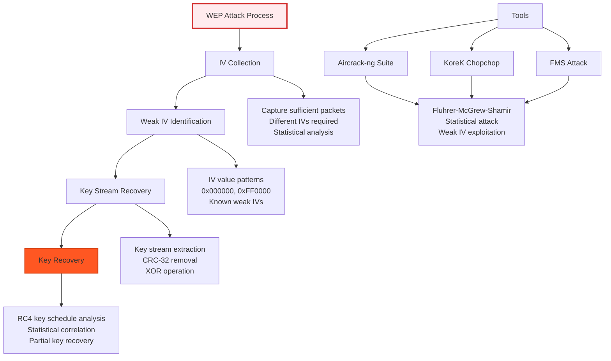

#### WPA (WiFi Protected Access)

**WPA Overview**:
- **Standard**: IEEE 802.11i draft (2003)
- **Encryption**: TKIP (Temporal Key Integrity Protocol)
- **Authentication**: 802.1X with EAP
- **Integrity**: Michael MIC (Message Integrity Code)

**TKIP Enhancements**:
1. **Dynamic Key Management**: Per-packet key derivation
2. **MIC Protection**: Michael integrity code
3. **IV Counter**: 48-bit IV sequence counter
4. **Replay Protection**: Sequence number verification

**TKIP Operation**:
```
1. Key Derivation: PTK = PRF(PMK, ANonce, SNonce, MAC_A, MAC_B)
2. Per-packet Key: TKIP key mixing function
3. Encryption: RC4 with per-packet key
4. Integrity: Michael MIC calculation
```

**WPA Vulnerabilities**:
1. **Michael MIC Weaknesses**:
   ```
   MIC forgery possible with moderate effort
   Computational complexity: 2^29 operations
   Attack time: Approximately 1 minute
   ```

2. **TKIP Limitations**:
   ```
   RC4-based encryption
   Compatibility with legacy hardware
   Performance overhead
   ```

#### WPA2 (WiFi Protected Access 2)

**WPA2 Overview**:
- **Standard**: IEEE 802.11i (2004)
- **Encryption**: AES-CCMP
- **Authentication**: 802.1X with EAP
- **Integrity**: AES-CBC-MAC (CCMP)

**AES-CCMP**:
```
1. Packet Number (PN): 48-bit sequence counter
2. Key Derivation: CCMP key derivation function
3. Encryption: AES-CTR mode
4. Integrity: AES-CBC-MAC
```

**CCMP Operation**:
```mermaid
graph TB
    A[CCMP Process] --> B[CCMP Header]
    A --> C[Key Derivation]
    A --> D[AES-CTR Encryption]
    A --> E[AES-CBC-MAC]
    
    B --> B1[PN field: 48-bit<br/>Key ID: 6 bits<br/>Reserved: 10 bits]
    
    C --> C1[CCMP key derivation<br/>KCK, KEK, TEK<br/>IEEE 802.11i specification]
    
    D --> D1[AES-CTR mode<br/>Counter: PN || 0x5A<br/>Encryption: P_i ⊕ AES_CTR]
    
    E --> E1[AES-CBC-MAC<br/>Key: KCK<br/>Authentication: MIC]
    
    F[Security Properties] --> G[Confidentiality]
    F --> H[Integrity]
    F --> I[Replay Protection]
    F --> J[Key Management]
    
    G --> G1[AES-128 encryption<br/>Counter mode<br/>Semantic security]
    
    H --> G1[AES-CBC-MAC<br/>64-bit MIC<br/>Forgery resistance]
    
    I --> G1[PN sequence checking<br/>Duplicate detection<br/>Replay window]
    
    J --> G1[Per-session keys<br/>Key rotation<br/>Secure derivation]
    
    style A fill:#e3f2fd,stroke:#1565c0,stroke-width:3px
    style F fill:#e8f5e8,stroke:#388e3c,stroke-width:2px
```

**WPA2 Security Analysis**:
1. **KRACK Attack (Key Reinstallation Attack)**:
   ```
   Vulnerability: WPA2 4-way handshake
   Attack: Reinstalling already-used keys
   Impact: Packet decryption and injection
   Status: Patched in most implementations
   ```

2. **PMKID Attack**:
   ```
   Vulnerability: PMKID extraction from 4-way handshake
   Attack: Offline dictionary attack on PMK
   Impact: Network password recovery
   Mitigation: Strong password policies
   ```

#### WPA3 (WiFi Protected Access 3)

**WPA3 Overview**:
- **Standard**: WiFi Alliance (2018)
- **Encryption**: AES-GCMP (Galois/Counter Mode Protocol)
- **Authentication**: SAE (Simultaneous Authentication of Equals)
- **Forward Secrecy**: Enhanced protection

**SAE (Simultaneous Authentication of Equals)**:
```
1. Password Element Generation: PWE = H(PW, i)
2. Scalar Exchange: PWE^a, PWE^b
3. Secret Computation: Shared secret = PWE^(ab)
4. Key Derivation: PMK = KDF(Shared secret)
```

**WPA3 Security Features**:
1. **Forward Secrecy**: Compromised password doesn't reveal past traffic
2. **Dragonfly Handshake**: Password-authenticated key exchange
3. **Protected Management Frames**: Enhanced management frame security
4. **Enhanced Open**: Opportunistic Wireless Encryption

### 3.3.2 Enterprise Wireless Security

#### 802.1X Authentication Framework

**802.1X Components**:
1. **Supplicant**: Client device requesting access
2. **Authenticator**: Network access device (AP, switch)
3. **Authentication Server**: RADIUS server for verification

**EAP (Extensible Authentication Protocol)**:
- **EAP-MD5**: Simple challenge-response (legacy)
- **EAP-TLS**: Certificate-based authentication
- **EAP-PEAP**: Protected EAP with TLS tunnel
- **EAP-TTLS**: Tunneled Transport Layer Security
- **EAP-FAST**: Flexible Authentication via Secure Tunneling

**802.1X Process**:
```mermaid
graph TB
    A[802.1X Authentication] --> B[Supplicant]
    A --> C[Authenticator]
    A --> D[Authentication Server]
    
    B --> E[Port Control<br/>EAP Protocol<br/>User Credentials]
    B --> E1[802.1X client<br/>EAP implementation<br/>Authentication methods]
    
    C --> F[Port Authorization<br/>Proxy EAP<br/>RADIUS Client]
    C --> F1[Network access point<br/>EAP relay<br/>RADIUS communication]
    
    D --> G[User Authentication<br/>Policy Enforcement<br/>Accounting]
    D --> G1[RADIUS server<br/>User database<br/>Access policies]
    
    H[Authentication Flow] --> I[EAP Start]
    H --> J[EAP Identity Request]
    H --> K[EAP Identity Response]
    H --> L[RADIUS Access Request]
    H --> M[RADIUS Access Accept]
    H --> N[Port Authorized]
    
    I --> I1[Supplicant initiates<br/>EAP-Start message<br/>Port Uncontrolled]
    
    J --> J1[Authenticator requests<br/>Identity information<br/>EAP-Request Identity]
    
    K --> K1[Supplicant responds<br/>User identity<br/>EAP-Response Identity]
    
    L --> K1[Authenticator forwards<br/>To RADIUS server<br/>Access-Request]
    
    M --> M1[RADIUS validates<br/>User credentials<br/>Access-Accept/Reject]
    
    N --> M1[Port becomes authorized<br/>Full network access<br/>EAP Success]
    
    style A fill:#e3f2fd,stroke:#1565c0,stroke-width:3px
    style H fill:#e8f5e8,stroke:#388e3c,stroke-width:2px
```

#### RADIUS Security

**RADIUS (Remote Authentication Dial-In User Service)**:
1. **Client**: Network access device (authenticator)
2. **Server**: Authentication and authorization server
3. **User**: Client requesting network access

**RADIUS Message Types**:
- **Access-Request**: Client authentication request
- **Access-Accept**: Successful authentication
- **Access-Reject**: Failed authentication
- **Accounting-Request**: Usage accounting
- **Accounting-Response**: Accounting acknowledgment

**RADIUS Security Mechanisms**:
1. **Shared Secret**: Client-server authentication
2. **Message Authenticator**: HMAC-MD5 integrity
3. **Attribute Encryption**: Sensitive data protection
4. **IPsec**: Network-level security

### 3.3.3 Emerging Wireless Security Standards

#### IEEE 802.11w (Protected Management Frames)

**Protected Management Frames (PMF)**:
- **Management Frame Protection**: Secures 802.11 management frames
- **Deauthentication Protection**: Prevents fake disconnection
- **Disassociation Protection**: Protects against forced disconnection
- **Robust Security Network (RSN)**: Enhanced security framework

**PMF Benefits**:
1. **Management Frame Integrity**: Cryptographic protection
2. **Replay Protection**: Sequence number validation
3. **Authentication**: Sender verification
4. **Encryption**: Confidentiality for management frames

#### IEEE 802.11ai (Fast Initial Link Setup)

**FILS (Fast Initial Link Setup)**:
- **Reduced Setup Time**: Faster connection establishment
- **Pre-authentication**: Cache-based authentication
- **Discovery Optimization**: Enhanced AP discovery
- **Security Integration**: Built-in security mechanisms

#### IEEE 802.11ax (High Efficiency Wireless)

**WiFi 6 Security Enhancements**:
- **BSS Coloring**: Spatial reuse with security
- **Multi-User MIMO**: Secure multi-user scheduling
- **OFDMA**: Secure resource allocation
- **Target Wake Time**: Secure power management

```mermaid
graph TB
    A[Emerging Wireless Standards] --> B[802.11w PMF]
    A --> C[802.11ai FILS]
    A --> D[802.11ax WiFi 6]
    A --> E[802.11ay WiGig]
    
    B --> F[Management Frame Protection<br/>Deauth Prevention<br/>Replay Protection]
    B --> F1[Encrypted management frames<br/>Sequential integrity<br/>Authenticated frames]
    
    C --> G[Fast Connection Setup<br/>Pre-authentication<br/>Discovery Optimization]
    C --> G1[Reduced handshake time<br/>Cached credentials<br/>Efficient AP selection]
    
    D --> H[High Efficiency<br/>Spatial Reuse<br/>Multi-User Support]
    D --> H1[BSS coloring security<br/>Secure MU-MIMO<br/>Protected OFDMA]
    
    E --> I[60 GHz Band<br/>Multi-gigabit Speeds<br/>Short Range]
    E --> I1[Directional beams<br/>Beamforming security<br/>High bandwidth encryption]
    
    J[Security Integration] --> K[Seamless Security]
    J --> L[Performance Impact]
    J --> M[Backward Compatibility]
    
    K --> K1[Automatic security<br/>Protocol integration<br/>Unified framework]
    
    L --> L1[Minimal overhead<br/>Efficient algorithms<br/>Hardware acceleration]
    
    M --> M1[Legacy support<br/>Gradual migration<br/>Interoperability]
    
    style A fill:#e3f2fd,stroke:#1565c0,stroke-width:3px
    style J fill:#e8f5e8,stroke:#388e3c,stroke-width:2px
```

---

## Attacks Against Naming and Addressing in the Internet

### 3.4.1 DNS Security Vulnerabilities

#### DNS Protocol Weaknesses

**DNS Overview**:
- **Port**: UDP 53 (primary), TCP 53 (zone transfers)
- **Query-Response**: Simple request-response model
- **Caching**: Recursive resolver caching
- **Distribution**: Distributed database architecture

**DNS Query Process**:
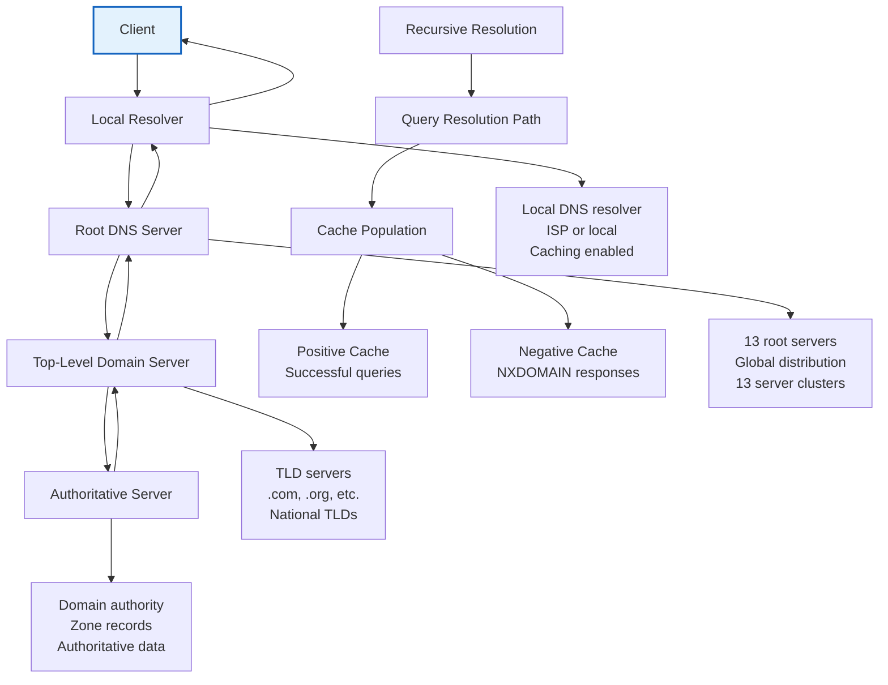

#### DNS Attack Vectors

**1. DNS Spoofing/Poisoning**:

**Cache Poisoning**:
```
1. Attacker sends forged DNS response before legitimate response
2. Response contains false IP address for target domain
3. Resolver caches false information
4. Subsequent queries return poisoned data
```

**Implementation Techniques**:
- **Bogon Responses**: Using unassigned IP addresses
- **Birthday Attack**: Exploiting probability of ID collision
- **Kaminsky Attack**: Multiple queries with varying names

**2. DNS Amplification Attacks**:

**Reflection-Based DDoS**:
```
1. Attacker sends small DNS query with spoofed source IP
2. DNS server responds with large response to victim
3. Amplification factor: 28-54x typical
4. Botnet amplification: Massive traffic volume
```

**Attack Characteristics**:
- **Source IP Spoofing**: Victim IP in DNS queries
- **Open Resolvers**: Misconfigured DNS servers
- **Amplification Factor**: Response size / query size ratio
- **Reflection**: Third-party DNS servers as amplifiers

**3. DNS Tunneling**:

**Covert Communication Channel**:
```
1. Encode data in DNS queries/responses
2. Use TXT, MX, CNAME records for data
3. Bypass network security controls
4. Exfiltrate data or establish C&C channel
```

**Detection Methods**:
- **Unusual Query Patterns**: High-frequency, specific domains
- **Base64 Encoding**: Encoded data in query names
- **Large Response Sizes**: Unusual TXT record sizes
- **Entropy Analysis**: High randomness in query names

```mermaid
graph TB
    A[DNS Security Threats] --> B[DNS Spoofing]
    A --> C[DNS Amplification]
    A --> D[DNS Tunneling]
    A --> E[DNS Hijacking]
    
    B --> F[Cache Poisoning<br/>Response Forgery<br/>ID Prediction]
    B --> F1[False IP mappings<br/>Malicious redirect<br/>Man-in-the-middle]
    
    C --> G[Reflection Attacks<br/>Amplification Factor<br/>Open Resolver Exploitation]
    C --> G1[DDoS amplification<br/>Traffic multiplication<br/>Bandwidth exhaustion]
    
    D --> H[Data Exfiltration<br/>C&C Channels<br/>Covert Communication]
    D --> H1[DNS as transport<br/>Bypass controls<br/>Steganographic data]
    
    E --> I[Domain Hijacking<br/>NS Record Manipulation<br/>Registry Compromise]
    E --> E1[Domain takeover<br/>Unauthorized changes<br/>Propagation attacks]
    
    J[Defense Mechanisms] --> K[DNSSEC]
    J --> L[DNS Filtering]
    J --> M[Rate Limiting]
    J --> N[Recursion Control]
    
    K --> K1[Cryptographic signatures<br/>Chain of trust<br/>Authentication]
    
    L --> L1[Domain blacklists<br/>Reputation systems<br/>Content filtering]
    
    M --> M1[Query rate limits<br/>Response rate limits<br/>Amplification control]
    
    N --> N1[Resolver restrictions<br/>Authorized clients only<br/>Access control]
    
    style A fill:#e3f2fd,stroke:#1565c0,stroke-width:3px
    style J fill:#e8f5e8,stroke:#388e3c,stroke-width:2px
```

### 3.4.2 DNS Security Extensions (DNSSEC)

#### DNSSEC Architecture

**DNSSEC Components**:
1. **Resource Record Signature (RRSIG)**: Cryptographic signatures
2. **DNS Public Key (DNSKEY)**: Public keys for verification
3. **Delegation Signer (DS)**: Trust anchor delegation
4. **Next Secure (NSEC/NSEC3)**: Authenticated denial of existence

**DNSSEC Chain of Trust**:
```
Root KSK → Root ZSK → .com KSK → .com ZSK → example.com ZSK
```

**DNSSEC Operation**:
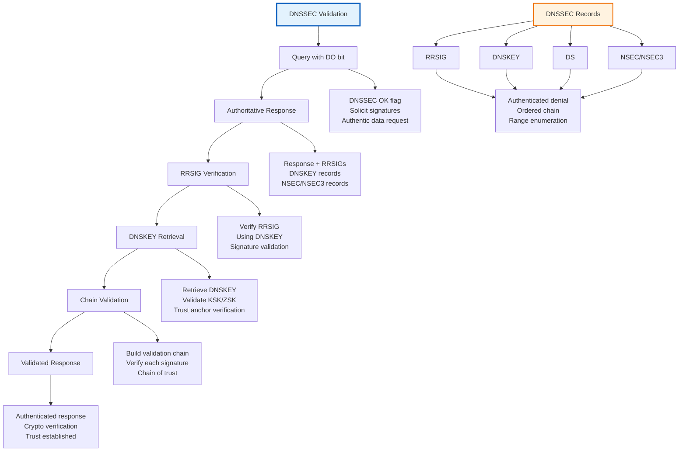

#### DNSSEC Implementation

**Zone Signing Process**:
1. **Key Generation**: Generate KSK and ZSK pairs
2. **Zone Signing**: Sign all RRsets with ZSK
3. **KSK Signing**: Sign DNSKEY RRset with KSK
4. **DS Submission**: Submit DS record to parent zone

**Key Rollover**:
- **ZSK Rollover**: Regular rotation (quarterly/annually)
- **KSK Rollover**: Less frequent rotation (multi-year)
- **Emergency Rollover**: Compromise response procedures

**DNSSEC Validation**:
1. **Query with DO Flag**: Request DNSSEC data
2. **Response Verification**: Validate signatures
3. **Chain Building**: Build authentication chain
4. **Trust Anchor Validation**: Verify against root keys

### 3.4.3 Address Resolution Attacks

#### ARP (Address Resolution Protocol) Vulnerabilities

**ARP Operation**:
```
1. Host needs MAC for IP: 192.168.1.1
2. Sends ARP Request: "Who has 192.168.1.1? Tell 192.168.1.100"
3. 192.168.1.1 responds: "192.168.1.1 is at 00:11:22:33:44:55"
4. Host caches IP-MAC mapping
```

**ARP Spoofing/Poisoning**:
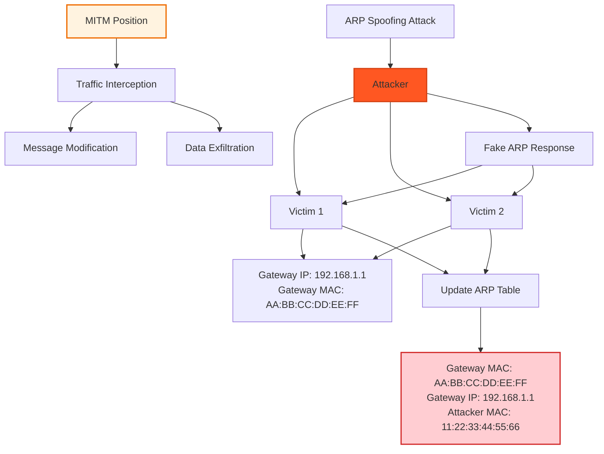

**ARP Attack Techniques**:
1. **Gratuitous ARP**: Unsolicited ARP responses
2. **ARP Flooding**: Excessive ARP traffic
3. **ARP Cache Poisoning**: False IP-MAC mappings
4. **ARP Proxy**: Responding for non-existent hosts

#### IPv6 Neighbor Discovery Attacks

**IPv6 Neighbor Discovery Protocol (NDP)**:
- **Router Solicitation/Advertisement**: Router discovery
- **Neighbor Solicitation/Advertisement**: Address resolution
- **Duplicate Address Detection**: Address uniqueness verification

**NDP Attack Vectors**:
1. **Router Advertisement Spoofing**:
   ```
   False router advertisements with:
   - Malicious prefix information
   - False DNS servers
   - Incorrect hop limits
   ```

2. **Neighbor Advertisement Spoofing**:
   ```
   False neighbor advertisements for:
   - Duplicate address claims
   - Wrong link-layer addresses
   - Address resolution hijacking
   ```

3. **Duplicate Address Detection Attacks**:
   ```
   Legitimate address claims:
   - Prevents address assignment
   - Causes DoS on address allocation
   - Network access denial
   ```

**NDP Security Enhancements**:
```mermaid
graph TB
    A[IPv6 Neighbor Discovery Security] --> B[SEND (Secure Neighbor Discovery)]
    A --> C[RA Guard]
    A --> D[DHCPv6 Guard]
    
    B --> E[Cryptographically Generated Addresses]
    B --> F[RSA Signatures]
    B --> G[Nonce-based Protection]
    
    C --> H[Router Advertisement Filtering]
    C --> I[Port-based VLAN Control]
    C --> J[Layer 2 Security]
    
    D --> K[DHCPv6 Message Filtering]
    D --> L[Server/Relay Isolation]
    D --> M[Authorized DHCPv6 Servers]
    
    E --> E1[CGA-based addresses<br/>Cryptographic addresses<br/>Address ownership proof]
    
    F --> E1[Message authentication<br/>Non-repudiation<br/>Tamper detection]
    
    G --> E1[Replay attack prevention<br/>Freshness validation<br/>Timing protection]
    
    H --> H1[Port security<br/>ACL filtering<br/>RA validation]
    
    style A fill:#e3f2fd,stroke:#1565c0,stroke-width:3px
    style B fill:#e8f5e8,stroke:#388e3c,stroke-width:2px
```

---

## Security Protocols for Address Resolution and Auto-Configuration

### 3.5.1 Secure Address Resolution Protocols

#### ARP Security Enhancements

**Dynamic ARP Inspection (DAI)**:
- **DHCP Snooping**: Builds IP-MAC binding database
- **ARP Validation**: Validates ARP packets against bindings
- **Rate Limiting**: Prevents ARP flooding
- **Logging**: Records suspicious ARP activity

**ARP Security Configuration**:
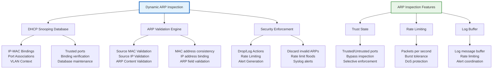

**ARPWatch and ARP Security Tools**:
1. **ARPWatch**: Monitors ARP traffic and logs changes
2. **ArpON**: ARP handler inspection and network bridge
3. **XArp**: Advanced ARP security with graphical interface

#### IPv6 Secure Neighbor Discovery (SEND)

**SEND Components**:
1. **Cryptographically Generated Addresses (CGA)**:
   ```
   CGA = Hash(IP Address || Public Key || Extension Fields)
   ```

2. **RSA Signatures**: Message authentication
3. **Nonces**: Replay attack prevention
4. **Timestamps**: Temporal validation

**SEND Message Format**:
```
SEND Message:
- IPv6 Header
- SEND Options:
  - CGA Parameter
  - RSA Signature
  - Timestamp
  - Nonce
- Original ICMPv6 Message
```

**SEND Operation**:
```mermaid
graph TB
    A[SEND Operation] --> B[CGA Generation]
    B --> C[Message Signing]
    B --> D[Signature Verification]
    B --> E[Security Validation]
    
    B --> B1[Generate CGA address<br/>Hash public key<br/>Create extension fields]
    
    C --> C1[RSA private key<br/>Sign SEND message<br/>Include nonce/timestamp]
    
    D --> D1[RSA public key<br/>Verify signature<br/>Check nonce/timestamp]
    
    E --> E1[CGA validation<br/>Timestamp freshness<br/>Nonce verification]
    
    F[SEND Options] --> G[CGA Parameter]
    F --> H[RSA Signature]
    F --> I[Timestamp]
    F --> J[Nonce]
    
    G --> G1[Public key parameters<br/>CGA modifiers<br/>Collision count]
    
    H --> G1[Message authentication<br/>Signer identity<br/>Signature algorithm]
    
    I --> G1[Message freshness<br/>Replay protection<br/>Temporal validation]
    
    J --> G1[Request-response matching<br/>Unpredictable values<br/>Replay prevention]
    
    style A fill:#e3f2fd,stroke:#1565c0,stroke-width:3px
    style F fill:#fff3e0,stroke:#ef6c00,stroke-width:2px
```

### 3.5.2 Secure Auto-Configuration Protocols

#### DHCPv6 Security

**DHCPv6 Operation**:
1. **Solicit**: Client requests DHCPv6 server
2. **Advertise**: Server offers configuration
3. **Request**: Client requests specific configuration
4. **Reply**: Server provides configuration

**DHCPv6 Security Threats**:
1. **Rogue DHCPv6 Server**: Malicious server providing false configuration
2. **DHCPv6 Snooping**: Unauthorized information disclosure
3. **DHCPv6 Starvation**: Resource exhaustion attacks
4. **Relay Attacks**: DHCPv6 message tampering

**DHCPv6 Guard**:
```mermaid
graph TB
    A[DHCPv6 Guard] --> B[Message Filtering]
    A --> C[Server/Relay Isolation]
    A --> D[Authorized Server List]
    
    B --> E[DHCPv6 Message Validation]
    B --> F[Port-based Filtering]
    B --> G[VLAN-based Filtering]
    
    C --> H[Trusted/Untrusted Ports]
    C --> I[Relay Agent Control]
    C --> J[Server Response Validation]
    
    D --> K[Static Authorization]
    D --> L[Dynamic Authorization]
    D --> M[Certificate-based Authorization]
    
    E --> E1[Server ID validation<br/>Client ID verification<br/>Option validation]
    
    F --> F1[Port trust state<br/>Inbound/outbound rules<br/>Rate limiting]
    
    G --> G1[VLAN isolation<br/>Cross-VLAN filtering<br/>Security context]
    
    H --> H1[Manually configured<br/>Port security<br/>Access control]
    
    style A fill:#e3f2fd,stroke:#1565c0,stroke-width:3px
    style E fill:#fff3e0,stroke:#ef6c00,stroke-width:2px
```

#### Secure Router Advertisement (RA) Guard

**RA Guard Operation**:
1. **RA Filtering**: Block unauthorized router advertisements
2. **RA Validation**: Verify RA message authenticity
3. **Port Security**: Control RA message transmission
4. **VLAN Security**: Isolate RA messages per VLAN

**RA Guard Implementation**:
```mermaid
graph TB
    A[RA Guard] --> B[RA Message Filtering]
    B --> C[VLAN-based Control]
    B --> D[Port-based Control]
    
    B --> E[RA Content Validation]
    B --> F[Source Validation]
    B --> G[Option Filtering]
    
    E --> E1[Prefix validation<br/>MTU verification<br/>Route preference]
    
    F --> F1[Source IP validation<br/>Source MAC validation<br/>Link-local address]
    
    G --> G1[Option filtering<br/>RDNSS filtering<br/>DNSSL filtering]
    
    C --> H[VLAN Isolation]
    C --> I[Cross-VLAN Blocking]
    C --> J[VLAN ACLs]
    
    D --> K[Trusted Ports]
    D --> L[Untrusted Ports]
    D --> M[RA Rate Limiting]
    
    H --> H1[VLAN-based RA filtering<br/>Per-VLAN configuration<br/>VLAN security context]
    
    style A fill:#e3f2fd,stroke:#1565c0,stroke-width:3px
    style E fill:#fff3e0,stroke:#ef6c00,stroke-width:2px
```

#### IPv6 Prefix Delegation Security

**Prefix Delegation Threats**:
1. **Unauthorized Prefix Assignment**: Malicious prefix delegation
2. **Prefix Hijacking**: Claiming ownership of delegated prefixes
3. **DoS on Prefix Assignment**: Exhausting prefix allocation
4. **Prefix Information Disclosure**: Unauthorized access to prefix information

**Secure Prefix Delegation**:
- **Authentication**: Cryptographic authentication of prefix requests
- **Authorization**: Policy-based prefix allocation
- **Rate Limiting**: Control prefix request frequency
- **Audit Logging**: Track prefix delegation activities

### 3.5.3 Certificate-Based Security

#### IEEE 802.1AR (Secure Device Identity)

**IEEE 802.1AR Overview**:
- **Device Identity**: Cryptographic device certificates
- **Secure Boot**: Hardware-based root of trust
- **Device Provisioning**: Secure device enrollment
- **Certificate Management**: Lifecycle certificate management

**DevID Certificate Structure**:
```
DevID Certificate:
- Subject: Device identifier
- Public Key: Device public key
- Subject Alternative Name: Device serial number
- Key Usage: Digital signature, key encipherment
- Extended Key Usage: 802.1AR device ID
```

#### Certificate-Based Network Access Control

**MACsec Security Associations**:
1. **Secure Association Key (SAK)**: Per-session encryption keys
2. **Connectivity Association Key (CAK)**: Long-term master keys
3. **Security Parameter Index (SPI)**: Key identification
4. **Key Server**: Centralized key management

**MACsec Operation**:
```mermaid
graph TB
    A[MACsec Security] --> B[Key Management]
    B --> C[Security Association]
    B --> D[Frame Encryption]
    B --> E[Frame Authentication]
    
    B --> F[CAK (Connectivity Association Key)]
    B --> G[SAK (Secure Association Key)]
    B --> H[Key Server]
    
    C --> I[SPI Assignment<br/>Key Derivation<br/>Association Establishment]
    
    D --> J[AES-GCM Encryption<br/>IV/Counter Management<br/>Confidentiality Protection]
    
    E --> K[ICV Calculation<br/>Frame Integrity<br/>Replay Protection]
    
    F --> F1[Long-term master key<br/>Shared between peers<br/>Out-of-band provisioning]
    
    G --> F1[Per-session encryption key<br/>Derived from CAK<br/>Regular key rotation]
    
    H --> H1[Centralized key server<br/>Key distribution<br/>Security parameter coordination]
    
    style A fill:#e3f2fd,stroke:#1565c0,stroke-width:3px
    style B fill:#fff3e0,stroke:#ef6c00,stroke-width:2px
```

---

## Summary and Key Takeaways

### Wireless Network Security Challenges

1. **Broadcast Medium**: Radio waves are inherently insecure due to their open propagation
2. **Dynamic Topology**: Constantly changing network structure complicates security
3. **Resource Constraints**: Limited computational power and battery life
4. **Mobility**: Device movement creates new attack surfaces and vulnerabilities

### Trust and Adversary Models

1. **Trust Models**: From centralized (PKI) to distributed (peer-to-peer)
2. **Adversary Classification**: Passive, active, and Byzantine adversaries
3. **Mobile Adversaries**: Adaptive attackers with changing positions and capabilities
4. **Cognitive Adversaries**: Learning and evolving attack strategies

### Security Protocol Evolution

1. **WEP to WPA3**: Continuous security improvements
2. **Enterprise Solutions**: 802.1X, EAP, and RADIUS for large deployments
3. **Emerging Standards**: 802.11w, 802.11ai, and 802.11ax security features
4. **Post-Quantum Considerations**: Preparing for quantum computing threats

### Address Resolution Security

1. **ARP Vulnerabilities**: Spoofing, poisoning, and MITM attacks
2. **DNSSEC**: Cryptographic protection for DNS infrastructure
3. **IPv6 Security**: SEND, RA Guard, and DHCPv6 Guard
4. **Certificate-Based Identity**: 802.1AR and MACsec implementations

### Defense-in-Depth Strategy

1. **Multiple Layers**: Physical, data link, network, and application layer security
2. **Cryptographic Protection**: Encryption, authentication, and integrity
3. **Access Control**: Strong authentication and authorization mechanisms
4. **Monitoring and Detection**: Continuous security monitoring and threat detection

Understanding these security challenges and implementing appropriate countermeasures is crucial for maintaining secure wireless network operations in both enterprise and ad-hoc environments.

---

*Unit 3 provides comprehensive coverage of wireless network security challenges and protocols. The unique characteristics of wireless communication require specialized security approaches that differ significantly from wired network security.*