# UNIT 4: ADVANCED SECURITY PROTOCOLS IN IP AND AD-HOC NETWORKS
## Comprehensive Detailed Notes with Visual Diagrams

---

## Table of Contents
1. [Security for Global IP Mobility](#security-for-global-ip-mobility)
2. [IP Security (IPSec) Protocol](#ip-security-ipsec-protocol)
3. [Key Establishment and Revocation Protocols in Sensor Networks](#key-establishment-and-revocation-protocols-in-sensor-networks)
4. [Secure Neighbor Discovery](#secure-neighbor-discovery)
5. [Secure Routing Protocols in Multihop Wireless Networks](#secure-routing-protocols-in-multihop-wireless-networks)
6. [Provable Security for Ad-hoc Network Routing Protocols](#provable-security-for-ad-hoc-network-routing-protocols)

---

## Security for Global IP Mobility

### 4.1 Mobile IP Architecture and Security

#### Mobile IP Fundamentals

**Mobile IP** enables mobile devices to maintain connectivity while moving between different networks, allowing a device to have a permanent "home address" while using a temporary "care-of address" in foreign networks.

**Core Components**:

1. **Mobile Node (MN)**: The device that moves between networks
2. **Home Agent (HA)**: Router in the mobile node's home network
3. **Foreign Agent (FA)**: Router in the visited network
4. **Correspondent Node (CN)**: Communication partner

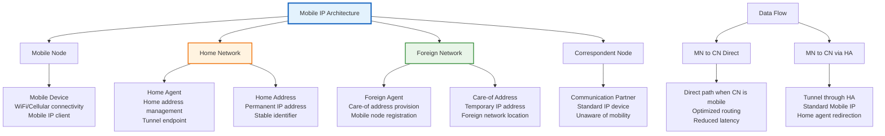

#### Mobile IP Operation Flow

**Registration Process**:
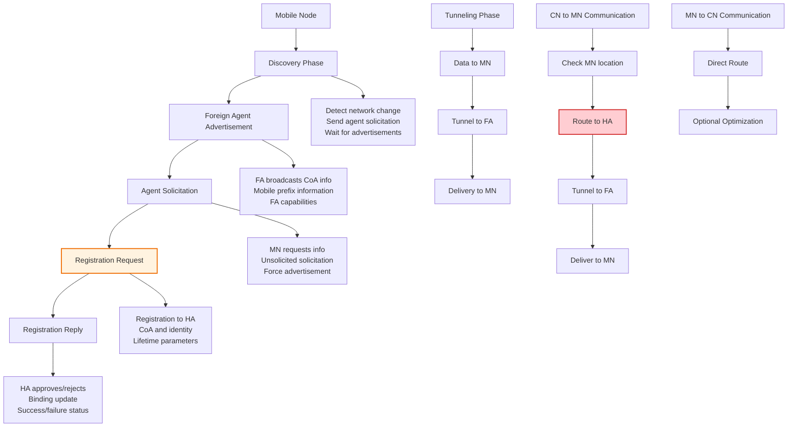

**Tunneling Mechanism**:
1. **Encapsulation**: IP packet wrapped in new IP header
2. **Tunnel Endpoint**: Foreign agent or mobile node
3. **Decapsulation**: Remove outer header, deliver inner packet

### 4.1.1 Mobile IP Security Challenges

#### Authentication and Authorization Issues

**Registration Security**:
- **Agent Authentication**: Verify legitimacy of foreign agents
- **Registration Authorization**: Ensure authorized network access
- **Replay Protection**: Prevent old registration replay
- **Lifetime Management**: Control registration duration

**Binding Update Security**:
```
Binding Update Message:
- Home Address: Mobile node's permanent address
- Care-of Address: Current foreign network address
- Lifetime: Registration duration
- Binding Authorization Data: HMAC or digital signature
```

#### Tunnel Security Vulnerabilities

**Tunnel Hijacking**:
1. **Unauthorized Tunnel Creation**: Attacker creates false tunnel
2. **Tunnel Interception**: Man-in-the-middle on tunnel traffic
3. **Tunnel Endpoint Spoofing**: False tunnel endpoints
4. **Traffic Analysis**: Infer information from tunnel patterns

**Countermeasures**:
- **IPSec Protection**: Encrypt and authenticate tunnel traffic
- **Binding Update Authentication**: Cryptographic binding validation
- **Tunnel Establishment Authorization**: Validate tunnel creation
- **Monitoring and Detection**: Identify suspicious tunnel activity

#### Mobile IP Attack Vectors

**1. False Foreign Agent Attacks**:
```
Attack: Attacker impersonates foreign agent
1. Send false foreign agent advertisements
2. Mobile node registers with attacker
3. Attacker can intercept/modify traffic
4. Potential DoS or data theft
```

**2. Registration Flooding**:
```
Attack: Excessive registration requests
1. Overwhelming home agent with requests
2. Consuming computational resources
3. Preventing legitimate registrations
4. DoS on registration service
```

**3. Binding Update Spoofing**:
```
Attack: False binding updates
1. Attacker sends binding update to CN
2. CN routes traffic to false location
3. Traffic interception or DoS
4. Service disruption
```

```mermaid
graph TB
    A[Mobile IP Security Threats] --> B[Registration Attacks]
    A --> C[Tunnel Security]
    A --> D[Binding Attacks]
    A --> E[Protocol Exploitation]
    
    B --> F[False Foreign Agent<br/>Registration Flooding<br/>Unauthorized Access]
    B --> F1[Impersonation attacks<br/>Resource exhaustion<br/>Access control bypass]
    
    C --> G[Tunnel Hijacking<br/>Endpoint Spoofing<br/>Traffic Interception]
    C --> G1[Tunnel creation abuse<br/>False endpoints<br/>MITM on tunnels]
    
    D --> H[Binding Update Spoofing<br/>False Location Claims<br/>Route Hijacking]
    D --> H1[Unauthorized updates<br/>False location info<br/>Traffic redirection]
    
    E --> I[Protocol Confusion<br/>State Manipulation<br/>Timing Attacks]
    E --> I1[Ambiguous states<br/>Race conditions<br/>Timing exploitation]
    
    J[Defense Mechanisms] --> K[Authentication]
    J --> L[Encryption]
    J --> M[Authorization]
    J --> N[Monitoring]
    
    K --> K1[Strong authentication<br/>Cryptographic binding<br/>Agent verification]
    
    L --> L1[IPSec tunnel protection<br/>Data confidentiality<br/>Traffic integrity]
    
    M --> M1[Access control policies<br/>Registration authorization<br/>Network admission]
    
    N --> N1[Anomaly detection<br/>Traffic analysis<br/>Security monitoring]
    
    style A fill:#ffebee,stroke:#d32f2f,stroke-width:3px
    style J fill:#e8f5e8,stroke:#388e3c,stroke-width:2px
```

### 4.1.2 Enhanced Mobile IP Security

#### Mobile IPv6 Security Extensions

**Mobile IPv6 Improvements**:
1. **Route Optimization**: Direct communication between CN and MN
2. **Home Agent Discovery**: Automatic HA discovery
3. **Return Routability**: Verify MN's home network presence
4. **Binding Management**: Enhanced binding update mechanisms

**Return Routability Procedure**:
```
1. CN sends Home Test Init to HA
2. HA forwards to MN
3. MN responds with Home Test
4. CN sends Care-of Test Init
5. MN responds with Care-of Test
6. CN can verify MN's location
```

**Binding Update Authentication**:
```
Binding Authorization Data = HMAC-SHA1(Kcn, Home Address | Care-of Address | Lifetime)
```

#### Hierarchical Mobile IPv6 (HMIPv6)

**HMIPv6 Architecture**:
- **Mobility Anchor Point (MAP)**: Hierarchical routing
- **Local Mobility Anchor**: Regional mobility management
- **Reduced Signaling**: Local vs. global mobility separation

**Security Benefits**:
- **Reduced Attack Surface**: Limited scope of local mobility
- **Faster Authentication**: Local authentication mechanisms
- **Scalable Security**: Hierarchical security management

#### Network Mobility (NEMO)

**NEMO Basic Support**:
- **Mobile Router (MR)**: Moving network gateway
- **Home Agent**: Network-level mobility management
- **Mobile Network Prefix**: Network identifier mobility

**Security Considerations**:
- **Prefix Continuity**: Maintain network prefix continuity
- **Network-level Security**: Group security for entire network
- **Nested Mobility**: Multiple levels of network mobility

---

## IP Security (IPSec) Protocol

### 4.2.1 IPSec Architecture Overview

#### IPSec Components and Structure

**IPSec** provides security at the IP layer, offering confidentiality, integrity, and authentication for IP traffic through a suite of protocols and algorithms.

**Core Components**:

1. **Authentication Header (AH)**: Provides integrity and authentication
2. **Encapsulating Security Payload (ESP)**: Provides confidentiality
3. **Internet Key Exchange (IKE)**: Key management protocol
4. **Security Associations (SA)**: Logical connection definitions

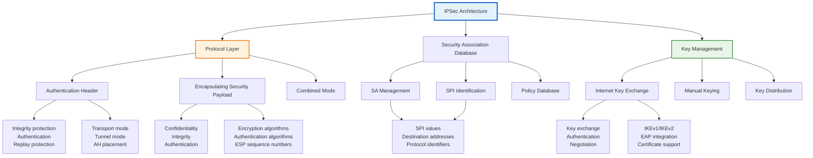

#### Security Associations (SA)

**SA Properties**:
```
Security Association Parameters:
- Security Parameters Index (SPI): 32-bit identifier
- Destination IP Address: Endpoint address
- Security Protocol: AH (51) or ESP (50)
- Encryption Algorithm: AES, 3DES, etc.
- Authentication Algorithm: HMAC-MD5, HMAC-SHA1, etc.
- Key Life Time: Time or byte count
- Anti-replay Window: Replay protection window
```

**SA Database Structure**:
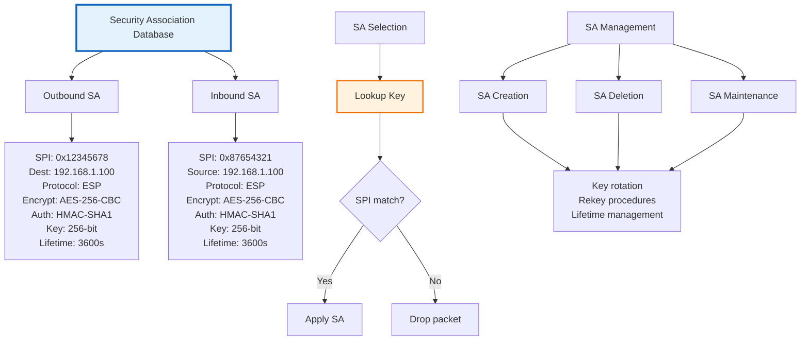

### 4.2.2 IPSec Modes and Operations

#### Transport Mode vs. Tunnel Mode

**Transport Mode**:
- **Purpose**: End-to-end communication between hosts
- **Protection**: IP payload only
- **Header**: Original IP header preserved
- **Use Case**: Host-to-host security

**Tunnel Mode**:
- **Purpose**: Gateway-to-gateway or host-to-gateway
- **Protection**: Entire original IP packet
- **Header**: New IP header added
- **Use Case**: VPN connections, network-to-network

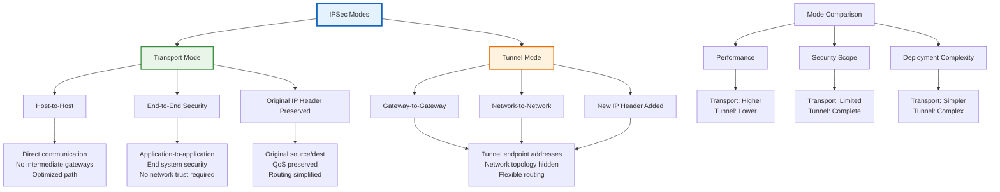

#### IPSec Header Structure

**Authentication Header (AH)**:
```
AH Format:
| Version | IHL | Type of Service | Total Length |
| Identification | Flags | Fragment Offset |
| TTL | Protocol = 51 | Header Checksum |
| Source IP Address |
| Destination IP Address |
| Security Parameters Index (SPI) |
| Sequence Number |
| Authentication Data (ICV) |
```

**Encapsulating Security Payload (ESP)**:
```
ESP Format:
| Security Parameters Index (SPI) |
| Sequence Number |
| Payload Data (variable) |
| Padding (0-255 bytes) |
| Pad Length | Next Header |
| Authentication Data (ICV) |
```

### 4.2.3 Internet Key Exchange (IKE)

#### IKEv2 Protocol Overview

**IKEv2 Phases**:
1. **IKE_SA_INIT**: Cryptographic negotiation and DH exchange
2. **IKE_AUTH**: Authentication and SA establishment
3. **CREATE_CHILD_SA**: Additional SA creation

**IKEv2 Message Exchange**:
```mermaid
graph TB
    A[IKEv2 Exchange] --> B[IKE_SA_INIT]
    B --> C[IKE_AUTH]
    C --> D[CHILD_SA Creation]
    
    B --> E[Initiator → Responder<br/>HDR, SAi1, KEi, Ni]
    E --> F[Responder → Initiator<br/>HDR, SAr1, KEr, Nr]
    
    C --> G[Initiator → Responder<br/>HDR, SK{IDi, AUTH, CP, TSi, TSr}]
    C --> H[Responder → Initiator<br/>HDR, SK{IDr, AUTH, CP, TSi, TSr}]
    
    D --> I[Initiator → Responder<br/>HDR, SK{N}
    D --> J[Responder → Initiator<br/>HDR, SK{N}]
    
    K[IKE_SA_INIT] --> L[SA Proposal]
    K --> M[Key Exchange]
    K --> N[Nonce Exchange]
    
    L --> L1[Encryption algorithms<br/>Integrity algorithms<br/>DH group selection]
    
    M --> L1[Diffie-Hellman exchange<br/>Shared secret derivation<br/>Perfect forward secrecy]
    
    N --> L1[Random values<br/>Replay protection<br/>State binding]
    
    O[IKE_AUTH] --> P[Identity Exchange]
    O --> Q[Authentication]
    O --> R[Configuration Exchange]
    
    P --> P1[IDi, IDr payloads<br/>Identity information<br/>Certificate exchange]
    
    Q --> P1[Digital signatures<br/>Shared secrets<br/>EAP authentication]
    
    R --> P1[IP address assignment<br/>DNS configuration<br/>Network parameters]
    
    style B fill:#e3f2fd,stroke:#1565c0,stroke-width:2px
    style C fill:#fff3e0,stroke:#ef6c00,stroke-width:2px
    style D fill:#e8f5e8,stroke:#388e3c,stroke-width:2px
```

#### IKEv2 Authentication Methods

**Authentication Types**:
1. **Digital Signatures**: RSA, ECDSA certificates
2. **Shared Secret**: Pre-shared keys
3. **EAP Authentication**: Extensible authentication

**EAP Integration in IKEv2**:
```
EAP Authentication Flow:
1. IKE_AUTH with EAP_Start
2. EAP Identity exchange
3. EAP method execution (EAP-TLS, EAP-MSCHAPv2, etc.)
4. EAP Success/Failure
5. IKE_AUTH completion
```

#### Perfect Forward Secrecy (PFS)

**PFS Definition**: Compromise of long-term keys does not compromise past session keys.

**PFS Implementation**:
- **Additional DH Exchange**: New DH key exchange per SA
- **Key Independence**: Each SA has independent encryption keys
- **Lifetime Separation**: Different key lifetimes for IKE and CHILD SA

### 4.2.4 IPSec Security Analysis

#### Cryptographic Security

**Encryption Algorithms**:
1. **AES (Advanced Encryption Standard)**:
   - **AES-CBC**: Cipher Block Chaining mode
   - **AES-CTR**: Counter mode for high performance
   - **AES-GCM**: Galois/Counter Mode (AEAD)

2. **3DES (Triple DES)**:
   - **Legacy support**: Backward compatibility
   - **Security concerns**: Vulnerable to attacks
   - **Performance**: Slower than AES

**Authentication Algorithms**:
1. **HMAC-SHA1**: SHA1 with HMAC construction
2. **HMAC-SHA256**: SHA256 with HMAC construction  
3. **AES-XCBC-MAC**: AES-based MAC algorithm

**Security Strengths**:
- **End-to-End Security**: Protection at IP layer
- **Protocol Independence**: Works with any higher-layer protocol
- **Transparent Operation**: No application modifications required
- **Scalable Security**: Supports large-scale deployments

#### Implementation Security

**Common Vulnerabilities**:
1. **Weak Cipher Suites**: Deprecated algorithms
2. **Key Management Issues**: Poor key handling
3. **Configuration Errors**: Incorrect security policies
4. **Implementation Flaws**: Software vulnerabilities

**Security Best Practices**:
1. **Strong Algorithms**: AES-256, SHA-256 minimum
2. **Proper Key Management**: Secure key generation and storage
3. **Regular Updates**: Keep software and certificates current
4. **Security Monitoring**: Continuous monitoring and alerting

---

## Key Establishment and Revocation Protocols in Sensor Networks

### 4.3.1 Sensor Network Security Challenges

#### Resource Constraints in Sensor Networks

**Computational Limitations**:
- **Processor**: 8-32 bit processors, 4-16 MHz typical
- **Memory**: 4-8 KB RAM, 64-128 KB flash storage
- **Power**: Battery-powered, energy harvesting
- **Communication**: Low bandwidth, high error rates

**Energy Consumption Analysis**:
```
Energy per Operation:
- Public Key Crypto: 1000-10000 times more expensive than symmetric
- Symmetric Crypto: Moderate energy cost
- Hash Functions: Low energy cost
- Communication: Highest energy cost (dominant factor)
```

#### Network Characteristics

**Deployment Challenges**:
1. **Unattended Operation**: No human intervention
2. **Adversarial Environment**: Physical and logical attacks
3. **Dynamic Topology**: Nodes join/leave frequently
4. **Scale**: Hundreds to thousands of nodes

**Communication Patterns**:
- **Many-to-One**: Sensor data to sink/base station
- **Local Communication**: Neighboring node coordination
- **Broadcast**: Network-wide announcements
- **Multi-hop**: Relay through intermediate nodes

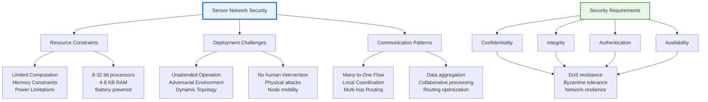

### 4.3.2 Key Predistribution Schemes

#### Probabilistic Key Predistribution

**Basic Scheme**:
1. **Key Pool**: Generate large pool of keys
2. **Key Ring**: Each node gets random subset of keys
3. **Shared Key Discovery**: Nodes find common keys
4. **Key Establishment**: Use shared keys for secure links

**Eγ Random Graph Model**:
```
Given:
- Key pool size: P
- Keys per node: k
- Desired connectivity: ε

Probability of shared key between two nodes:
P_shared = (k/P) × (k-1)/(P-1) ≈ (k²/P)

For connected graph: k = c√(P × ln(P))
```

**Enhanced Schemes**:

1. **q-Composite Scheme**:
   - Require q common keys instead of 1
   - Improved resilience against node capture
   - Key computation: H(K₁||K₂||...||K_q)

2. **Multi-Path Key Establishment**:
   - Multiple disjoint paths for key establishment
   - Improved resilience against path disruption
   - Key derivation from multiple key fragments

#### Deterministic Key Predistribution

**Polynomial-Based Schemes**:

**Blom's Scheme**:
```
Setup Phase:
- Choose prime q and field F_q
- Select symmetric polynomial f(x,y) = Σᵢⱼ aᵢⱼ xⁱ yʲ
- Generate polynomial shares for each node

Key Establishment:
- Node i computes K_ij = f(i,j)
- Node j computes K_ji = f(j,i)
- Verify K_ij = K_ji
```

**Threshold-Based Schemes**:
- **t-degree polynomials**: Require t shares for key recovery
- **Secret sharing**: (t,n)-threshold scheme
- **Polynomial evaluation**: Lagrange interpolation

#### Deployment Knowledge-Based Schemes

**Location-Aware Schemes**:
1. **Grid-Based Deployment**:
   ```
   Deployment Area: M × N grid
   Each grid cell: Assigned key pool
   Neighboring cells: Overlapping key pools
   ```

2. **Sector-Based Deployment**:
   - **Circular deployment**: Concentric sectors
   - **Key assignment**: Sector-specific key pools
   - **Cross-sector communication**: Shared keys between sectors

3. **Polynomial Pool Schemes**:
   ```
   Master Polynomial: F(x,y,z) = Σ aᵢⱼₖ xⁱ yʲ zᵏ
   Cell Assignment: (i,j) → F(x,y,cell_id)
   ```

**Deployment Advantages**:
- **Improved Connectivity**: Higher probability of neighbor communication
- **Reduced Overhead**: Smaller key rings
- **Better Resilience**: Localized key compromise
- **Scalability**: Efficient for large networks

### 4.3.3 Key Management Protocols

#### Pairwise Key Establishment

**Direct Key Establishment**:
```
Protocol Steps:
1. Key Discovery: Find common keys
2. Key Agreement: Establish shared secret
3. Key Confirmation: Verify key establishment
4. Key Refresh: Periodic key updates
```

**Protocol Security Properties**:
1. **Key Secrecy**: Key cannot be derived by eavesdroppers
2. **Forward Secrecy**: Compromised keys don't affect future keys
3. **Key Confirmation**: Both parties verify key agreement
4. **Replay Protection**: Freshness verification

#### Group Key Management

**Group Key Establishment**:
1. **Centralized Approach**: 
   - Key distribution center (KDC)
   - Key server generates and distributes keys
   - Single point of failure and bottleneck

2. **Decentralized Approach**:
   - Hierarchical key management
   - Cluster-based key distribution
   - Distributed key servers

3. **Distributed Approach**:
   - Collaborative key establishment
   - No central authority
   - Byzantine fault tolerance

**Group Key Operations**:
- **Group Formation**: Initial key establishment
- **Member Join**: New member key distribution
- **Member Leave**: Key rekeying for security
- **Group Merge**: Combining multiple groups

#### Key Revocation Mechanisms

**Revocation Triggers**:
1. **Node Compromise**: Physical capture or logical attack
2. **Key Exposure**: Cryptographic key disclosure
3. **Policy Violation**: Security policy breaches
4. **Node Malfunction**: Defective or misbehaving nodes

**Revocation Strategies**:

1. **Broadcast Revocation**:
   ```
   Revocation Message:
   - Revoked Node ID
   - Reason for Revocation
   - Digital Signature (KDC)
   - Revocation List
   ```

2. **Local Revocation**:
   - Revoke keys within local neighborhood
   - Reduce network-wide overhead
   - Trade security for efficiency

3. **Threshold-Based Revocation**:
   - Require multiple nodes to trigger revocation
   - Resist false revocation claims
   - Balance security and overhead

**Revocation Protocol Design**:
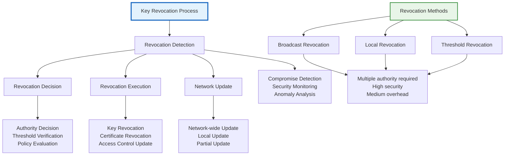

### 4.3.4 Secure Data Aggregation

#### Privacy-Preserving Aggregation

**Problem Definition**:
- **Goal**: Compute aggregate functions over sensor data
- **Constraint**: Individual data privacy protection
- **Requirement**: Prevent privacy leakage from aggregates

**Solutions**:

1. **Secure Multi-party Computation (SMC)**:
   ```
   Protocol: Yao's Garbled Circuits
   Properties: Privacy-preserving computation
   Overhead: High computational cost
   ```

2. **Homomorphic Encryption**:
   ```
   Additive Homomorphism: H(x) + H(y) = H(x+y)
   Examples: Paillier, Damgård-Jurik
   Application: Sum aggregation
   ```

3. **Data Perturbation**:
   ```
   Random Additive Perturbation: x' = x + noise
   Properties: Differential privacy
   Trade-off: Privacy vs. accuracy
   ```

#### Robust Aggregation

**Byzantine Fault Tolerance**:
- **Goal**: Correct aggregation despite faulty nodes
- **Challenge**: Distinguish between faulty and legitimate data
- **Approach**: Statistical outlier detection

**Robust Aggregation Protocols**:

1. **Trimmed Mean**:
   ```
   Remove highest and lowest k values
   Compute mean of remaining values
   Resilient to outliers
   ```

2. **Median-Based Aggregation**:
   ```
   Find median of all values
   Inherently robust to outliers
   Efficient computation
   ```

3. **Weighted Aggregation**:
   ```
   Weight values based on trust scores
   Higher weight for trusted nodes
   Adaptive trust-based weighting
   ```

---

## Secure Neighbor Discovery

### 4.4.1 IPv6 Neighbor Discovery Protocol (NDP)

#### NDP Fundamentals

**IPv6 Neighbor Discovery** replaces IPv4's ARP and ICMP Router Discovery with a comprehensive protocol for address resolution, router discovery, and parameter discovery.

**NDP Functions**:
1. **Router Discovery**: Find available routers
2. **Prefix Discovery**: Learn network prefixes
3. **Parameter Discovery**: Obtain network parameters
4. **Address Resolution**: Resolve IP to MAC addresses
5. **Next-Hop Determination**: Choose next-hop router
6. **Neighbor Unreachability Detection**: Monitor reachability

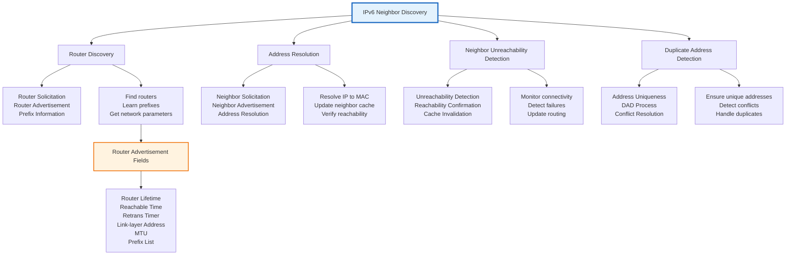

#### NDP Message Types

**Router Solicitation (RS)**:
```
Router Solicitation Format:
- Type: 133
- Code: 0
- Checksum
- Reserved
- Options: Source link-layer address
```

**Router Advertisement (RA)**:
```
Router Advertisement Format:
- Type: 134
- Code: 0
- Checksum
- Cur Hop Limit: Default hop limit
- M flag: Managed address configuration
- O flag: Other configuration
- Router Lifetime: Seconds
- Reachable Time: Milliseconds
- Retrans Timer: Milliseconds
- Options: Source link-layer address, MTU, Prefix list
```

**Neighbor Solicitation (NS)**:
```
Neighbor Solicitation Format:
- Type: 135
- Code: 0
- Checksum
- Reserved
- Target Address: IPv6 address being resolved
- Options: Source link-layer address
```

**Neighbor Advertisement (NA)**:
```
Neighbor Advertisement Format:
- Type: 136
- Code: 0
- Checksum
- R flag: Router flag
- S flag: Solicited flag
- O flag: Override flag
- Reserved
- Target Address: IPv6 address
- Options: Target link-layer address
```

### 4.4.2 Secure Neighbor Discovery (SEND)

#### SEND Overview

**Secure Neighbor Discovery (SEND)** provides cryptographic protection for NDP messages, addressing the security vulnerabilities in standard NDP.

**SEND Components**:
1. **Cryptographically Generated Addresses (CGA)**: Address ownership proof
2. **RSA Signatures**: Message authentication
3. **Nonces**: Replay attack prevention
4. **Timestamps**: Temporal validation

#### Cryptographically Generated Addresses (CGA)

**CGA Generation Process**:
```
CGA = Hash(Interface ID || Public Key || Extension Fields)

where Interface ID = Hash(Modifier || Public Key || Collision Count || Extensions)
```

**CGA Parameters**:
- **Modifier**: 80-bit random value
- **Public Key**: RSA or ECDSA public key
- **Collision Count**: Address collision counter
- **Extensions**: Optional additional data

**CGA Verification**:
```
Verification Steps:
1. Extract CGA parameters from address
2. Recompute hash with parameters
3. Compare with original address
4. Verify public key authenticity
```

**CGA Security Properties**:
1. **Address Ownership**: Proves control of corresponding private key
2. **Collision Resistance**: Difficult to find address collisions
3. **Computational Cost**: Moderate computational overhead
4. **Deployment**: Compatible with existing IPv6 stacks

#### SEND Message Format

**SEND Options**:

1. **CGA Parameter Option**:
   ```
   Type: 11
   Length: Variable
   Modifier: 80 bits
   Collision Count: 8 bits
   Public Key: Variable length
   Extension Fields: Variable length
   ```

2. **RSA Signature Option**:
   ```
   Type: 12
   Length: Variable
   Key Hash: Hash of public key
   Digital Signature: RSA signature
   Padding: RSA padding
   ```

3. **Timestamp Option**:
   ```
   Type: 13
   Length: 2
   Timestamp: 64-bit timestamp
   ```

4. **Nonce Option**:
   ```
   Type: 14
   Length: Variable
   Nonce: Random value
   ```

**SEND Message Processing**:
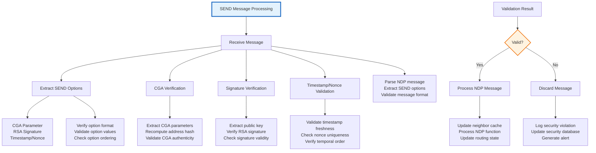

### 4.4.3 SEND vs. Standard NDP Comparison

#### Security Feature Comparison

| Feature | Standard NDP | SEND |
|---------|-------------|------|
| Message Authentication | None | RSA Signatures |
| Replay Protection | Sequence numbers | Nonces + Timestamps |
| Address Verification | None | CGA verification |
| Cryptographic Protection | None | End-to-end crypto |
| Deployment Complexity | Low | High |
| Performance Impact | Minimal | Moderate |

#### SEND Deployment Considerations

**Deployment Challenges**:
1. **Key Management**: Secure key generation and distribution
2. **Computational Overhead**: RSA signature verification cost
3. **Backward Compatibility**: Mixed SEND/non-SEND environments
4. **Certificate Infrastructure**: PKI requirements

**Performance Analysis**:
```
SEND Overhead:
- CGA Generation: Moderate (hash computation)
- Signature Verification: High (RSA operations)
- Memory Usage: Higher (key storage)
- Network Traffic: Slightly higher (additional options)
```

**Migration Strategy**:
1. **Gradual Deployment**: Mixed environments
2. **Certificate Rollout**: PKI establishment
3. **Configuration Management**: SEND parameter configuration
4. **Monitoring**: Security event monitoring

---

## Secure Routing Protocols in Multihop Wireless Networks

### 4.5.1 Ad-hoc Network Routing Challenges

#### Ad-hoc Network Characteristics

**Ad-hoc Network Properties**:
1. **Infrastructureless**: No fixed infrastructure
2. **Self-organizing**: Nodes form network dynamically
3. **Multi-hop**: Communication through intermediate nodes
4. **Mobile**: Nodes move freely
5. **Resource-constrained**: Limited power and bandwidth

**Routing Challenges**:
- **Dynamic Topology**: Frequent topology changes
- **Limited Resources**: Energy and bandwidth constraints
- **Security Threats**: Malicious and compromised nodes
- **Scalability**: Large network support
- **QoS Requirements**: Real-time communication needs

```mermaid
graph TB
    A[Ad-hoc Network Challenges] --> B[Routing Complexity]
    A --> C[Security Threats]
    A --> D[Resource Constraints]
    A --> E[Scalability Issues]
    
    B --> F[Dynamic Topology<br/>Route Discovery<br/>Route Maintenance]
    B --> F1[Frequent changes<br/>Path recomputation<br/>Loop prevention]
    
    C --> G[Node Compromise<br/>Route Manipulation<br/>Data Interception]
    C --> G1[Byzantine nodes<br/>False routing info<br/>MITM attacks]
    
    D --> H[Limited Power<br/>Bandwidth Constraints<br/>Processing Limits]
    D --> H1[Battery powered<br/>Shared medium<br/>8-bit processors]
    
    E --> I[Network Size<br/>Routing Overhead<br/>Convergence Time]
    E --> I1[100s-1000s of nodes<br/>Control message cost<br/>Slow convergence]
    
    J[Security Requirements] --> K[Route Integrity]
    J --> L[Node Authentication]
    J --> M[Data Confidentiality]
    J --> N[Non-repudiation]
    
    K --> K1[Authentic routing info<br/>Tamper detection<br/>Route validation]
    
    L --> K1[Node identity verification<br/>Access control<br/>Trust management]
    
    M --> K1[Data encryption<br/>Key management<br/>Secure aggregation]
    
    N --> K1[Digital signatures<br/>Audit trails<br/>Legal accountability]
    
    style A fill:#e3f2fd,stroke:#1565c0,stroke-width:3px
    style J fill:#e8f5e8,stroke:#388e3c,stroke-width:2px
```

### 4.5.2 Secure Routing Protocol Categories

#### Proactive Routing Protocols

**Proactive (Table-Driven) Protocols**:
- **Characteristics**: Maintain routes to all destinations
- **Advantages**: Low latency, fast route availability
- **Disadvantages**: High control overhead, poor scalability

**OLSR (Optimized Link State Routing)**:
```
OLSR Process:
1. Topology Control (TC) messages
2. Multi-Point Relay (MPR) selection
3. Link state dissemination
4. Route computation
```

**Security Challenges**:
1. **TC Message Manipulation**: False topology information
2. **MPR Selection Attacks**: Compromised MPR selection
3. **Hello Message Spoofing**: False neighbor relationships
4. **Routing Table Poisoning**: Corrupted routing information

**DSDV (Destination-Sequenced Distance Vector)**:
```
DSDV Process:
1. Periodic routing updates
2. Sequence numbers for freshness
3. Full dump vs. incremental updates
4. Route computation
```

#### Reactive Routing Protocols

**Reactive (On-Demand) Protocols**:
- **Characteristics**: Discover routes on demand
- **Advantages**: Lower control overhead, better scalability
- **Disadvantages**: Route discovery latency, higher latency

**AODV (Ad-hoc On-Demand Distance Vector)**:
```
AODV Process:
1. Route Request (RREQ) broadcast
2. Route Reply (RREP) unicast
3. Route Error (RERR) propagation
4. Route maintenance
```

**DSR (Dynamic Source Routing)**:
```
DSR Process:
1. Route Discovery with source routing
2. Route Reply with complete path
3. Route maintenance
4. Route caching
```

**Security Issues**:
1. **RREQ/RREP Manipulation**: False route information
2. **Source Route Attacks**: Malicious route insertion
3. **Cache Poisoning**: Corrupted route cache
4. **Selective Forwarding**: Dropping specific packets

#### Hybrid Routing Protocols

**ZRP (Zone Routing Protocol)**:
- **Hybrid Approach**: Proactive within zone, reactive outside
- **Zone Radius**: Adjustable proactive region
- **IARP/IERP**: Intra-zone/Inter-zone routing

**Security Considerations**:
- **Zone Security**: Local security mechanisms
- **Border Security**: Inter-zone communication protection
- **Coordination**: Security policy synchronization

### 4.5.3 Secure Routing Protocols

#### Secure AODV (SAODV)

**SAODV Overview**:
- **Base Protocol**: AODV with security extensions
- **Cryptographic Protection**: Digital signatures and hash chains
- **Non-repudiation**: Strong authentication of routing messages

**SAODV Extensions**:

1. **RREQ Protection**:
   ```
   RREQ Message:
   - Original AODV fields
   - Public Key of initiator
   - Signature over RREQ (except signature field)
   - Hash chain for hop count verification
   ```

2. **RREP Protection**:
   ```
   RREP Message:
   - Original AODV fields
   - Public Key of responder
   - Signature over RREP (except signature field)
   - Hash chain for hop count verification
   ```

3. **RERR Protection**:
   ```
   RERR Message:
   - Original AODV fields
   - Digital signature
   - Timestamp for freshness
   ```

**Hash Chain Verification**:
```
Hash Chain Construction:
- Terminal value: H^k(hops)
- Propagation: H^i(hops) = H(H^{i+1}(hops))
- Verification: Check hash chain integrity

Example for 3-hop path:
- Source: H³(hops)
- Hop 1: H²(hops)
- Hop 2: H¹(hops)
- Destination: H⁰(hops) = hops
```

#### Secure Routing Protocol (SRP)

**SRP Overview**:
- **Source Routing**: Complete path included in packets
- **Byzantine Fault Tolerance**: Handles arbitrary node behavior
- **Collaborative Routing**: Multiple path establishment

**SRP Mechanism**:
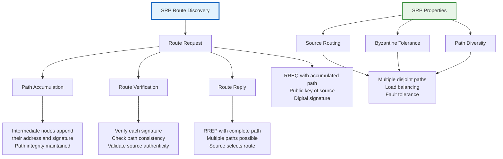

#### Ariadne

**Ariadne Overview**:
- **TESLA-based**: Time-based symmetric keys
- **Efficient**: Minimal computational overhead
- **Broadcast Authentication**: Efficient group authentication

**Ariadne Mechanism**:
```
Ariadne Components:
1. TESLA keys for time-based authentication
2. Hash chains for path verification
3. Per-hop authentication
4. Source routing with authentication
```

**Authentication Process**:
1. **Key Disclosure**: Keys revealed after delay
2. **Message Authentication**: TESLA-based MAC
3. **Path Verification**: Hash chain validation
4. **Replay Protection**: Timestamp verification

#### ARAN (Authenticated Routing for Ad-hoc Networks)

**ARAN Overview**:
- **Certificate-based**: PKI for authentication
- **Route Discovery**: Secure RREQ/RREP
- **Route Maintenance**: Secure error reporting

**ARAN Process**:
```
Route Discovery:
1. Source broadcasts signed RREQ
2. Intermediate nodes verify signature
3. Append their certificate and signature
4. Destination replies with signed RREP

Route Maintenance:
1. Detect link failures
2. Send signed error messages
3. Invalidate corrupted routes
4. Trigger new route discovery
```

### 4.5.4 Routing Attack Analysis

#### Common Routing Attacks

**Blackhole Attack**:
```
Attack Process:
1. Malicious node claims shortest path
2. Intercepts and drops all packets
3. Causes network partitioning
4. Affects all traffic through node
```

**Wormhole Attack**:
```
Attack Process:
1. Two colluding nodes create tunnel
2. Advertise false short path
3. Divert traffic through tunnel
4. Enable subsequent attacks
```

**Byzantine Attack**:
```
Attack Process:
1. Compromised node behaves arbitrarily
2. Drops, modifies, or creates packets
3. Spoofs identity or routes
4. Creates routing loops
```

**Rushing Attack**:
```
Attack Process:
1. Malicious node forwards RREQ quickly
2. Legitimate nodes drop slower RREQs
3. Attacker's route becomes preferred
4. Traffic routes through attacker
```

#### Attack Detection and Mitigation

**Detection Mechanisms**:
1. **Route Verification**: Cross-check routing information
2. **Behavior Analysis**: Monitor node behavior patterns
3. **Statistical Analysis**: Detect anomalous routing behavior
4. **Cryptographic Verification**: Validate routing message authenticity

**Mitigation Strategies**:
1. **Redundant Paths**: Multiple route discovery
2. **Reputation Systems**: Trust-based routing
3. **Cryptographic Protection**: Secure routing protocols
4. **Intrusion Detection**: Real-time attack detection

```mermaid
graph TB
    A[Routing Attack Detection] --> B[Anomaly Detection]
    A --> C[Behavior Analysis]
    A --> D[Cryptographic Verification]
    A --> E[Statistical Methods]
    
    B --> F[Route Consistency<br/>Path Validation<br/>Hop Count Verification]
    B --> F1[Compare multiple paths<br/>Verify route topology<br/>Check hop count]
    
    C --> G[Traffic Patterns<br/>Timing Analysis<br/>Performance Metrics]
    C --> G1[Normal vs. anomalous<br/>Response time analysis<br/>Throughput monitoring]
    
    D --> H[Signature Verification<br/>Certificate Validation<br/>Key Authentication]
    D --> H1[Verify digital signatures<br/>Check certificate chains<br/>Authenticate keys]
    
    E --> I[Machine Learning<br/>Statistical Models<br/>Threshold Analysis]
    E --> I1[Pattern recognition<br/>Outlier detection<br/>Threshold-based alerts]
    
    J[Response Actions] --> K[Route Exclusion]
    J --> L[Node Isolation]
    J --> M[Alert Generation]
    J --> N[Key Revocation]
    
    K --> K1[Remove malicious routes<br/>Find alternative paths<br/>Update routing tables]
    
    L --> L1[Block malicious nodes<br/>Network partitioning<br/>Access control]
    
    M --> K1[Security team alerts<br/>Log security events<br/>Generate reports]
    
    N --> K1[Revoke node credentials<br/>Update trust databases<br/>Certificate revocation]
    
    style A fill:#e3f2fd,stroke:#1565c0,stroke-width:3px
    style J fill:#ffcdd2,stroke:#d32f2f,stroke-width:2px
```

---

## Provable Security for Ad-hoc Network Routing Protocols

### 4.6.1 Provable Security Framework

#### Formal Security Models

**Security Model Components**:

1. **Adversary Model**: Defines attacker capabilities
2. **Security Goals**: Specifies desired security properties
3. **Security Proof**: Mathematical proof of security
4. **Reduction**: Security based on computational hardness

**Adversary Models**:

1. **Passive Adversary**:
   - **Capabilities**: Eavesdropping, traffic analysis
   - **Limitations**: Cannot modify messages
   - **Goal**: Learn routing information

2. **Active Adversary**:
   - **Capabilities**: Message modification, injection
   - **Limitations**: Limited computational power
   - **Goal**: Compromise routing integrity

3. **Byzantine Adversary**:
   - **Capabilities**: Arbitrary malicious behavior
   - **Limitations**: Limited network control
   - **Goal**: Maximize network disruption

#### Security Definitions

**Routing Security Properties**:

1. **Route Integrity**: Routes are authentic and unaltered
2. **Route Availability**: Routes remain available when needed
3. **Node Anonymity**: Node identities are protected
4. **Non-repudiation**: Actions can be proven

**Formal Definitions**:
```
Route Integrity Game:
1. Adversary chooses source and destination
2. Protocol executes route discovery
3. Adversary attempts to produce false route
4. Challenger verifies route authenticity

Advantage: Pr[Adversary succeeds] - 1/2
Secure if: Advantage is negligible
```

### 4.6.2 Security Reductions

#### Reduction-Based Security

**Security Reduction**:
```
Protocol Π is secure if:
For every polynomial-time adversary A,
there exists a polynomial-time reduction R
such that:
Adv_A^Π(λ) ≤ f(Adv_B^H(λ)) + negl(λ)

where:
- H is hard problem
- f is polynomial function
- negl(λ) is negligible function
```

**Common Hard Problems**:
1. **Discrete Logarithm Problem**: Computational hardness of finding discrete logs
2. **Computational Diffie-Hellman**: Hardness of computing DH values
3. **RSA Problem**: Hardness of RSA inversion
4. **Hash Function Security**: Pre-image, second pre-image, collision resistance

#### Security Proof Techniques

**Game-Based Proofs**:
1. **Sequential Games**: Step-by-step security analysis
2. **Hybrid Arguments**: Transition between ideal and real worlds
3. **Reduction Arguments**: Security based on hard problems

**Simulation-Based Proofs**:
1. **Ideal World**: Perfect security environment
2. **Real World**: Actual protocol execution
3. **Indistinguishability**: Adversaries cannot distinguish worlds

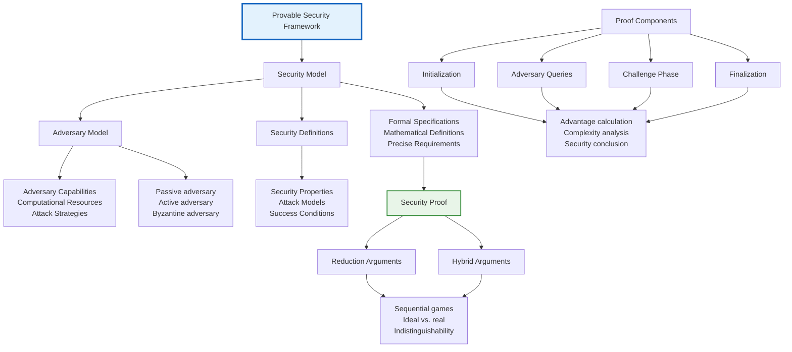

### 4.6.3 Security Analysis of Routing Protocols

#### AODV Security Analysis

**AODV Vulnerabilities**:
1. **RREQ Spoofing**: False route requests
2. **RREP Manipulation**: Incorrect route replies
3. **RERR Attacks**: False error messages
4. **Sequence Number Fraud**: Outdated routing information

**Security Analysis**:
```
AODV Security Model:
Adversary Goals:
- Create false routes
- Deny route availability
- Learn network topology

Attack Capabilities:
- Message injection/modification
- Node impersonation
- Timing manipulation

Security Properties:
- Route authenticity
- Route freshness
- Non-repudiation
```

**Security Proof Sketch**:
```
Theorem: Secure AODV provides route integrity
Proof Sketch:
1. Assume adversary creates false route
2. False route requires forged signatures
3. Forgery contradicts signature security
4. Therefore, routes must be authentic
```

#### DSR Security Analysis

**DSR Vulnerabilities**:
1. **Source Route Manipulation**: Malicious route insertion
2. **Cache Poisoning**: Corrupted route cache
3. **Route Discovery Attacks**: False route discovery
4. **Cache Overflow**: Resource exhaustion

**Security Enhancements**:
1. **Cryptographic Signatures**: Authenticate source routes
2. **Route Validation**: Verify route consistency
3. **Cache Integrity**: Protect route cache
4. **Rate Limiting**: Control route discovery rate

### 4.6.4 Formal Verification Tools

#### Automated Verification Tools

**ProVerif**:
- **Purpose**: Cryptographic protocol verification
- **Language**: Applied pi calculus
- **Features**: Automatic verification, equivalence checking
- **Limitations**: Scalability, infinite state spaces

**AVISPA**:
- **Purpose**: Security protocol verification
- **Approach**: Model checking, constraint solving
- **Tools**: OFMC, CL-AtSe, SATMC, TA4SP
- **Languages**: HLPSL, IF

**Tamarin Prover**:
- **Purpose**: Symbolic protocol analysis
- **Language**: Multi-set rewriting
- **Features**: Interactive verification, lemma proving
- **Applications**: Complex protocols, post-quantum protocols

#### Manual Analysis Methods

**State-Space Exploration**:
1. **State Enumeration**: Systematically explore states
2. **Transition Analysis**: Analyze state transitions
3. **Reachability Analysis**: Check security property reachability

**Dolev-Yao Attacker Model**:
1. **Perfect Cryptography**: Cryptographic primitives are perfect
2. **Message Knowledge**: Attacker knows all messages
3. **Computational Bounds**: Polynomial-time adversaries
4. **Network Control**: Attacker controls network communication

#### Verification Case Studies

**Case Study: SAODV Verification**:
```
Verification Goals:
- Route integrity against forgery
- Replay attack resistance
- Computational efficiency

Verification Results:
- Route integrity: Proven under CDH assumption
- Replay protection: Achieved through timestamps
- Efficiency: Acceptable overhead

Limitations:
- Scalability concerns
- Key management overhead
- Deployment complexity
```

**Case Study: ARAN Verification**:
```
Verification Goals:
- Byzantine fault tolerance
- Certificate-based security
- Route availability

Verification Results:
- Byzantine tolerance: Proven under weak synchrony
- Certificate security: Based on PKI security
- Route availability: Achieved through redundancy

Challenges:
- Certificate distribution
- Revocation mechanisms
- Performance overhead
```

---

## Summary and Key Takeaways

### Advanced IP Security

1. **Mobile IP Security**: Addresses challenges of IP mobility through tunnel security and binding authentication
2. **IPSec Architecture**: Comprehensive IP-layer security with AH, ESP, and IKE protocols
3. **Key Management**: Sophisticated key establishment and management for security associations

### Sensor Network Security

1. **Key Predistribution**: Efficient key establishment for resource-constrained environments
2. **Probabilistic Schemes**: Trade-off between connectivity and security
3. **Deployment Knowledge**: Leveraging location information for improved security

### Secure Neighbor Discovery

1. **SEND Protocol**: Cryptographic protection for IPv6 neighbor discovery
2. **CGA Addresses**: Address ownership proof through cryptographic generation
3. **Deployment Considerations**: Balancing security and performance

### Secure Routing Protocols

1. **Protocol Categories**: Proactive, reactive, and hybrid approaches to routing
2. **Security Extensions**: Adding cryptographic protection to existing protocols
3. **Attack Detection**: Identifying and mitigating routing attacks

### Provable Security

1. **Formal Methods**: Mathematical security proofs for protocols
2. **Reduction Arguments**: Security based on computational hardness assumptions
3. **Verification Tools**: Automated and manual verification approaches

### Implementation Considerations

1. **Performance Trade-offs**: Security vs. efficiency in resource-constrained environments
2. **Deployment Challenges**: Practical issues in real-world implementations
3. **Scalability**: Maintaining security in large-scale deployments

Understanding these advanced security protocols and their formal security analysis is crucial for designing and implementing secure IP and ad-hoc network systems that can withstand sophisticated attacks while maintaining acceptable performance.

---

*Unit 4 provides comprehensive coverage of advanced security protocols for IP and ad-hoc networks, including formal security analysis methods essential for designing provably secure network protocols.*