# UNIT 5: PRIVACY AND SECURITY IN AD-HOC AND VEHICULAR NETWORKS
## Comprehensive Detailed Notes with Visual Diagrams

---

## Table of Contents
1. [Privacy-Preserving Routing in Ad-hoc Networks](#privacy-preserving-routing-in-ad-hoc-networks)
2. [Location Privacy in Vehicular Ad-hoc Networks](#location-privacy-in-vehicular-ad-hoc-networks)
3. [Secure Protocols for Behavior Enforcement](#secure-protocols-for-behavior-enforcement)
4. [Game Theoretic Model of Packet Forwarding](#game-theoretic-model-of-packet-forwarding)

---

## Privacy-Preserving Routing in Ad-hoc Networks

### 5.1 Privacy Requirements in Ad-hoc Networks

#### Privacy Threat Models

**Privacy Dimensions**:
1. **Identity Privacy**: Concealing node identities
2. **Location Privacy**: Hiding physical positions
3. **Communication Pattern Privacy**: Preventing traffic analysis
4. **Relationship Privacy**: Concealing communication partners

**Adversary Models for Privacy**:

1. **Global Adversary**:
   - **Capability**: Monitor entire network
   - **Resources**: Unlimited computational power
   - **Goal**: Complete network de-anonymization
   - **Challenge**: Strongest privacy threat

2. **Local Adversary**:
   - **Capability**: Monitor limited network region
   - **Resources**: Limited computational power
   - **Goal**: Local traffic analysis
   - **Challenge**: Moderate privacy threat

3. **Honest-but-Curious Adversary**:
   - **Capability**: Follow protocol correctly
   - **Resources**: Computational access to data
   - **Goal**: Learn from protocol execution
   - **Challenge**: Passive information gathering

```mermaid
graph TB
    A[Privacy Threats in Ad-hoc Networks] --> B[Identity Exposure]
    A --> C[Location Tracking]
    A --> D[Communication Analysis]
    A --> E[Behavioral Profiling]
    
    B --> F[Node Identification<br/>MAC Address Exposure<br/>IP Address Correlation]
    B --> F1[Unique identifiers<br/>Protocol headers<br/>Cryptographic keys]
    
    C --> G[Position Inference<br/>Signal Strength Analysis<br/>Timing Correlation]
    C --> G1[RSSI measurements<br/>Time difference of arrival<br/>Angle of arrival]
    
    D --> H[Traffic Patterns<br/>Communication Frequency<br/>Message Correlation]
    D --> H1[Communication partners<br/>Message timing<br/>Data volume analysis]
    
    E --> I[Mobility Patterns<br/>Route Preferences<br/>Network Usage]
    E --> I1[Movement prediction<br/>Social relationships<br/>Usage behavior]
    
    J[Adversary Models] --> K[Global Observer]
    J --> L[Local Eavesdropper]
    J --> M[Honest-but-Curious]
    
    K --> K1[Complete network view<br/>Long-term observation<br/>Statistical analysis]
    
    L --> K1[Partial network access<br/>Local monitoring<br/>Spatial correlation]
    
    M --> K1[Protocol compliance<br/>Data analysis<br/>Information inference]
    
    style A fill:#ffebee,stroke:#d32f2f,stroke-width:3px
    style J fill:#e3f2fd,stroke:#1565c0,stroke-width:2px
```

#### Privacy vs. Security Trade-offs

**Privacy-Security Relationship**:
- **Complementary Goals**: Privacy enhances security through anonymity
- **Conflicting Requirements**: Some security measures reduce privacy
- **Balance Required**: Optimize both privacy and security
- **Context-Dependent**: Trade-offs vary by application

**Performance Implications**:
```
Privacy Overhead:
- Computational: Additional encryption/processing
- Communication: Increased message size/frequency
- Storage: Additional state information
- Latency: Processing delays
```

### 5.1.1 Anonymous Communication Systems

#### Mix Networks

**Mix Network Fundamentals**:
A **mix network** is a network of proxy servers that hides the relationship between input and output messages through cryptographic operations and message reordering.

**Mix Network Components**:
1. **Mix Nodes**: Proxy servers performing transformations
2. **Message Encryption**: Multiple layers of encryption
3. **Batch Processing**: Collect and process multiple messages
4. **Output Ordering**: Randomize output message order

**Mix Network Operation**:
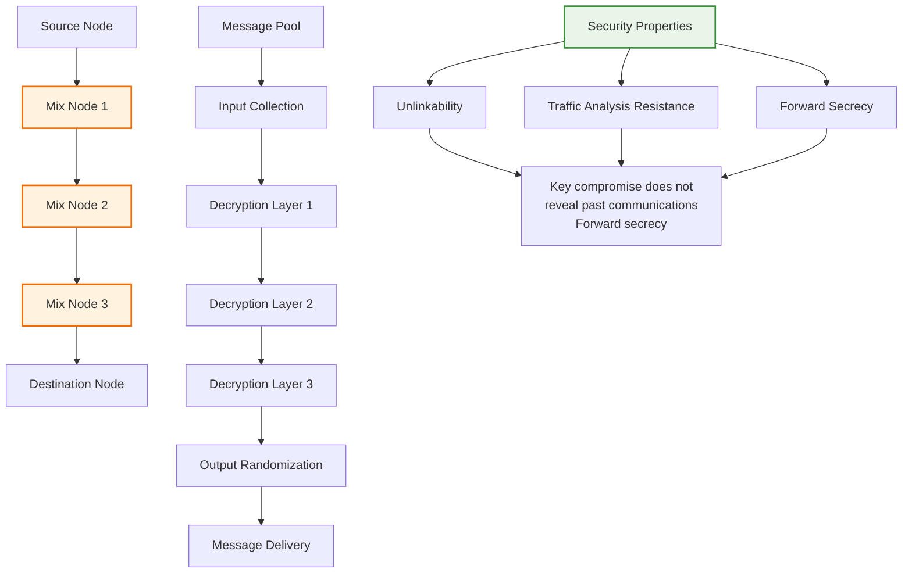

**Mix Network Types**:

1. **Threshold Mixes**:
   - **Requirement**: Minimum number of messages for operation
   - **Advantage**: Prevents small batch attacks
   - **Disadvantage**: Latency due to batching

2. **Timed Mixes**:
   - **Requirement**: Messages held for fixed time period
   - **Advantage**: Predictable timing
   - **Disadvantage**: Vulnerable to timing analysis

3. **Stop-and-Go Mixes**:
   - **Requirement**: Random delay for each message
   - **Advantage**: Variable timing
   - **Disadvantage**: Complex timing management

#### Onion Routing

**Onion Routing Architecture**:
Onion routing creates encrypted connections through multiple relay nodes, with each layer of encryption peeled off at each hop.

**Onion Routing Process**:
```
1. Path Selection: Choose relay nodes
2. Key Exchange: Establish symmetric keys with each relay
3. Onion Creation: Encrypt message with all relay keys
4. Transmission: Send through selected path
5. Decryption: Each relay decrypts one layer
6. Delivery: Final relay sends to destination
```

**Onion Routing Security**:
- **Path Diversity**: Multiple possible routes
- **Cryptographic Protection**: End-to-end encryption
- **Relay Anonymity**: Relays don't know complete path
- **Traffic Padding**: Uniform message sizes

**Tor Network**:
- **Implementation**: Most widely used onion routing system
- **Directory Servers**: Maintain relay lists
- **Exit Nodes**: Final relay to destination
- **Hidden Services**: Anonymous services within Tor

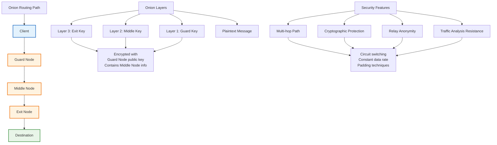

#### DC-Nets ( Dining Cryptographers Networks)

**DC-Nets Fundamentals**:
DC-Nets enable anonymous broadcast communication using cryptographic protocols without requiring trusted mix servers.

**DC-Nets Principle**:
```
Basic DC-Net Setup:
- N participants
- Shared secret key matrix K[i,j]
- Each participant i computes sum of row K[i,*]
- XOR with message to create shares
- Combine shares to recover message
```

**DC-Nets Operation**:
1. **Key Setup**: Establish shared secret matrix
2. **Message Transmission**: Compute and broadcast shares
3. **Message Recovery**: XOR all shares to recover message
4. **Anonymity**: Individual contributions untraceable

**DC-Nets Security**:
- **Information-Theoretic Security**: Unconditional privacy
- **Collusion Resistance**: Requires majority compromise
- **Efficiency**: High communication overhead
- **Scalability**: Limited to small groups

### 5.1.2 Anonymous Routing Protocols

#### ANODR (Anonymous On-Demand Distance Vector Routing)

**ANODR Overview**:
ANODR provides source and route anonymity in ad-hoc networks through trapdoor-based routing and route discovery without revealing identities.

**ANODR Components**:
1. **Trapdoor-based Routing**: Using cryptographic trapdoors
2. **Anonymous Route Discovery**: Hiding source and path information
3. **Route Anonymity**: Concealing intermediate nodes
4. **Label-based Forwarding**: Using labels instead of addresses

**ANODR Route Discovery**:
```mermaid
graph TB
    A[Source Node] --> B[Route Request Phase]
    B --> C[Trapdoor Generation]
    B --> D[Anonymous Propagation]
    B --> E[Route Reply Phase]
    
    B --> B1[Generate route request<br/>Create trapdoor<br/>Anonymous broadcast]
    
    C --> C1[Trapdoor = E_PK(Destination, Path_Info)<br/>Contains destination info<br/>Path accumulation]
    
    D --> D1[Intermediate nodes process<br/>Update trapdoor info<br/>Accumulate path data]
    
    E --> E1[Destination responds<br/>Anonymous route reply<br/>Path validation]
    
    F[Anonymous Forwarding] --> G[Label Generation]
    G --> H[Label-based Routing]
    G --> I[Route Verification]
    
    F --> F1[Generate route labels<br/>Cryptographic labels<br/>Path-specific]
    
    H --> F1[Forward using labels<br/>No address disclosure<br/>Route-specific routing]
    
    I --> F1[Verify route integrity<br/>Validate path<br/>Check trapdoor info]
    
    style A fill:#e3f2fd,stroke:#1565c0,stroke-width:3px
    style F fill:#e8f5e8,stroke:#388e3c,stroke-width:2px
```

**ANODR Security Properties**:
1. **Source Anonymity**: Source identity protected
2. **Route Anonymity**: Path information concealed
3. **Destination Anonymity**: Destination identity hidden
4. **Traffic Analysis Resistance**: Communication patterns protected

#### ASR (Anonymous Secure Routing)

**ASR Overview**:
ASR implements anonymous routing through multi-path source routing with cryptographic protection.

**ASR Features**:
1. **Multi-path Routing**: Multiple disjoint paths for anonymity
2. **Source Routing**: Complete path included in packets
3. **Cryptographic Protection**: Digital signatures and encryption
4. **Route Diversity**: Load balancing across paths

**ASR Operation**:
```
ASR Route Discovery:
1. Source initiates route discovery
2. Multiple paths discovered through flooding
3. Each path validated cryptographically
4. Source selects multiple paths for diversity
5. Traffic distributed across paths
```

**ASR Security Analysis**:
- **Path Anonymity**: Multiple paths obscure single route
- **Traffic Analysis Resistance**: Distributed traffic patterns
- **Fault Tolerance**: Alternative paths available
- **Performance**: Trade-off between anonymity and efficiency

#### MASK (Mutual Anonymity and Secure Communication)

**MASK Overview**:
MASK provides mutual anonymity in ad-hoc networks through pseudonym-based routing and secure communication channels.

**MASK Components**:
1. **Pseudonym Management**: Temporary identities for nodes
2. **Secure Channels**: Encrypted communication between pseudonyms
3. **Route Anonymity**: Hiding routing information
4. **Certificate Management**: Pseudonym certificate infrastructure

**MASK Architecture**:
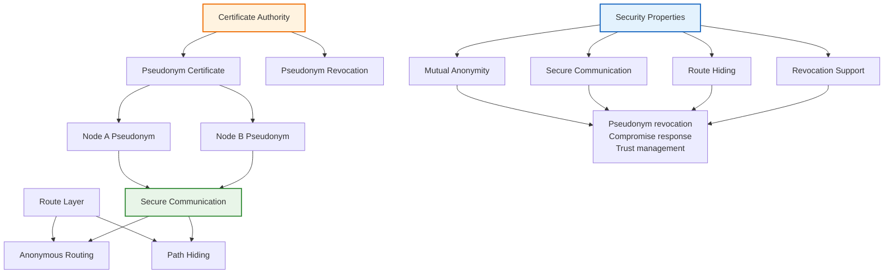

### 5.1.3 Privacy-Preserving Techniques

#### k-Anonymity

**k-Anonymity Definition**:
A dataset is k-anonymous if each record is indistinguishable from at least k-1 other records with respect to quasi-identifier attributes.

**k-Anonymity Techniques**:

1. **Generalization**:
   ```
   Original: ZIP Code: 90210
   Generalized: ZIP Code: 902**
   ```

2. **Suppression**:
   ```
   Original: Age: 25
   Suppressed: Age: *
   ```

3. **Perturbation**:
   ```
   Original: Location: (34.0522, -118.2437)
   Perturbed: Location: (34.05, -118.24)
   ```

**k-Anonymity in Ad-hoc Networks**:
- **Location k-Anonymity**: Location indistinguishable from k-1 others
- **Temporal k-Anonymity**: Timing information generalized
- **Communication k-Anonymity**: Communication patterns obscured

#### Differential Privacy

**Differential Privacy Definition**:
A randomized algorithm M provides ε-differential privacy if for all datasets D1, D2 that differ by one element:
```
Pr[M(D1) ∈ S] ≤ exp(ε) × Pr[M(D2) ∈ S]
```

**Differential Privacy Mechanisms**:

1. **Laplace Mechanism**:
   ```
   M(D) = f(D) + Lap(0, 1/ε)
   where Lap(b) is Laplace distribution with scale b
   ```

2. **Exponential Mechanism**:
   ```
   Pr[M(D) = r] ∝ exp(ε × Score(D, r))
   ```

**Application to Ad-hoc Networks**:
- **Location Privacy**: Add noise to location reports
- **Traffic Analysis**: Perturb communication patterns
- **Aggregate Statistics**: Provide differentially private aggregates

#### Secure Multi-Party Computation (SMC)

**SMC Fundamentals**:
SMC enables multiple parties to jointly compute a function over their inputs while keeping those inputs private.

**SMC Protocols**:

1. **Yao's Garbled Circuits**:
   ```
   Protocol Steps:
   1. Alice creates garbled circuit
   2. Alice sends garbled circuit and keys to Bob
   3. Bob computes on encrypted inputs
   4. Alice reveals result
   ```

2. **Secret Sharing**:
   ```
   Shamir's Secret Sharing:
   - Split secret into n shares
   - Any k shares can reconstruct secret
   - Fewer than k shares reveal nothing
   ```

**SMC in Ad-hoc Networks**:
- **Collaborative Routing**: Joint route computation
- **Aggregate Statistics**: Privacy-preserving aggregation
- **Trust Evaluation**: Secure trust computation

---

## Location Privacy in Vehicular Ad-hoc Networks (VANETs)

### 5.2.1 VANET Architecture and Applications

#### VANET System Architecture

**VANET Components**:

1. **On-Board Units (OBUs)**: Vehicle-mounted communication devices
2. **Roadside Units (RSUs)**: Infrastructure-based communication points
3. **Trusted Authority (TA)**: Central management and certification authority
4. **Vehicle-to-Vehicle (V2V)**: Direct vehicle communication
5. **Vehicle-to-Infrastructure (V2I)**: Vehicle to roadside communication

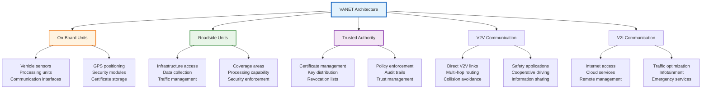

#### VANET Applications

**Safety Applications**:
1. **Collision Avoidance**: Warning systems for potential collisions
2. **Emergency Vehicle Preemption**: Priority for emergency vehicles
3. **Hazardous Condition Warning**: Weather, road conditions
4. **Intersection Collision Avoidance**: Traffic light violations

**Traffic Management Applications**:
1. **Traffic Flow Optimization**: Dynamic traffic control
2. **Route Guidance**: Optimal routing recommendations
3. **Parking Management**: Real-time parking availability
4. **Toll Collection**: Electronic toll systems

**Commercial Applications**:
1. **Infotainment Services**: Internet, multimedia content
2. **Fuel Optimization**: Fuel-efficient routing
3. **Maintenance Alerts**: Predictive maintenance notifications
4. **Insurance Telematics**: Usage-based insurance

### 5.2.2 Location Privacy Challenges

#### Location Inference Attacks

**Types of Location Attacks**:

1. **Temporal Correlation Attacks**:
   ```
   Attack Process:
   1. Observe vehicle movements over time
   2. Correlate timing with known schedules
   3. Infer vehicle identity from patterns
   4. Build movement profiles
   ```

2. **Spatial Correlation Attacks**:
   ```
   Attack Process:
   1. Observe multiple location reports
   2. Correlate with geographic databases
   3. Match patterns to known locations
   4. Identify vehicle origins/destinations
   ```

3. **Social Network Analysis**:
   ```
   Attack Process:
   1. Analyze communication patterns
   2. Identify social relationships
   3. Infer vehicle ownership
   4. Profile driver behavior
   ```

**Location Privacy Metrics**:

1. **k-Anonymity**: Location indistinguishable from k-1 others
2. **l-Diversity**: k-anonymous locations have l different sensitive attributes
3. **t-Closeness**: Distribution of sensitive attributes in k-group close to overall distribution
4. **ε-Differential Privacy**: Privacy budget for location releases

#### Contextual Attacks

**Multi-source Correlation**:
- **Insurance Data**: Correlate with insurance claims
- **Cell Phone Data**: Cross-reference with cellular records
- **Social Media**: Match with social media check-ins
- **Purchase Records**: Correlate with credit card transactions

**Attack Examples**:
```
Example 1: Hospital Visits
- Vehicle reports hospital location
- Correlate with medical records
- Infer health conditions

Example 2: Workplace Identification
- Daily pattern: Home → Office → Home
- Correlate with business directories
- Identify workplace location

Example 3: School Route
- Regular morning/evening patterns
- Child drop-off/pickup times
- Identify school location
```

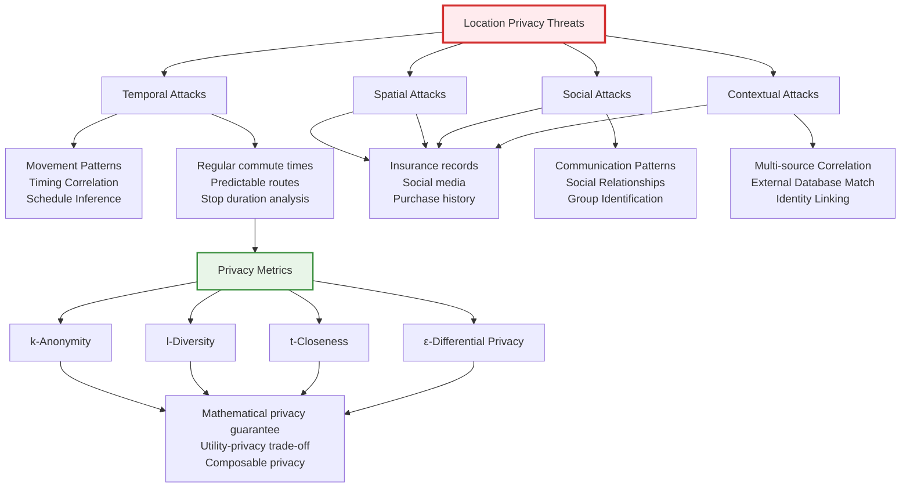

### 5.2.3 Privacy-Preserving Techniques

#### Pseudonym Systems

**Pseudonym Lifecycle**:
```
1. Certificate Request: Vehicle requests pseudonym certificate
2. Certificate Issuance: TA issues pseudonym with validity period
3. Usage Period: Vehicle uses pseudonym for communication
4. Pseudonym Change: Vehicle switches to new pseudonym
5. Certificate Revocation: Compromise response
```

**Pseudonym Management Strategies**:

1. **Periodic Change**:
   ```
   Change Interval: Fixed time period (e.g., daily, weekly)
   Advantages: Simple implementation, predictable
   Disadvantages: Attacker can correlate time periods
   ```

2. **Distance-Based Change**:
   ```
   Change Trigger: Vehicle travels certain distance
   Advantages: Geographic privacy protection
   Disadvantages: Complex distance calculation
   ```

3. **Mix-Zone Based Change**:
   ```
   Change Trigger: Enter designated mix-zones
   Advantages: Multiple vehicles change simultaneously
   Disadvantages: Requires infrastructure support
   ```

#### Mix-Zones

**Mix-Zone Definition**:
A mix-zone is a geographic area where vehicles change their pseudonyms simultaneously to break the link between old and new pseudonyms.

**Mix-Zone Types**:

1. **Static Mix-Zones**:
   - **Fixed Locations**: Pre-defined geographic areas
   - **Permanent Infrastructure**: RSUs manage pseudonym changes
   - **Predictable**: Known to vehicles and attackers

2. **Dynamic Mix-Zones**:
   - **Variable Locations**: Mix-zones move with traffic
   - **Self-organizing**: Vehicles cooperate to form mix-zones
   - **Unpredictable**: Harder for attackers to monitor

**Mix-Zone Operation**:
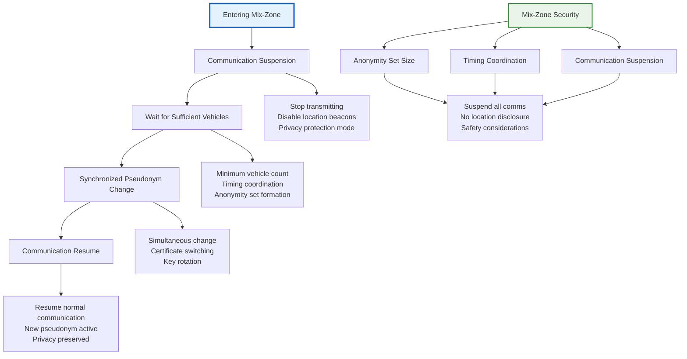

#### Temporal Cloaking

**Temporal Cloaking Definition**:
Temporal cloaking delays location reports to ensure that any location snapshot contains at least k different vehicles.

**Temporal Cloaking Algorithm**:
```
1. Collect location reports in time window T
2. Ensure at least k vehicles in window
3. Release all reports simultaneously after delay
4. Destroy individual timing information
```

**Implementation Considerations**:
- **Window Size**: Balance privacy vs. utility
- **Delay Tolerance**: Acceptable delay for applications
- **Minimum k**: Privacy parameter selection
- **Real-time Requirements**: Safety application constraints

#### Location Obfuscation

**Location Perturbation Techniques**:

1. **Geometric Perturbation**:
   ```
   Obfuscated Location = Original Location + Noise
   where Noise follows Gaussian distribution
   ```

2. **Grid-based Obfuscation**:
   ```
   Grid Cell = floor(Original Location / Grid Size)
   Report grid cell center instead of exact location
   ```

3. **Path Perturbation**:
   ```
   Report discrete waypoints instead of continuous path
   Hide precise movement details
   ```

**Differential Privacy for Location**:
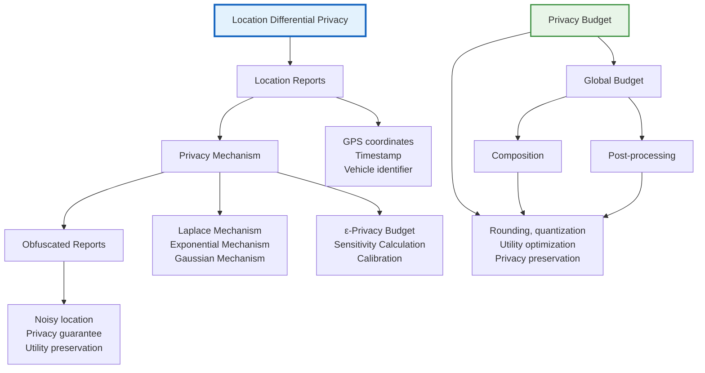

### 5.2.4 Privacy-Preserving Applications

#### Privacy-Preserving Traffic Monitoring

**Challenges**:
- **Aggregate Statistics**: Need traffic flow information
- **Individual Privacy**: Protect specific vehicle data
- **Real-time Processing**: Traffic management requirements
- **Accuracy**: Maintain utility for traffic analysis

**Solutions**:

1. **Counting with Privacy**:
   ```
   Vehicle Count = Actual Count + Noise
   where Noise provides differential privacy
   ```

2. **Secure Aggregation**:
   ```
   Multi-party computation for traffic statistics
   Individual vehicles' data remains private
   Aggregate results accurate
   ```

3. **Homomorphic Encryption**:
   ```
   Encrypt location data
   Process encrypted data
   Decrypt aggregate results
   ```

#### Privacy-Preserving Collision Avoidance

**Safety Requirements**:
- **Low Latency**: Critical safety applications
- **High Accuracy**: Precise location for collision avoidance
- **Reliability**: Guaranteed message delivery
- **Scalability**: Support many vehicles

**Privacy-Security Balance**:
```
Collision Avoidance with Privacy:
1. Use pseudonyms for communication
2. Apply minimum necessary privacy protection
3. Prioritize safety over privacy
4. Implement emergency privacy override
```

**Implementation Strategy**:
- **Context-aware Privacy**: Adjust protection based on situation
- **Emergency Protocols**: Override privacy for safety
- **Graduated Response**: Increasing privacy with decreasing urgency

---

## Secure Protocols for Behavior Enforcement

### 5.3.1 Behavioral Trust Models

#### Trust Definition and Components

**Trust in Ad-hoc Networks**:
Trust represents the belief that a node will behave correctly and reliably in network operations, based on past experiences and recommendations.

**Trust Components**:

1. **Direct Trust**: Based on first-hand experience
   ```
   Direct_Trust(i,j) = f(Interaction_History, Performance_Metrics, Reliability_Score)
   ```

2. **Recommendation Trust**: Based on others' recommendations
   ```
   Recommendation_Trust(i,j) = Σ(rec_k(i,j) × Trust(i,k))
   ```

3. **Context Trust**: Based on specific context or situation
   ```
   Context_Trust(i,j,context) = Trust(i,j) × Context_Factor(context)
   ```

#### Trust Metrics and Calculation

**Trust Metrics**:

1. **Reliability Score**:
   ```
   Reliability(i,j) = Successful_Interactions / Total_Interactions
   ```

2. **Performance Score**:
   ```
   Performance(i,j) = (Packet_Delivery_Rate + Latency_Score + Bandwidth_Share) / 3
   ```

3. **Cooperation Score**:
   ```
   Cooperation(i,j) = (Packet_Forwarding + Resource_Sharing + Collaborative_Activities) / 3
   ```

**Trust Update Mechanisms**:
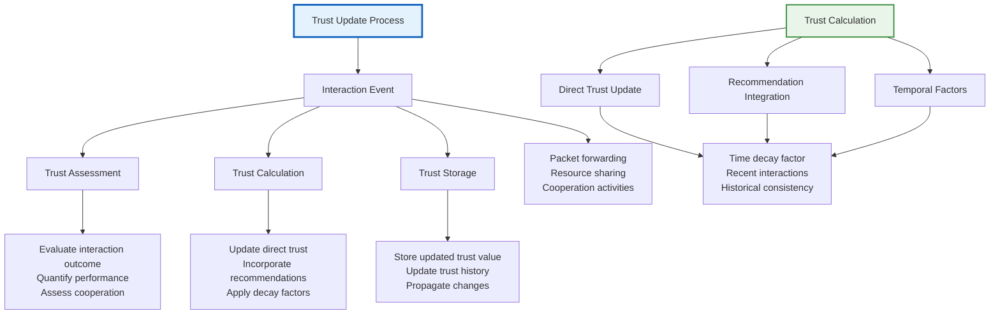

#### Trust Models Classification

**Centralized Trust Models**:
- **Trusted Authority**: Centralized trust management
- **Certificate Authority**: PKI-based trust
- **Reputation Server**: Centralized reputation system

**Distributed Trust Models**:
- **Peer-to-peer Trust**: Direct peer evaluations
- **Web of Trust**: Personal trust networks
- **Distributed Reputation**: Decentralized reputation sharing

**Hybrid Trust Models**:
- **Hierarchical Trust**: Multi-level trust architecture
- **Context-aware Trust**: Situation-dependent trust
- **Dynamic Trust**: Adaptive trust management

### 5.3.2 Misbehavior Detection

#### Misbehavior Types

**Routing Misbehavior**:
1. **Blackhole Attack**: Dropping all packets
2. **Grayhole Attack**: Selectively dropping packets
3. **Wormhole Attack**: Creating false shortcuts
4. **Rushing Attack**: Propagating requests quickly

**Packet Forwarding Misbehavior**:
1. **Selfish Node**: Not forwarding others' packets
2. **On-off Misbehavior**: Intermittent cooperation
3. **Malicious Dropping**: Targeted packet dropping
4. **Delay Injection**: Introducing artificial delays

**Resource Misbehavior**:
1. **Bandwidth Hogging**: Consuming excessive bandwidth
2. **Channel Jamming**: Interfering with communications
3. **Fake Alert Generation**: Spreading false information
4. **Resource Exhaustion**: Overwhelming network resources

#### Detection Mechanisms

**Reputation-based Detection**:
```
Detection Process:
1. Monitor neighbor behavior
2. Calculate reputation scores
3. Compare with expected behavior
4. Flag suspicious nodes
5. Initiate response actions
```

**Anomaly Detection**:
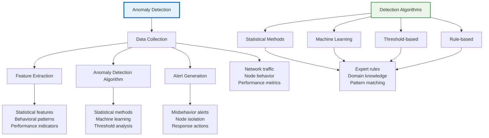

**Collaborative Detection**:
1. **Watchdog Mechanism**: Monitor neighbors' behavior
2. **Reputation Sharing**: Exchange reputation information
3. **Voting Mechanisms**: Collaborative misbehavior detection
4. **Distributed Detection**: Network-wide detection

#### Detection Performance Metrics

**Detection Accuracy**:
```
Precision = True_Positives / (True_Positives + False_Positives)
Recall = True_Positives / (True_Positives + False_Negatives)
F1_Score = 2 × (Precision × Recall) / (Precision + Recall)
```

**Detection Overhead**:
- **Computational Overhead**: Processing requirements
- **Communication Overhead**: Detection message traffic
- **Storage Overhead**: Detection data storage
- **Latency Overhead**: Detection delay

### 5.3.3 Response Mechanisms

#### Automated Response Strategies

**Dynamic Isolation**:
```
Isolation Process:
1. Detect misbehavior
2. Calculate threat level
3. Apply isolation measures
4. Monitor isolation effectiveness
5. Adjust isolation parameters
```

**Isolation Techniques**:
1. **Communication Isolation**: Block communications
2. **Route Isolation**: Exclude from routing
3. **Resource Isolation**: Limit resource access
4. **Network Isolation**: Physical network separation

**Graduated Response**:
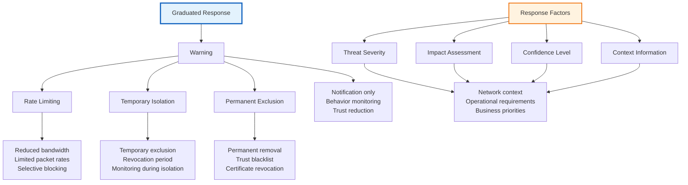

#### Human-in-the-Loop Response

**Manual Response Process**:
1. **Incident Classification**: Categorize security incidents
2. **Impact Assessment**: Evaluate incident severity
3. **Response Decision**: Choose appropriate response
4. **Implementation**: Execute response actions
5. **Follow-up**: Monitor and adjust response

**Decision Support Systems**:
- **Risk Assessment Tools**: Automated risk calculation
- **Response Recommendations**: Suggest appropriate actions
- **Impact Prediction**: Forecast response consequences
- **Performance Monitoring**: Track response effectiveness

### 5.3.4 Incentive Mechanisms

#### Reputation-Based Incentives

**Reputation System Design**:
```
Reputation Components:
1. Local Reputation: Direct interaction history
2. Global Reputation: Community-wide reputation
3. Recommendation Reputation: Source credibility
4. Temporal Reputation: Recent vs. historical behavior
```

**Incentive Calculation**:
```
Incentive(i) = Base_Reward × Reputation_Score × Behavior_Weight

where:
- Base_Reward: Fixed reward amount
- Reputation_Score: Node's reputation level
- Behavior_Weight: Recent behavior quality
```

**Reward Mechanisms**:
1. **Direct Rewards**: Immediate benefits for cooperation
2. **Indirect Rewards**: Future benefits through reputation
3. **Social Rewards**: Community recognition
4. **Penalty Mechanisms**: Punishment for misbehavior

#### Game-Theoretic Incentives

**Cooperation Game Model**:
```
Game Definition:
- Players: Network nodes
- Actions: Cooperate / Defect
- Payoffs: Benefit - Cost
- Strategies: Optimal cooperation levels
```

**Nash Equilibrium Analysis**:
```
Equilibrium Conditions:
1. Individual Rationality: Cooperation profitable
2. Strategy Stability: No incentive to deviate
3. Pareto Optimality: No player can be better off
4. Efficiency: Maximum total payoff
```

**Mechanism Design**:
```mermaid
graph TB
    A[Mechanism Design] --> B[Auction-based]
    A --> C[Credit-based]
    A --> D[Reputation-based]
    A --> E[Blockchain-based]
    
    B --> B1[Vickrey auction<br/>Progressive auction<br/>Sealed-bid auction]
    B --> B2[Resource allocation<br/>Fair pricing<br/>Incentive alignment]
    
    C --> C1[Credit systems<br/>Payment mechanisms<br/>Resource accounting]
    C --> C2[Direct compensation<br/>Service payment<br/>Resource exchange]
    
    D --> D1[Reputation scoring<br/>Trust mechanisms<br/>Community incentives]
    D --> C2[Long-term benefits<br/>Social recognition<br/>Peer pressure]
    
    E --> E1[Cryptocurrency rewards<br/>Smart contracts<br/>Automated payments]
    E --> C2[Tamper-proof records<br/>Transparent rewards<br/>Decentralized control]
    
    F[Design Principles] --> G[Individual Rationality]
    F --> H[Truthfulness]
    F --> I[Pareto Efficiency]
    F --> J[Computational Efficiency]
    
    G --> G1[Participation profitable<br/>Participation voluntary<br/>No negative payoff]
    
    H --> G1 truthful bidding optimal<br/>No benefit from lying<br/>Strategy-proof]
    
    I --> G1[No one can improve<br/>without harming others<br/>Optimal allocation]
    
    J --> G1[Efficient algorithms<br/>Polynomial time<br/>Scalable mechanisms]
    
    style A fill:#e3f2fd,stroke:#1565c0,stroke-width:3px
    style F fill:#e8f5e8,stroke:#388e3c,stroke-width:2px
```

---

## Game Theoretic Model of Packet Forwarding

### 5.4.1 Game Theory Fundamentals in Networks

#### Basic Game Theory Concepts

**Game Definition**:
A game consists of:
1. **Players**: Decision-making entities
2. **Strategies**: Available actions for each player
3. **Payoffs**: Utility functions for each player
4. **Information**: Knowledge available to players

**Game Types**:

1. **Cooperative vs. Non-cooperative**:
   - **Cooperative**: Players can make binding agreements
   - **Non-cooperative**: No binding agreements possible

2. **Simultaneous vs. Sequential**:
   - **Simultaneous**: Players choose strategies simultaneously
   - **Sequential**: Players move in sequence

3. **Perfect vs. Imperfect Information**:
   - **Perfect**: All players know all previous moves
   - **Imperfect**: Some information is hidden

#### Nash Equilibrium

**Nash Equilibrium Definition**:
A strategy profile (s₁*, s₂*, ..., sₙ*) is a Nash equilibrium if for each player i:
```
u_i(s₁*, s₂*, ..., sₙ*) ≥ u_i(s₁*, ..., sᵢ₋₁*, sᵢ, sᵢ₊₁*, ..., sₙ*)
```
for all strategies sᵢ in the strategy set of player i.

**Nash Equilibrium Properties**:
1. **Self-enforcing**: No player wants to deviate
2. **Stability**: Equilibrium strategy profiles are stable
3. **Existence**: Nash equilibria exist in finite games
4. **Efficiency**: May not be Pareto efficient

### 5.4.2 Packet Forwarding Game Model

#### Game Formulation

**Game Components**:

1. **Players**: Network nodes
2. **Strategies**: Forward packets or drop packets
3. **Payoffs**: Benefits minus costs
4. **Information**: Node capabilities and costs

**Basic Packet Forwarding Game**:
```
Players: N network nodes
Strategies: 
- Cooperate: Forward others' packets (C)
- Defect: Drop others' packets (D)

Payoffs:
- Cooperate: Benefit - Cost_C
- Defect: 0 (no cost, no benefit)
```

**Extended Game Model**:
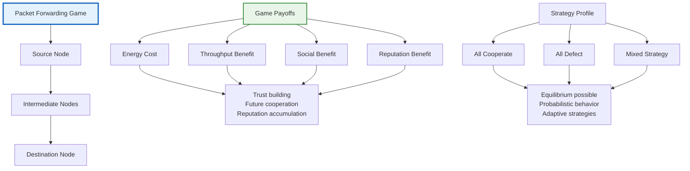

#### Game Analysis

**Pure Strategy Equilibrium**:
```
Analysis:
1. If all others cooperate, best response is to cooperate
2. If all others defect, best response is to defect
3. All-cooperate is Nash equilibrium if Benefit > Cost
4. All-defect is Nash equilibrium if Cost > Benefit
```

**Mixed Strategy Equilibrium**:
```
Mixed Strategy Profile:
- Probability of cooperation: p*
- Probability of defection: 1-p*

Indifference Condition:
Expected payoff from cooperating = Expected payoff from defecting
Benefit - Cost × p* = 0
p* = Benefit / Cost
```

**Pareto Efficiency**:
- **Cooperative Outcome**: Pareto efficient if all benefit from cooperation
- **Defective Outcome**: Pareto inefficient as all could be better off
- **Mixed Strategy**: May be Pareto inefficient

### 5.4.3 Repeated Games and Reputation

#### Repeated Game Framework

**Repeated Game Setup**:
```
Game Repetition:
- Finite Horizon: T repetitions
- Infinite Horizon: Unlimited repetitions
- Discount Factor: δ (0 < δ < 1)

Payoff Calculation:
Total Payoff = Σ(δ^(t-1) × Stage Game Payoff)
```

**Folk Theorems**:
For infinitely repeated games, any feasible, individually rational payoff vector can be sustained as a Nash equilibrium of the repeated game if the discount factor is sufficiently high.

**Trigger Strategies**:
```
Trigger Strategy:
1. Cooperate as long as all others cooperate
2. Defect forever if anyone defects
3. Punish defection to maintain cooperation
```

#### Reputation Mechanisms

**Reputation Building**:
```
Reputation Update:
Reputation_{t+1} = α × Reputation_t + (1-α) × Current_Behavior

where α is the memory factor (0 < α < 1)
```

**Reputation-based Payoffs**:
```
Extended Payoff = Stage_Payoff + β × Reputation_Benefit

where β is the reputation weight
```

**Reputation Equilibrium**:
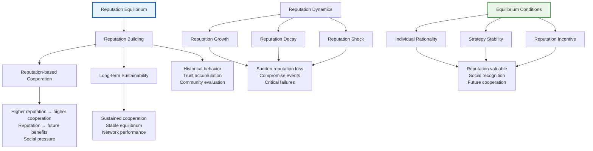

### 5.4.4 Cooperative Game Theory

#### Coalition Formation

**Coalition Games**:
A coalition is a group of players who coordinate their strategies to achieve better outcomes.

**Coalition Value**:
```
v(S) = Maximum payoff that coalition S can achieve
       by cooperating among themselves
```

**Coalition Stability**:
- **Core**: Set of payoff distributions where no coalition can improve
- **Shapley Value**: Fair division of coalition value
- **Nucleolus**: Minimizes maximum dissatisfaction

#### Network Formation Games

**Network Formation Models**:
1. **Strategic Network Formation**: Players choose connections strategically
2. **Spontaneous Network Formation**: Networks form based on local interactions
3. **Hybrid Models**: Combine strategic and spontaneous elements

**Network Formation Payoffs**:
```
Payoff Function:
π_i(G) = Benefits_i(G) - Costs_i(G)

where G is the network structure
```

**Network Efficiency**:
- **Social Welfare**: Sum of all players' payoffs
- **Individual Rationality**: Each player gets at least their outside option
- **Stability**: No player wants to deviate from network

### 5.4.5 Mechanism Design for Packet Forwarding

#### Incentive-Compatible Mechanisms

**Vickrey-Clarke-Groves (VCG) Mechanism**:
```
VCG Payment for player i:
Payment_i = (Σ_{j≠i} v_j(N) - Σ_{j≠i} v_j(N \ {i}))

where v_j(S) is the value of coalition S for player j
```

**Auction-based Mechanisms**:
1. **Reverse Auction**: Nodes bid for forwarding services
2. **Progressive Auction**: Increasing bids over time
3. **Sealed-bid Auction**: Private bid submission

#### Smart Contract Implementation

**Blockchain-based Incentives**:
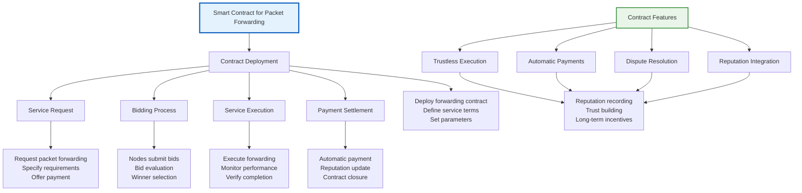

**Cryptocurrency Incentives**:
1. **Direct Payments**: Immediate cryptocurrency rewards
2. **Reputation Tokens**: Tokens representing reputation
3. **Utility Tokens**: Tokens for network services
4. **Staking Mechanisms**: Collateral for reliable service

#### Implementation Considerations

**Computational Overhead**:
- **Game Theory Computation**: Strategic analysis requirements
- **Cryptographic Operations**: Encryption and signatures
- **Blockchain Operations**: Smart contract execution
- **Consensus Mechanisms**: Agreement protocols

**Scalability Issues**:
- **Player Coordination**: Large-scale game coordination
- **Information Exchange**: Communication overhead
- **State Management**: Game state synchronization
- **Performance Optimization**: Efficient algorithms

**Security Considerations**:
- **Collusion Prevention**: Players working together to cheat
- **Strategy Manipulation**: Players misrepresenting capabilities
- **Sybil Attacks**: Multiple identities by same player
- **Replay Attacks**: Reusing past game outcomes

---

## Summary and Key Takeaways

### Privacy-Preserving Communication

1. **Anonymous Communication Systems**: Mix networks, onion routing, and DC-nets provide different approaches to anonymous communication
2. **Ad-hoc Routing Privacy**: Specialized protocols like ANODR, ASR, and MASK address privacy in routing
3. **Privacy Techniques**: k-anonymity, differential privacy, and SMC offer mathematical privacy guarantees

### Location Privacy in VANETs

1. **Privacy Threats**: Temporal, spatial, social, and contextual attacks pose significant privacy risks
2. **Pseudonym Systems**: Effective pseudonym management is crucial for location privacy
3. **Privacy-Preserving Techniques**: Mix-zones, temporal cloaking, and differential privacy provide practical solutions

### Behavior Enforcement

1. **Trust Models**: Multi-dimensional trust assessment combining direct experience and recommendations
2. **Misbehavior Detection**: Anomaly detection and collaborative mechanisms identify malicious behavior
3. **Response Mechanisms**: Graduated responses from warnings to permanent exclusion

### Game Theory Applications

1. **Packet Forwarding Games**: Model cooperation and defection in network environments
2. **Repeated Games**: Reputation mechanisms sustain long-term cooperation
3. **Mechanism Design**: Incentive-compatible mechanisms ensure desired outcomes

### Implementation Challenges

1. **Performance Trade-offs**: Privacy and security often come at the cost of performance
2. **Scalability**: Solutions must scale to large networks with many nodes
3. **Usability**: Security mechanisms must be transparent to end users
4. **Integration**: Privacy and security features must integrate with existing protocols

Understanding these privacy and security challenges in ad-hoc and vehicular networks is essential for designing systems that protect user privacy while maintaining network functionality and security.

---

*Unit 5 concludes the comprehensive coverage of cybersecurity in wireless and ad-hoc networks, focusing on privacy preservation and behavioral enforcement in dynamic network environments.*