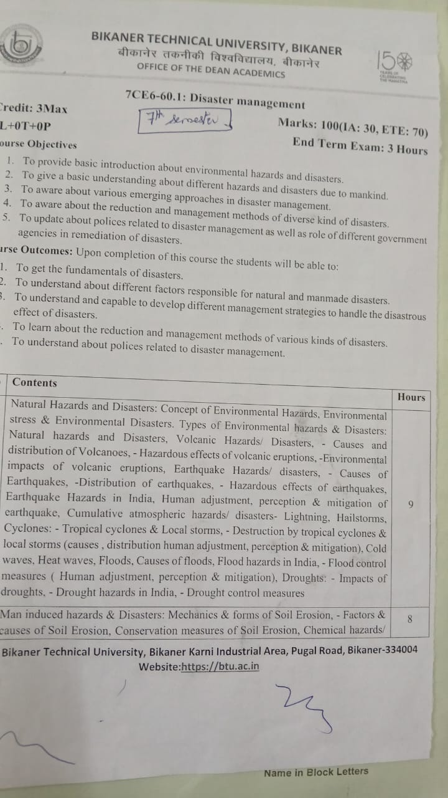
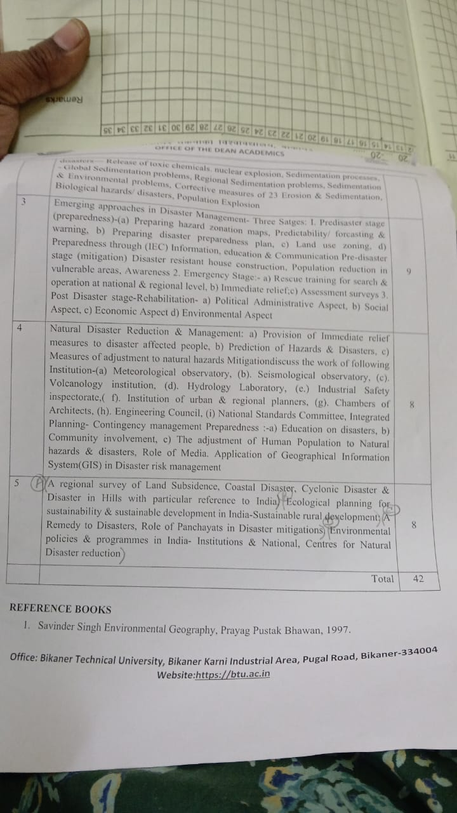

# DM
## syllabus 

Click To See Syllubus

---

---
---

# UNIT–1: Natural Hazards and Disasters

## 1) Environmental Hazards
**Meaning:** Events/conditions/substances in the environment that can harm **human health, ecosystems, or property**.

### Types of Environmental Hazards
1. **Natural Hazards (from Earth processes)**
   - **Geological:** earthquakes, volcanoes, tsunamis, landslides  
   - **Meteorological:** hurricanes/cyclones, tornadoes, floods, droughts, heatwaves  
   - **Biological:** pandemics, infestations, diseases (viruses, bacteria)
2. **Anthropogenic / Human-made Hazards**
   - **Chemical:** pesticides, industrial pollutants, heavy metals, toxic waste  
   - **Physical:** radiation exposure, urban heat islands, noise pollution  
   - **Social/Technological:** overcrowding, poor sanitation, nuclear accidents
3. **Hybrid Hazards (natural + human influence)**
   - Climate change increasing storms/wildfires  
   - Deforestation → landslides/flood risk

### Impacts
- **Health:** respiratory disease, cancers, cardiovascular issues, infections  
- **Ecosystems:** biodiversity loss, habitat destruction, food-chain disruption  
- **Economy:** infrastructure damage, crop loss, healthcare costs, displacement  
- **Society:** migration, conflicts over resources, lower quality of life (vulnerable groups hit hardest)

### Factors Increasing Hazards
- Climate change, urbanization/industrialization, deforestation/land-use change, globalization (fast disease spread)

### Management/Mitigation
- Risk assessment (hazard maps + vulnerability assessment)  
- Regulations (pollution control, resource management)  
- Technology (early warning, disaster-resistant infrastructure, renewables)  
- Community action (awareness + local planning)  
- International cooperation (e.g., climate agreements)

---

## 2) Environmental Stress
**Meaning:** Long-term or sudden pressure on ecosystems/human systems due to **natural or human-induced change**.

### Types
- **Natural stress:** climatic variability (drought/flood/extreme temp), natural disasters  
- **Anthropogenic stress:** pollution, resource depletion, land-use change  
- **Chronic vs Acute:**  
  - Chronic: air pollution, deforestation  
  - Acute: oil spill, forest fire

### Causes
Population growth, industrialization/urbanization, harmful agriculture (pesticides/fertilizers/over-irrigation), global trade/transport, climate change

### Impacts
- Ecosystem services weaken (pollination, water purification)  
- Human health issues + food/water insecurity  
- Worsens climate change (deforestation + fossil fuels)  
- Socioeconomic losses (yield decline, migration, conflicts)

### Management
Sustainable resources (renewables, sustainable farming), pollution control, ecosystem restoration (re/afforestation), climate action, education, tech (AI/remote sensing monitoring)

---

## 3) Environmental Disasters
**Meaning:** Catastrophic events (natural or human-caused) that cause major harm to ecosystems, health, and infrastructure.

### Types
- **Natural:** earthquake, tsunami, hurricane/typhoon, flood, wildfire  
- **Man-made:** oil spill, nuclear accident, deforestation, industrial pollution, climate change

### Consequences
Biodiversity loss, health impacts (respiratory/cancer), economic damage, displacement + trauma

### Examples (from notes)
- Natural: 2004 Indian Ocean Tsunami, 2010 Haiti earthquake, 2023 Turkey–Syria earthquake  
- Man-made: 1986 Chernobyl, 2010 Deepwater Horizon, 1984 Bhopal gas tragedy

### Prevention & Mitigation
Prevention → mitigation → preparedness → response → recovery

### Relationship (very important)
- **Hazard** = potential threat  
- **Stress** = pressure that increases vulnerability  
- **Disaster** = hazard event causing major damage (often when stress is high)  
Example: flood-prone river (hazard) + deforestation (stress) → catastrophic flood (disaster)

---

## 4) Natural Hazards & Disasters (Core Classification)
**Key idea:** A hazard becomes a **disaster** when it causes **widespread damage/loss of life** and overwhelms coping capacity.

### Types
1. **Geological:** earthquakes, volcanoes  
2. **Meteorological:** heat/cold waves, cyclones/hurricanes, freezing rain  
3. **Hydrological:** floods, droughts, mudslides, tsunamis  
4. **Biological:** infectious diseases, epidemics/pandemics

### Effects
- Human (death, injury, displacement, trauma)  
- Economic (infrastructure + agriculture loss, recovery cost)  
- Environmental (habitat loss, soil erosion, pollution)  
- Social (service disruption, poverty, conflicts)

### “Service Functions” (Positive roles in nature)
- Ecosystem renewal (flood silt fertility, wildfire regeneration, volcanic soil enrichment)  
- Biodiversity maintenance (fire-dependent species)  
- Geological/hydrological balance (landform creation, sediment redistribution)  
- Climate regulation (large eruptions → temporary cooling)

### Natural Hazard vs Disaster (quick differences)
- **Hazard:** potential damaging event; may not affect people; may not need external aid  
- **Disaster:** actual severe impact on people/property; disrupts society; external aid often needed; usually in inhabited/infrastructure areas

---

## 5) Volcanic Hazards/Disasters
### Basics
- Volcano = opening/crack where **magma + gases** escape.  
- Magma underground; **lava** = magma at surface.

### Causes of Volcanoes
- Plate boundaries: **convergent (subduction), divergent (rifts/ridges), transform (less common)**  
- **Hotspots** and **mantle plumes**  
- Subduction zones + crustal stretching (rifting) + Earth’s internal heat

### Distribution
Ring of Fire, mid-ocean ridges (Iceland), hotspots (Hawaii), rift zones (East Africa), subduction zones (most explosive; ~80% active)

### Hazardous Effects
- **Primary:** lava flows, ash fall, pyroclastic flows, volcanic gases  
- **Secondary:** lahars (mudflows), tsunamis, landslides

### Environmental Impacts
Air pollution, water contamination, habitat destruction; **long-term soil fertility increase**; stratospheric SO₂ aerosols → cooling (“volcanic winter”)

### Monitoring
Seismic activity, gas emissions, ground deformation (GPS/satellite), thermal imaging, ash tracking, hydrology

### Mitigation
Early warnings, evacuation plans, resilient infrastructure, land-use buffers, public education; geothermal use with safe management

### Risk Zones around Active Volcano (as per notes)
- **Extreme risk:** up to ~100 m (death zone; toxic gases, crater quakes, projectiles)  
- **High risk:** 100–300 m  
- **Medium risk:** 300 m–3 km  
- **Low risk:** 3–10 km  
- **Safe zone:** >10 km (only very large eruptions may affect)

---

## 6) Earthquake Hazards/Disasters
### Meaning
Sudden ground shaking due to energy release in Earth’s crust (tectonic, volcanic, etc.). Prediction is still unreliable → focus on mitigation.

### Causes
Tectonic plate movement, volcanic activity, faulting, human-induced (mining/reservoir/fracking), isostatic rebound

### Distribution (world)
Ring of Fire, Himalayan belt, Mid-Atlantic Ridge, San Andreas, Alpide belt, Indo‑Gangetic region (seismic influence)

### Hazardous Effects
- **Primary:** ground shaking, fault rupture, tectonic deformation  
- **Secondary:** liquefaction, landslides/mudslides, submarine avalanches, snow avalanches, tsunamis

### India: Major Seismic Regions (7)
Kashmir & W Himalayas; Central Himalayas; North‑East India; Indo‑Gangetic Plain & Rajasthan; Khambhat & Rann of Kutch; Peninsular India; Andaman & Nicobar

### Measurement
- Instrument: **seismometer/seismograph**  
- Severity by **magnitude** (often taught as Richter scale in basics)

### Human Adjustment & Preparedness
- Earthquake-resistant construction + retrofitting  
- Zoning/avoid fault + liquefaction areas  
- Education: “Drop, Cover, Hold On” + drills  
- Community preparedness + supplies + response teams  
- Insurance + psychological support

### Do’s & Don’ts (summary)
- **Before:** follow codes, retrofit weak buildings, drills, first aid, family plan  
- **During:** stay calm, shut gas/electric if safe, don’t use lifts, take cover, avoid glass; outdoors move to open area  
- **After:** expect aftershocks, check fires/injuries, avoid gas leak ignition, don’t touch power lines, cooperate with authorities, avoid rumors

### Perception Factors
Geography, culture, past experience, media, education, proactive vs reactive mindset

### Mitigation
Codes, retrofitting, land-use planning, early warning sensors, awareness, response readiness, policy enforcement, research collaboration

---

## 7) Cumulative Atmospheric Hazards/Disasters
### (a) Lightning
- **Cause:** charge separation in thunderstorms → discharge  
- **Types:** cloud–cloud, cloud–air, cloud–ground  
- **How it “earths”:** direct strike, side flash, contact voltage, step potential  
- **Impacts:** fires, power outages, fatalities/injuries, building/electronics damage  
- **Do’s:** shelter indoors/vehicle, avoid water, unplug devices, wait ~30 min after last thunder  
- **Don’ts:** don’t stand near tall isolated objects/trees, don’t use wired electronics, don’t shelter in sheds/tents  
- **Mitigation:** lightning rods, surge protection, warnings + awareness

### (b) Hailstorms
- **Formation:** strong updrafts lift droplets into freezing zone → layered hailstones  
- **Impacts:** crop loss, roof/window/vehicle damage, injuries  
- **Mitigation:** hail‑resistant materials, shelters, hail nets for crops, forecasting

### (c) Cyclones
- **Meaning:** rotating low-pressure system with strong winds, rain, storm surge  
- **Types:** tropical cyclones; local cyclonic storms  
- **Causes:** warm seas, low pressure, instability, Coriolis effect  
- **Distribution:** 5°–20° latitudes; Bay of Bengal/Arabian Sea important for India  
- **Destruction:** wind damage, storm surges, flooding, landslides, tornadoes  
- **Human adjustment:** cyclone-resistant housing, coastal defenses, early warnings, evacuation shelters, drills, crop diversification  
- **Mitigation:** EWS, seawalls/levees, response plans, education  
- **Storm intensity idea (from notes):** categories rise from low pressure → depression → deep depression → cyclonic storm → severe → very severe → super cyclone

### (d) Cold Waves
- **Causes:** polar air inflow, high-pressure trapping, clear skies, winds, jet stream shifts  
- **Effects:** hypothermia/frostbite, crop loss, pipe bursts, transport disruption, power strain  
- **Adjustment/Mitigation:** warm clothing, heating + insulation, shelters/warming centers, alerts, health support, energy management

### (e) Heat Waves
- **Causes:** persistent high pressure, climate change, urban heat island, jet stream, drought, El Niño  
- **Effects:** heatstroke/dehydration, crop stress, grid overload, wildfires, mortality  
- **Adjustment/Mitigation:** hydration, avoid peak heat hours, light clothing, cooling centers, heat action plans, urban greening, energy efficiency

### (f) Floods
- **Causes:** heavy rain, snowmelt, dam failure, storm surge, urbanization, deforestation, climate change  
- **India flood risk:** monsoon rivers (Ganga/Brahmaputra), urban flooding (poor drainage), coastal flooding, flash floods (Himalayas/Western Ghats/NE), sedimentation raising riverbeds  
- **Impacts:** deaths, displacement, crop loss, water contamination, erosion, transport disruption  
- **Control:** zoning + drainage, embankments/dams, forecasting & warning, evacuation plans; afforestation/wetland restoration; floodwalls; green urban planning; insurance

### (g) Droughts
- **Causes:** meteorological (low rain), hydrological (low water bodies), agricultural overuse, climate change, deforestation  
- **India:** Rajasthan, Maharashtra (Vidarbha), Gujarat (Kutch), parts of TN/KA/AP  
- **Impacts:** water scarcity, crop failure, food insecurity, health risk, desertification, migration  
- **Control:** conservation + rainwater harvesting, drought-resistant crops, efficient irrigation, early warning, govt support/insurance, afforestation, livelihood diversification

---

---

# UNIT–2: Man-Induced Hazards & Disasters

## 1) Meaning
Disasters caused by **human activities** (accidental, negligent, or intentional) causing damage to life, property, and environment.

## 2) Major Types
- **Industrial:** chemical spills, oil spills, radiation leaks (e.g., Bhopal)  
- **Technological:** nuclear accidents, electromagnetic disruptions, infrastructure failure  
- **Environmental degradation:** deforestation, pollution, climate change  
- **Mining disasters:** collapses, explosions, toxic waste dumping  
- **Conflict-driven:** war, terrorism (incl. bio/chemical attacks)  
- **Transport failures:** aviation, rail derailments, maritime disasters

### Prevention (high-yield)
Regulations & codes, monitoring tech, sustainable practices, training/awareness, conflict prevention

### Mitigation
DRR planning, resilient infrastructure, rapid response & recovery, ecological restoration, health monitoring, community participation

---

## 3) Soil Erosion
**Meaning:** loss of nutrient-rich topsoil due to wind/water/gravity + human activity.

### Mechanics
Detachment → transportation → deposition

### Forms
- **Water erosion:** sheet, rill, gully, stream-bank  
- **Wind erosion:** saltation, suspension, creep  
- **Gravity erosion:** landslides, rockfalls, slumping  
- **Human-induced:** deforestation, overgrazing, poor farming

### Causes/Factors
Rain intensity, wind speed, dry conditions, slope/elevation, lack of vegetation; plus deforestation, monoculture, bad irrigation, plowing along slopes, urbanization, mining

### Conservation Measures
Vegetative cover, terracing, contour plowing, windbreaks, controlled irrigation, mulching, no‑till, crop rotation/organic matter, check dams/sediment ponds, gabions/retaining walls/silt fences

---

## 4) Chemical Hazards/Disasters
### Types
Chemical spills, industrial explosions/fires/leaks, toxic gas leaks (chlorine/ammonia), poisoning (pesticides/heavy metals), agricultural runoff, chemical warfare (and nuclear accidents included in notes)

### Effects
Health (burns/respiratory/cancer/death), environment contamination, economic losses

### Prevention/Mitigation
Strict safety rules + inspections, safe storage/disposal, emergency plans + drills, public/worker awareness, leak detection + automatic shutdown, monitoring air/water/soil

---

## 5) Release of Toxic Chemicals
### Causes
Industrial/transport accidents, improper storage, natural disasters damaging facilities, warfare, negligence

### Examples of toxic agents (categories)
Heavy metals, pesticides/herbicides, industrial chemicals, asbestos, radioactive materials

### Effects & Control
Same as chemical hazards + strong focus on **containment, evacuation, decontamination, medical response** and environmental monitoring

---

## 6) Nuclear Explosion
### Causes
Weapon detonation, reactor failure/meltdown, accidental detonation

### Effects
- Immediate: blast wave, extreme heat (fires/burns), radiation sickness  
- Long-term: fallout contamination, cancers/genetic effects, ecosystem damage, possible “nuclear winter”

### Prevention/Mitigation
Non‑proliferation treaties, nuclear plant safety protocols, preparedness (shelters/evacuation), diplomacy/conflict resolution

---

## 7) Sedimentation Processes
**Meaning:** transport and deposition of particles (sand/silt/clay) by water/wind/ice, forming layers.

### Types
Hydraulic sorting, aeolian, glacial, biological, gravitational settling, flocculation

### Stages
Transportation → deposition → compaction → cementation

### Problems
- **Global:** marine pollution, coastal ecosystem loss, river/lake sedimentation, reservoir capacity loss, glacier melt sediment, climate‑driven erosion, desertification, water scarcity  
- **Regional:** river flooding from sediment, farm runoff, coastal sediment changes, reservoir sedimentation, wind erosion, extreme rainfall effects

### Environmental Issues
Water quality decline, habitat smothering, eutrophication, higher flood risk, altered river courses, coastal erosion

### Corrective Measures
Vegetation/landscaping, check dams/silt fences/riprap/gabions/terracing, stormwater + sediment basins, soil stabilization, buffer zones + land-use planning, construction-site controls, awareness programs

---

## 8) Biological Hazards/Disasters
### Types
Outbreaks, epidemics/pandemics (e.g., COVID‑19), bioterrorism, vector-borne diseases, foodborne illness, fungal infections, antimicrobial resistance, zoonoses, environmental bio-contaminants (mold/contaminated water)

### Effects
Mass illness/death, ecosystem imbalance, economic shutdown, fear/panic/stigma

### Prevention/Mitigation
Surveillance, vaccination, sanitation/clean water, vector control, rapid detection & response, antibiotic stewardship, public education, global cooperation

---

## 9) Population Explosion
### Causes
High birth rates, lower death rates (healthcare), improved living standards, cultural factors

### Effects
Resource depletion, pollution/deforestation, overcrowding, unemployment, pressure on services, conflicts, rapid urbanization, health stress

### Solutions
Family planning, education (especially women), government policies, healthcare access, sustainable development, planned urbanization, economic development/jobs

---

---

# UNIT–3: Emerging Approaches in Disaster Management

## Disaster Management (DM) Cycle
A continuous cycle to **reduce vulnerability**, respond effectively, and recover faster.

### 3 Stages
1. **Pre‑disaster:** preparedness + prevention/mitigation  
2. **Emergency stage:** response during/just after disaster  
3. **Post‑disaster:** rehabilitation/recovery

---

## 1) Pre‑Disaster Stage

### A) Preparedness Phase
#### i) Hazard Zonation Maps
**Purpose:** Identify **high/moderate/low risk zones** for hazards (earthquake/flood/landslide/cyclone).

**Steps:** data collection → risk analysis → zoning (red/yellow/green) → tech use (GIS/RS/drones/models) → ground-truthing → share/use

**Benefits:** safer planning, faster evacuation, economic savings, protects environment

**Tech trends:** GIS, remote sensing, drones, AI/ML, big data, 3D simulation, IoT sensors

**Applications:** urban planning, preparedness, infrastructure siting, insurance, community awareness

#### ii) Predictability / Forecasting
- Meteorological forecasting (storms/floods)  
- Seismic forecasting + tsunami warning  
- Flood forecasting (river flow models + satellite)  
- Landslide prediction (rain/soil + ground sensors)  
- ML/big data pattern detection  
- Integrated multi-hazard models + scenario simulation

#### iii) Warning Systems
- Early Warning Systems (real-time monitoring + automated alerts)  
- Communication: SMS, TV/radio, social media, apps  
- Seismic sensors, tsunami buoys  
- Flood/weather models  
- Community-based networks + drills  
- Centralized integrated data platforms + data sharing

#### iv) Disaster Preparedness Plan (Organization/Community)
**Steps:** risk assessment → roles/responsibilities → emergency procedures → data backup/cyber safety → supplies/resources → drills → review/update → partnerships/insurance → business continuity plan

**Benefits:** safety, reduced damage, continuity, efficient resources, compliance  
**Challenges:** cost, time, complexity, resistance, coordination, unforeseen risks

#### v) Land Use Zoning
Purpose: orderly development + separate incompatible uses + safety/environment protection  
Types: residential, commercial, industrial, agricultural, mixed-use  
Tools: rezoning, variances  
Regulations: height, setbacks, density, land coverage, use restrictions  
Pros: safety, property value stability, environment protection  
Cons: inflexibility, conflicts, displacement, overregulation, limits property rights

#### vi) IEC (Information–Education–Communication)
- **Information:** risks, routes, contacts, warnings  
- **Education:** first aid, drills, kits, hazard-specific actions  
- **Communication:** multi-channel, two-way reporting

Objectives: awareness, behavior change, EWS support, resilience  
Strategies: tailor to groups, multiple channels, community engagement, continuous education, visuals, tech, partnerships, evaluation  
Challenges: limited reach, cultural fit, info overload, maintaining momentum

---

### B) Mitigation Phase (Prevention)
#### Disaster-Resistant House Construction
Codes, strong materials (RC/steel/fire-resistant), safe sites, retrofitting, community engagement, insurance support, green + resilient designs

#### Population Reduction in Vulnerable Areas
Zoning restrictions, relocation programs, safe zones + infrastructure, incentives, direct growth to safer areas, awareness, strict enforcement  
Challenges: resistance, cost, cultural disruption, weak infrastructure in safe zones  
Benefits: fewer casualties, lower loss, easier response

#### Awareness Programs
Campaigns, workshops, risk communication, school programs, volunteer training, PPP, apps/simulations

---

## 2) Emergency Stage
**Goal:** save lives, reduce damage, stabilize situation.

### Key Strategies
- **Search & rescue training** (national/regional specialized units, drills, tech like drones/thermal cams, medical training, coordination)  
- **Immediate relief:** rapid supplies, shelters, healthcare, psychosocial support, coordination  
- **Assessment surveys:** damage/needs, data collection (field/satellite/drones), vulnerability focus, stakeholder coordination, continuous monitoring

### Challenges
Logistics, shortages, communication breakdown, security issues, disease outbreaks

---

## 3) Post‑Disaster Stage (Rehabilitation/Recovery)
**Goal:** restore services + rebuild safer (“build back better”).

### Aspects
- **Political-administrative:** leadership, policies, resource allocation, community inclusion, institution capacity building  
- **Social:** health + mental health, protect vulnerable groups, welfare safety nets, education restoration, skills development  
- **Economic:** livelihood support, business recovery, infrastructure restoration, financial aid, long-term diversification  
- **Environmental:** ecosystem restoration, sustainable resource use, climate resilience, waste management, green infrastructure

### Challenges
Resource constraints, infrastructure damage, coordination gaps, instability, environmental degradation

---

---

# UNIT–4: Natural Disaster Reduction & Management + Mitigation + Integrated Planning

## PART 1: Natural Disaster Reduction & Management

### A) Immediate Relief Measures
Food & water, temporary shelter/clothing, medical aid, psychological support, restore communication/transport, hygiene kits, search & rescue

### B) Prediction of Hazards & Disasters
Weather forecasting, seismic monitoring, satellite imagery, modeling + big data, early warning systems, historical pattern analysis, community monitoring

### C) Measures of Adjustment to Natural Hazards
Land-use planning, disaster-resistant infrastructure, drills/training, insurance, awareness programs, warning/communication systems, preserve natural barriers (mangroves/forests/wetlands)

---

## PART 2: Mitigation — Work of Key Institutions
- **Meteorological Observatory:** monitoring + forecasting, climate research, disaster support, agri advisories, aviation/marine safety, public awareness  
- **Seismological Observatory:** detect/locate quakes, hazard assessment, early warnings, research, guide building codes, tsunami support, public training  
- **Volcanology Institution:** monitor (seismic/gas/deformation), warnings, hazard maps, risk assessment, secondary hazards (tsunami), support response, community education  
- **Hydrology Laboratory:** river/groundwater monitoring, flood forecasts, drought assessment, water quality tests, hydrological models, guide dams/drainage, policy awareness  
- **Industrial Safety Inspectorate:** inspections/compliance, hazard analysis, safety training, accident investigation, emergency planning, enforce safety tech, protect public/environment  
- **Urban & Regional Planners:** resilient planning, zoning/risk assessment, evacuation routes, community planning, conservation + climate adaptation, reconstruction planning, research/policy  
- **Chambers of Architects:** resilient design, sustainable architecture, coordination with planners/engineers, risk-sensitive siting, post-disaster rebuilding, code compliance, awareness  
- **Engineering Council:** set standards, resilient infrastructure design, professional development, R&D innovation, govt/industry collaboration, post-disaster technical support, risk management integration  
- **National Standards Committee:** national safety standards, material specs, expert collaboration, promote innovation, compliance audits, training, resilient recovery standards

---

## PART 3: Integrated Planning & Contingency Management
### Integrated Planning
**Meaning:** coordinated multi-sector planning integrating DRR + development + climate adaptation.  
**Features:** multi-sector coordination, stakeholder participation, sustainability, flexibility, risk-informed decisions

### Contingency Management
**Meaning:** ready-to-activate plans for emergencies.  
**Features:** scenario planning, resource mobilization, response coordination, training, monitoring, recovery procedures

---

## Preparedness (Key Themes)
- **Education on disasters:** awareness, kits/plans, resilience, targeted programs, school drills, media support, continuous training  
- **Community involvement:** local knowledge, leader empowerment, trust, participatory planning, capacity building, strong social networks, community-led recovery  
- **Adjustment of population:** relocation, resilient infrastructure, zoning, adaptive agriculture, education, early warnings, livelihood diversification

### Role of Media in Disaster Management
Awareness, early warning dissemination, real-time updates, relief coordination, recovery info, fight misinformation, advocate policy improvements

### GIS Applications in Disaster Risk Management
Hazard mapping, response coordination, infrastructure vulnerability analysis, damage assessment, preparedness planning, early warning integration, public education maps

---

---

# UNIT–5: Regional Survey + India-Focused Disaster Issues, Policies & Institutions

## 1) Regional Survey of Land Subsidence
**Meaning:** gradual ground sinking due to natural/human causes.

**Key points in survey**
- Identify affected areas (GIS/remote sensing)  
- Assess causes: groundwater overuse, mining, compaction, tectonics  
- Study impacts on infrastructure/agriculture  
- Monitoring: GPS + **InSAR** (satellite radar)  
- Risk zoning maps for planning  
- Mitigation: regulate groundwater, safer construction standards  
- Public awareness + policy development

---

## 2) Coastal Disasters in India
### Types
Cyclones, coastal flooding, tsunamis, coastal erosion, oil spills

### Causes
Natural events + climate change (sea level, storm intensity) + human activity (coastal development, ecosystem loss, pollution)

### Impacts
Life loss, infrastructure/ports damage, livelihood loss (fishing/tourism), ecosystem destruction (mangroves/corals), displacement

### Mitigation
Seawalls/dikes/breakwaters, restore mangroves/corals/wetlands, early warning systems, regulated coastal development, preparedness training, climate action

---

## 3) Cyclonic Disaster in India
- **Why common:** Bay of Bengal + Arabian Sea cyclogenesis; peak Jun–Nov  
- **Types:** tropical cyclones, severe cyclones, depressions/storms, storm surges, cyclonic tornadoes  
- **Causes:** warm seas, atmospheric disturbance, monsoon winds, climate change, El Niño/La Niña/Indian Ocean Dipole  
- **Impacts:** deaths/injuries, infrastructure collapse, flooding + water contamination, displacement, economic losses (agri/fisheries)  
- **Mitigation:** IMD warnings, coastal zone management, shelters + evacuation routes, resilient infrastructure, public education, rapid response + recovery, ongoing research/monitoring

---

## 4) Disasters in Hills of India
### Types
Landslides, earthquakes, flash floods, avalanches, forest fires

### Causes
Heavy monsoon, unplanned construction/roads, seismic activity, climate change, deforestation/erosion, mining/logging

### Impacts
Deaths/displacement, road/bridge collapse (isolation), livelihood loss (agriculture), biodiversity loss, long-term trauma

### Mitigation
Slope-safe infrastructure, landslide/quake/flood early warnings, zoning (avoid steep/unstable slopes), reforestation + soil conservation, community preparedness, seismic retrofitting, stronger response systems

---

## 5) Ecological Planning for Sustainability & Sustainable Development (India)
### Objectives
Protect environment, support economic growth, ensure social equity, climate mitigation, conserve biodiversity

### Strategies
Green infrastructure, water conservation (rainwater harvesting/recycling), sustainable agriculture, renewables, waste management, ecotourism, public awareness

### Challenges
Population pressure, unplanned urbanization, weak implementation/political-economic barriers, low awareness, inadequate infrastructure

---

## 6) Sustainable Rural Development: Remedy to Disasters
**Importance:** boosts resilience, stabilizes livelihoods, reduces environmental degradation, supports disaster-resistant infrastructure, strengthens community participation

**Strategies:** climate-resilient farming, watershed/rainwater harvesting, resilient homes/roads, renewable energy, community preparedness drills, reforestation/soil conservation, livelihood diversification

---

## 7) Role of Panchayats in Disaster Mitigation
**Why important:** local knowledge + fastest community mobilization + inclusive planning.

### Key Roles (Before / During / After)
- **Early warning/forecasting:** listen/relay warnings; link with block/district  
- **Shelters & infrastructure:** identify/manage shelters; arrange essentials; repair basic services  
- **Sanitation/health/first aid:** support vulnerable groups; immediate relief; health support  
- **Search, rescue, evacuation:** organize evacuation; rescue injured; restore normalcy + communication

### Actions by Level (from diagrams)
- **Gram Panchayat:** information dissemination, identify/train first responders, first response & damage assessment, enforce advisories, prepare village DM plan, review/update  
- **Block Panchayat:** stock taking (resources), prepare block DM plan, coordinate preparedness, relief & rescue, long-term mitigation planning, review/update  
- **District Panchayat:** mobilize resources, strengthen preparedness, stakeholder coordination, capacity development, review/update plans

---

## 8) Environmental Policies & Programs in India (as listed)
- National Environmental Policy (2006)  
- National Action Plan on Climate Change (NAPCC, 2008)  
- Swachh Bharat Abhiyan  
- Forest Conservation Act (1980)  
- Biological Diversity Act (2002)  
- Pollution control laws via CPCB/SPCB (Air Act, Water Act, etc.)  
- Renewable energy policies/targets (solar mission etc.)  
- Environment (Protection) Act (1986)  
- Wildlife Protection Act (1972)  
- National Clean Energy Fund (NCEF)

---

## 9) Institutions & National Centres for Natural Disaster Reduction (India)
NDMA, NIDM, IMD, CWC, NRSC, NCS, INCOIS, NIRM, NDRF, CDM, Local Government Bodies & Panchayati Raj Institutions (PRIs)

---

